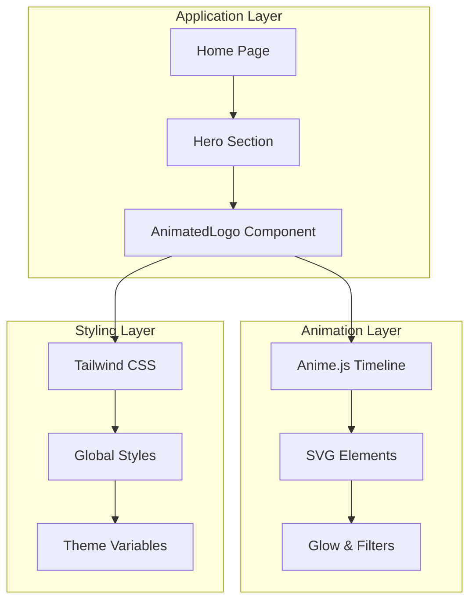
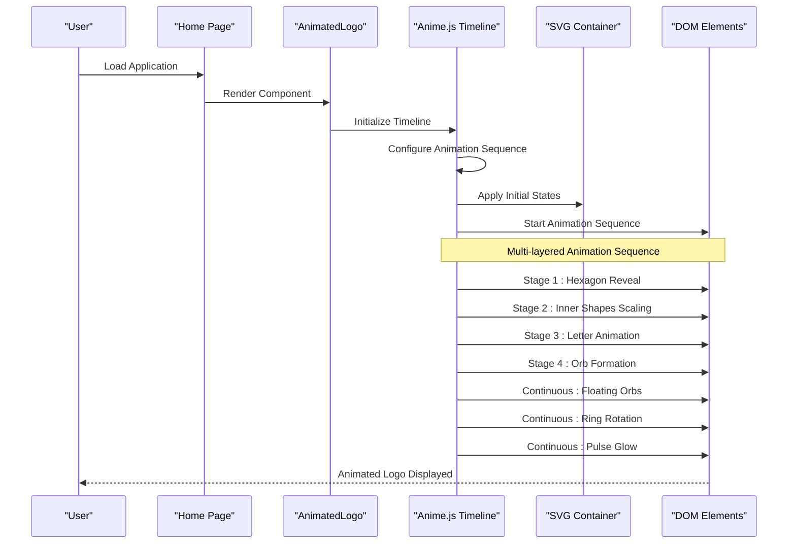
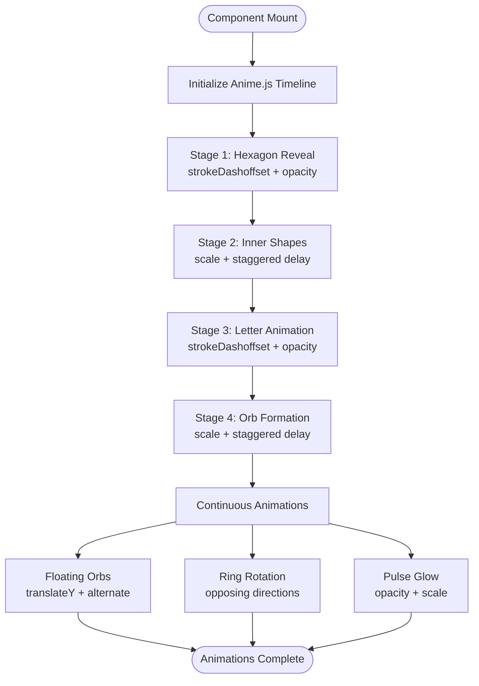
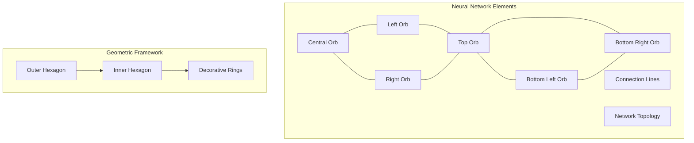

# Animated Logo Component

<cite>
**Referenced Files in This Document**
- [AnimatedLogo.tsx](file://components/AnimatedLogo.tsx)
- [page.tsx](file://app/page.tsx)
- [globals.css](file://app/globals.css)
- [tailwind.config.ts](file://tailwind.config.ts)
- [package.json](file://package.json)
- [button.tsx](file://components/ui/button.tsx)
- [card.tsx](file://components/ui/card.tsx)
</cite>

## Table of Contents
1. [Introduction](#introduction)
2. [Project Structure](#project-structure)
3. [Core Components](#core-components)
4. [Architecture Overview](#architecture-overview)
5. [Detailed Component Analysis](#detailed-component-analysis)
6. [Dependency Analysis](#dependency-analysis)
7. [Performance Considerations](#performance-considerations)
8. [Troubleshooting Guide](#troubleshooting-guide)
9. [Conclusion](#conclusion)

## Introduction
The AnimatedLogo component is a sophisticated multi-layered SVG animation system built with Anime.js timeline control. It creates a modern, AI-inspired brand identity featuring a hexagonal framework, neural network-inspired orbital elements, and dynamic lighting effects. The component demonstrates advanced animation composition techniques including staggered timing, continuous loops, and responsive design patterns.

## Project Structure
The AnimatedLogo component is integrated into the main application as a dynamic client-side component, positioned prominently in the hero section alongside other animated UI elements.



**Diagram sources**
- [page.tsx](file://app/page.tsx#L168-L174)
- [AnimatedLogo.tsx](file://components/AnimatedLogo.tsx#L1-L243)

**Section sources**
- [page.tsx](file://app/page.tsx#L1-L501)
- [AnimatedLogo.tsx](file://components/AnimatedLogo.tsx#L1-L243)

## Core Components
The AnimatedLogo component consists of several interconnected systems working together to create a cohesive animated experience:

### Animation Timeline System
The component uses Anime.js timeline to orchestrate complex multi-stage animations with precise timing control and easing functions.

### SVG Structure Architecture
The component renders a sophisticated SVG containing multiple layers:
- Outer decorative rings with gradient strokes
- Main hexagonal framework with stroke animations
- Inner geometric shapes with scaling effects
- Neural network-inspired orbital elements
- Connection lines forming a network topology

### Visual Effects System
Integrated glow effects, filters, and gradient backgrounds create depth and visual interest while maintaining performance.

**Section sources**
- [AnimatedLogo.tsx](file://components/AnimatedLogo.tsx#L11-L96)

## Architecture Overview
The AnimatedLogo component follows a layered architecture pattern combining React state management with Anime.js animation orchestration and Tailwind CSS styling.



**Diagram sources**
- [AnimatedLogo.tsx](file://components/AnimatedLogo.tsx#L11-L96)
- [page.tsx](file://app/page.tsx#L25-L26)

## Detailed Component Analysis

### Animation Sequence Architecture
The component implements a carefully orchestrated animation sequence with four main stages plus continuous effects:

#### Stage 1: Hexagon Reveal
The outer hexagonal framework animates from a hidden state to full visibility using stroke dashoffset animation.

#### Stage 2: Inner Shape Scaling
Multiple inner geometric shapes scale up with staggered delays, creating a cascading effect.

#### Stage 3: Letter Animation
The stylized "A" letter animates with stroke drawing effects and opacity transitions.

#### Stage 4: Orb Formation
Seven neural network-inspired orbital elements appear with staggered timing and scaling effects.

#### Continuous Effects
- Floating orbs with alternating vertical movement
- Decorative ring rotation with opposing directions
- Pulsing glow effect with scale and opacity variations



**Diagram sources**
- [AnimatedLogo.tsx](file://components/AnimatedLogo.tsx#L15-L96)

**Section sources**
- [AnimatedLogo.tsx](file://components/AnimatedLogo.tsx#L15-L96)

### SVG Structure and Design Elements

#### Neural Network-Inspired Design
The component incorporates AI-themed visual metaphors through orbital elements and connection lines:



**Diagram sources**
- [AnimatedLogo.tsx](file://components/AnimatedLogo.tsx#L169-L222)

#### Gradient and Filter System
The component utilizes sophisticated visual effects through gradient definitions and SVG filters:

- Primary gradient transitioning from cyan to deep purple
- Accent gradient for highlighting elements
- Gaussian blur filters for glow effects
- Stroke dasharray patterns for decorative borders

**Section sources**
- [AnimatedLogo.tsx](file://components/AnimatedLogo.tsx#L111-L139)

### Responsive Design Implementation
The component maintains responsive behavior through multiple design patterns:

#### Aspect Ratio Control
Fixed aspect ratio maintained through container sizing and SVG viewBox configuration.

#### Dynamic Sizing
CSS max-width constraints ensure proper scaling across different screen sizes.

#### Flexible Container Layout
Centered positioning with automatic margin handling for optimal display.

**Section sources**
- [AnimatedLogo.tsx](file://components/AnimatedLogo.tsx#L98-L110)

### Integration with UI System
The AnimatedLogo integrates seamlessly with the broader application through:

#### Dynamic Import Pattern
Client-side rendering ensures proper animation execution without SSR conflicts.

#### Theme System Integration
Leveraging Tailwind CSS theme variables for consistent color schemes.

#### Layout Coordination
Positioned within the hero section alongside other animated elements.

**Section sources**
- [page.tsx](file://app/page.tsx#L25-L26)
- [globals.css](file://app/globals.css#L1-L45)

## Dependency Analysis

### External Dependencies
The component relies on several key dependencies for its functionality:

```mermaid
graph LR
subgraph "Core Dependencies"
Anime[animejs v3.2.2]
React[React 18+]
NextJS[Next.js]
end
subgraph "Styling Dependencies"
Tailwind[Tailwind CSS]
PostCSS[PostCSS]
Typescript[TypeScript]
end
subgraph "Development Dependencies"
TypeAnime[@types/animejs]
TypeNode[@types/node]
TypeReact[@types/react]
end
AnimatedLogo --> Anime
AnimatedLogo --> React
AnimatedLogo --> NextJS
AnimatedLogo --> Tailwind
Tailwind --> PostCSS
AnimatedLogo --> Typescript
Anime -.-> TypeAnime
React -.-> TypeReact
NodeJS -.-> TypeNode
```

**Diagram sources**
- [package.json](file://package.json#L11-L31)

### Internal Component Dependencies
The AnimatedLogo integrates with the application's UI system through shared styling and component patterns.

**Section sources**
- [package.json](file://package.json#L1-L33)

## Performance Considerations

### Animation Optimization Strategies
The component implements several performance optimization techniques:

#### Efficient Timeline Management
- Single timeline orchestrating multiple animation sequences
- Shared easing functions reducing computational overhead
- Optimized stagger calculations for smooth performance

#### Hardware Acceleration
- Transform-based animations leveraging GPU acceleration
- Filter effects optimized for modern browsers
- Minimal DOM manipulation during animation cycles

#### Memory Management
- Animation cleanup on component unmount
- Reference-based element targeting avoiding repeated queries
- Single animation instance per component lifecycle

### Browser Compatibility
The component uses widely supported CSS properties and JavaScript APIs ensuring broad browser compatibility.

### Accessibility Considerations
- Reduced motion support through animation duration controls
- Color contrast maintained through theme variables
- Focus management for interactive elements

## Troubleshooting Guide

### Common Issues and Solutions

#### Animation Not Starting
- Verify Anime.js library is properly loaded
- Check component is rendered client-side only
- Ensure SVG elements have proper class names

#### Performance Issues
- Monitor animation frame rates in browser dev tools
- Consider reducing animation complexity on lower-end devices
- Optimize filter effects for mobile browsers

#### Styling Problems
- Verify Tailwind CSS is properly configured
- Check theme variables are correctly defined
- Ensure CSS animations are not conflicting with other styles

### Debugging Techniques
- Use browser dev tools to inspect animation timing
- Monitor memory usage during animation sequences
- Test component responsiveness across different screen sizes

**Section sources**
- [AnimatedLogo.tsx](file://components/AnimatedLogo.tsx#L1-L243)

## Conclusion
The AnimatedLogo component represents a sophisticated implementation of modern web animation techniques, combining React's declarative approach with Anime.js's powerful timeline control. The component successfully demonstrates advanced animation composition, responsive design patterns, and seamless integration with contemporary UI frameworks. Its neural network-inspired aesthetic aligns perfectly with the AI-focused brand identity while maintaining excellent performance characteristics across diverse device configurations.

The modular architecture allows for easy customization and extension, making it a valuable foundation for creating engaging animated brand experiences in modern web applications.