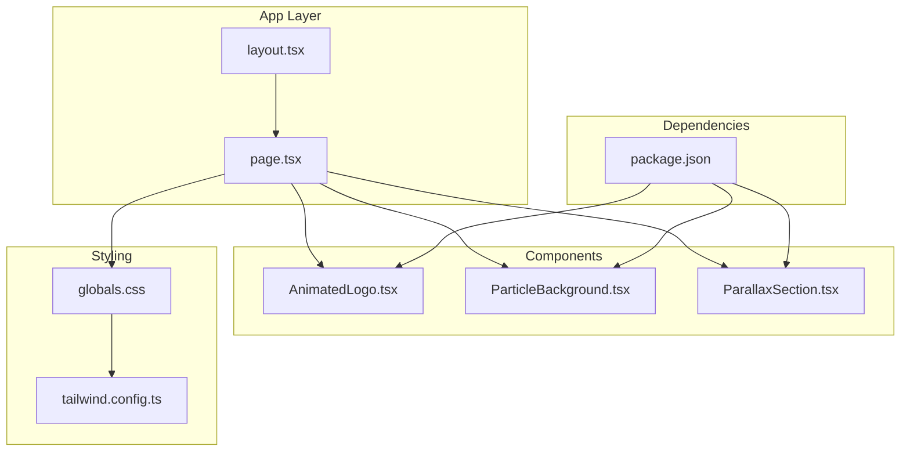
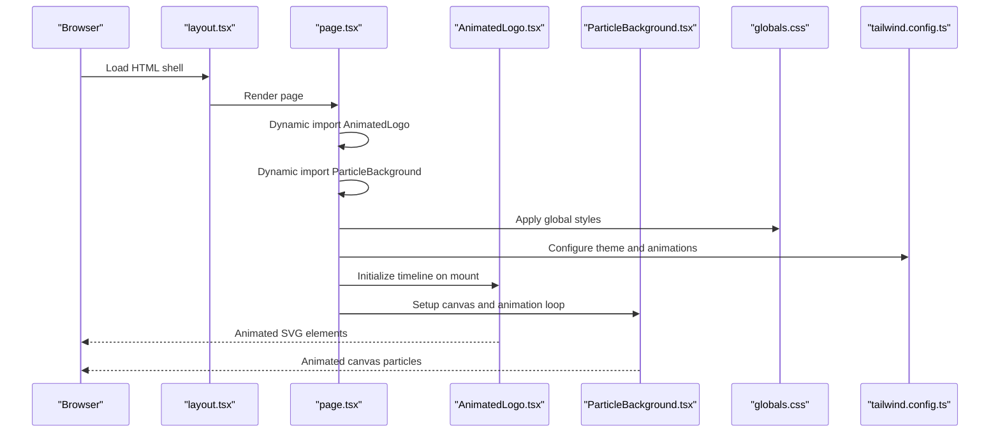
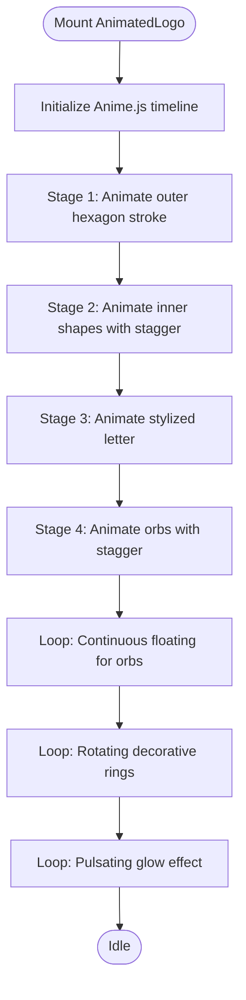
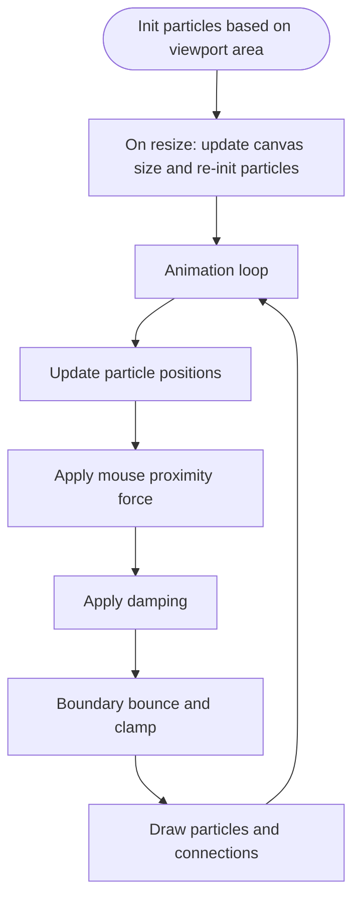
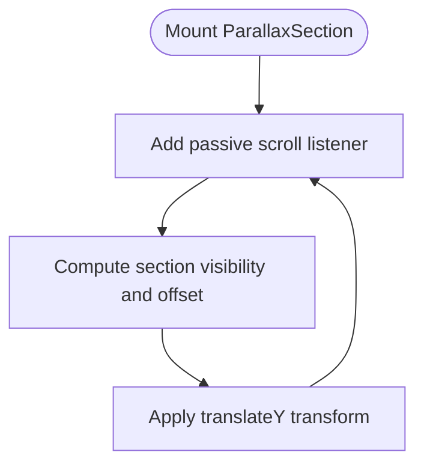
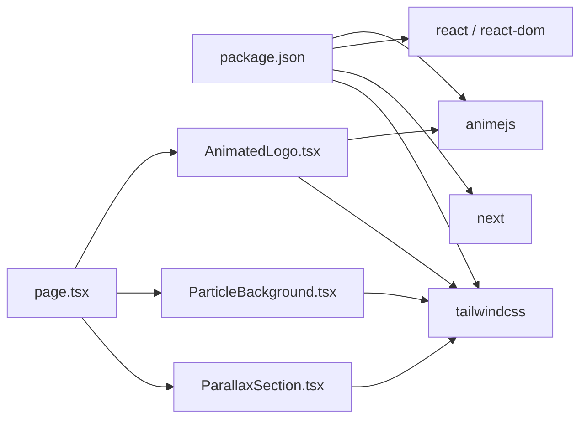

# Animation System

<cite>
**Referenced Files in This Document**
- [AnimatedLogo.tsx](file://components/AnimatedLogo.tsx)
- [ParticleBackground.tsx](file://components/ParticleBackground.tsx)
- [ParallaxSection.tsx](file://components/ParallaxSection.tsx)
- [page.tsx](file://app/page.tsx)
- [globals.css](file://app/globals.css)
- [layout.tsx](file://app/layout.tsx)
- [package.json](file://package.json)
- [tailwind.config.ts](file://tailwind.config.ts)
- [next.config.mjs](file://next.config.mjs)
</cite>

## Table of Contents
1. [Introduction](#introduction)
2. [Project Structure](#project-structure)
3. [Core Components](#core-components)
4. [Architecture Overview](#architecture-overview)
5. [Detailed Component Analysis](#detailed-component-analysis)
6. [Dependency Analysis](#dependency-analysis)
7. [Performance Considerations](#performance-considerations)
8. [Troubleshooting Guide](#troubleshooting-guide)
9. [Conclusion](#conclusion)
10. [Appendices](#appendices)

## Introduction
This document explains the AlterLabs animation system with a focus on three core components:
- AnimatedLogo: timeline-driven SVG animation powered by Anime.js
- ParticleBackground: canvas-based particle physics simulation with mouse interaction
- ParallaxSection: scroll-triggered parallax effects

It covers Anime.js integration, canvas rendering, performance optimization, configuration options, customization possibilities, and responsive behavior across screen sizes.

## Project Structure
The animation system is implemented as Next.js client components integrated into the homepage layout. The components are dynamically imported to ensure client-side-only execution, and animations rely on Tailwind utilities and Anime.js.

**Diagram sources**
- [layout.tsx](file://app/layout.tsx#L18-L28)
- [page.tsx](file://app/page.tsx#L24-L26)
- [globals.css](file://app/globals.css#L1-L252)
- [tailwind.config.ts](file://tailwind.config.ts#L1-L108)
- [package.json](file://package.json#L11-L21)

**Section sources**
- [layout.tsx](file://app/layout.tsx#L18-L28)
- [page.tsx](file://app/page.tsx#L24-L26)
- [globals.css](file://app/globals.css#L1-L252)
- [tailwind.config.ts](file://tailwind.config.ts#L1-L108)
- [package.json](file://package.json#L11-L21)

## Core Components
- AnimatedLogo: orchestrates a multi-stage timeline animation of SVG elements using Anime.js, including hexagon strokes, inner shapes, stylized letter, orbital elements, continuous floating, rotating rings, and pulsating glow.
- ParticleBackground: renders a canvas particle system with physics (velocity, damping, boundary bounce), mouse proximity attraction, and inter-particle connection lines.
- ParallaxSection: applies scroll-driven transforms to child content for layered depth perception.

**Section sources**
- [AnimatedLogo.tsx](file://components/AnimatedLogo.tsx#L1-L243)
- [ParticleBackground.tsx](file://components/ParticleBackground.tsx#L1-L151)
- [ParallaxSection.tsx](file://components/ParallaxSection.tsx#L1-L43)

## Architecture Overview
The homepage integrates the three animation components and global styles. The page dynamically imports client-only components to avoid server-side rendering conflicts. Tailwind utilities define gradients, glows, and reusable animations. Anime.js powers the AnimatedLogo timeline.

**Diagram sources**
- [layout.tsx](file://app/layout.tsx#L18-L28)
- [page.tsx](file://app/page.tsx#L24-L26)
- [globals.css](file://app/globals.css#L1-L252)
- [tailwind.config.ts](file://tailwind.config.ts#L1-L108)
- [AnimatedLogo.tsx](file://components/AnimatedLogo.tsx#L11-L96)
- [ParticleBackground.tsx](file://components/ParticleBackground.tsx#L106-L141)

## Detailed Component Analysis

### AnimatedLogo
- Timeline orchestration: Uses Anime.js timeline to sequence multiple targets with staggered delays and easing.
- SVG elements: Outer hexagon stroke, inner shapes, stylized “A” letter, neural network-like orbs, decorative rings, and glow background.
- Continuous animations: Floating orbs, rotating rings, and pulsating glow.
- Responsive sizing: SVG scales with container while maintaining aspect ratio.

Key implementation patterns:
- Timeline stages for hexagon stroke, inner shapes, letter, and orbs.
- Continuous tweens for floating, rotation, and glow.
- Anime.js utilities for dashoffset and staggered delays.

Configuration options:
- Easing presets and durations are defined per stage.
- Orb stagger and floating delays are configurable via Anime.js APIs.

Customization possibilities:
- Modify gradients, filters, and stroke properties in SVG.
- Adjust timing, easing, and delays in the timeline.
- Add or remove animated elements by extending the SVG and timeline targets.

Performance considerations:
- Single-use effect to prevent re-initialization.
- Continuous tweens are lightweight; consider throttling on low-end devices.

Integration patterns:
- Dynamically imported in the homepage to ensure client-side execution.
- Composed within a responsive container with aspect-ratio constraints.

**Section sources**
- [AnimatedLogo.tsx](file://components/AnimatedLogo.tsx#L1-L243)
- [page.tsx](file://app/page.tsx#L24-L26)

#### Timeline Flow

**Diagram sources**
- [AnimatedLogo.tsx](file://components/AnimatedLogo.tsx#L15-L96)

### ParticleBackground
- Physics model: Each particle has position, velocity, radius, opacity, and color; updates position each frame with damping and boundary checks.
- Mouse interaction: Subtle attraction force proportional to inverse distance within a threshold.
- Rendering: Draws circles and connects nearby particles with alpha-blended lines.
- Responsive initialization: Particle count scales with viewport area; canvas resizes on window resize.

Key implementation patterns:
- Particle interface defines state.
- Initialization computes particle count based on area.
- Draw loop updates positions, applies forces, and renders connections.
- requestAnimationFrame drives the animation loop.

Configuration options:
- Colors array controls particle palette.
- Interaction radius and force strength are adjustable constants.
- Damping factor and boundary bounce behavior are tunable.

Customization possibilities:
- Change colors, radii, and opacity ranges.
- Adjust mouse influence distance and force magnitude.
- Modify connection thresholds and line widths.

Performance considerations:
- Particle count derived from viewport area to balance quality and performance.
- requestAnimationFrame ensures smooth 60fps where possible.
- Cleanup removes event listeners and cancels animation frames on unmount.

Integration patterns:
- Dynamically imported to run client-side.
- Fixed-position canvas layered behind page content.

**Section sources**
- [ParticleBackground.tsx](file://components/ParticleBackground.tsx#L1-L151)
- [page.tsx](file://app/page.tsx#L25-L26)

#### Physics Simulation Flow

**Diagram sources**
- [ParticleBackground.tsx](file://components/ParticleBackground.tsx#L27-L104)
- [ParticleBackground.tsx](file://components/ParticleBackground.tsx#L106-L141)

### ParallaxSection
- Scroll listener: Calculates section visibility and computes vertical offset based on scroll position and section geometry.
- Transform application: Applies a translateY transform proportional to scroll speed.
- Passive scrolling: Uses passive event listener for improved scroll performance.

Key implementation patterns:
- Uses getBoundingClientRect and window scrollY to compute offsets.
- Applies transform with will-change hint for GPU acceleration.
- Speed parameter controls sensitivity.

Configuration options:
- speed prop controls parallax intensity (default 0.5).
- className allows adding additional styling or parallax layers.

Customization possibilities:
- Combine with Tailwind parallax utilities for multi-layer depth.
- Adjust speed per section for varied motion.

Performance considerations:
- Passive event listener minimizes layout thrashing.
- Transform-based movement leverages GPU acceleration.

Integration patterns:
- Wrap content blocks to create layered parallax effects.
- Combine with other scroll-driven animations on the page.

**Section sources**
- [ParallaxSection.tsx](file://components/ParallaxSection.tsx#L1-L43)
- [page.tsx](file://app/page.tsx#L103-L185)
- [globals.css](file://app/globals.css#L211-L228)

#### Scroll-Based Parallax Flow

**Diagram sources**
- [ParallaxSection.tsx](file://components/ParallaxSection.tsx#L14-L35)

## Dependency Analysis
External libraries and integrations:
- Anime.js: Timeline and tweening engine for AnimatedLogo.
- Tailwind CSS: Utility classes for gradients, glows, animations, and responsive layouts.
- Next.js: Dynamic imports for client-side-only components.

**Diagram sources**
- [package.json](file://package.json#L11-L21)
- [page.tsx](file://app/page.tsx#L24-L26)
- [AnimatedLogo.tsx](file://components/AnimatedLogo.tsx#L4)
- [ParticleBackground.tsx](file://components/ParticleBackground.tsx#L3)
- [ParallaxSection.tsx](file://components/ParallaxSection.tsx#L3)

**Section sources**
- [package.json](file://package.json#L11-L21)
- [page.tsx](file://app/page.tsx#L24-L26)

## Performance Considerations
- Client-side only: All animation components are dynamically imported to avoid SSR overhead.
- GPU acceleration: Transform-based animations (ParallaxSection, AnimatedLogo continuous transforms) leverage GPU where supported.
- requestAnimationFrame: ParticleBackground uses efficient animation loops.
- Passive events: Scroll listener uses passive option to reduce scroll jank.
- Responsive scaling: Particle count scales with viewport area to balance quality and performance.
- Cleanup: Event listeners and animation frames are canceled on unmount to prevent memory leaks.
- Anime.js: Optimized tweening with easing functions; avoid excessive simultaneous tweens on low-end devices.

[No sources needed since this section provides general guidance]

## Troubleshooting Guide
Common issues and resolutions:
- Components not animating on server-rendered pages: Ensure components are client-only via dynamic imports.
- Canvas not filling viewport: Verify fixed positioning and z-index; confirm resize handler runs on mount.
- Scroll parallax not smooth: Confirm passive event listener is attached; avoid heavy DOM manipulation inside scroll handlers.
- Performance drops on mobile: Reduce particle count or simplify animations; throttle or disable certain effects on lower-end devices.
- Color and gradient mismatches: Check Tailwind theme variables and global CSS color tokens.

**Section sources**
- [page.tsx](file://app/page.tsx#L24-L26)
- [ParticleBackground.tsx](file://components/ParticleBackground.tsx#L106-L141)
- [ParallaxSection.tsx](file://components/ParallaxSection.tsx#L14-L35)
- [globals.css](file://app/globals.css#L47-L60)

## Conclusion
The AlterLabs animation system combines Anime.js-driven timelines, canvas-based particle physics, and scroll-triggered parallax to deliver a visually rich, performant experience. By leveraging dynamic imports, Tailwind utilities, and GPU-friendly transforms, the system remains responsive and customizable across devices.

[No sources needed since this section summarizes without analyzing specific files]

## Appendices

### Configuration Options Reference
- AnimatedLogo
  - Timeline stages: hexagon stroke, inner shapes, letter, orbs
  - Continuous animations: floating, rotation, glow
  - Easing and duration: configured per stage
- ParticleBackground
  - Colors: array of RGBA strings
  - Interaction radius: mouse influence threshold
  - Damping: velocity decay factor
  - Boundary behavior: bounce with clamp
- ParallaxSection
  - speed: scroll sensitivity multiplier
  - className: additional styling and parallax layers

**Section sources**
- [AnimatedLogo.tsx](file://components/AnimatedLogo.tsx#L15-L96)
- [ParticleBackground.tsx](file://components/ParticleBackground.tsx#L21-L104)
- [ParallaxSection.tsx](file://components/ParallaxSection.tsx#L11-L35)

### Browser Compatibility and Responsiveness
- Anime.js: Supports modern browsers; ensure polyfills if targeting older environments.
- Canvas: Widely supported; fallbacks may be needed for extremely old browsers.
- Tailwind: Works across modern browsers; ensure PostCSS pipeline is configured.
- Responsiveness: Components adapt to viewport size; adjust particle count and animation speeds for smaller screens.

**Section sources**
- [package.json](file://package.json#L11-L21)
- [tailwind.config.ts](file://tailwind.config.ts#L1-L108)
- [next.config.mjs](file://next.config.mjs#L1-L7)