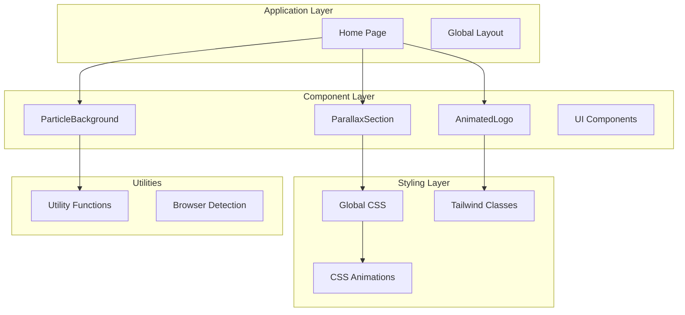
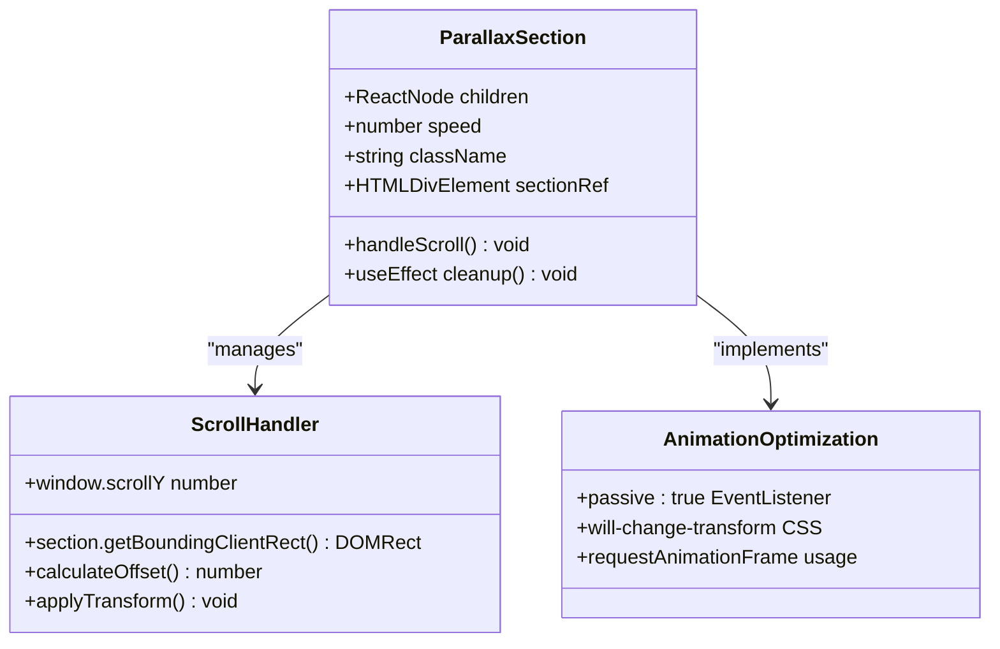
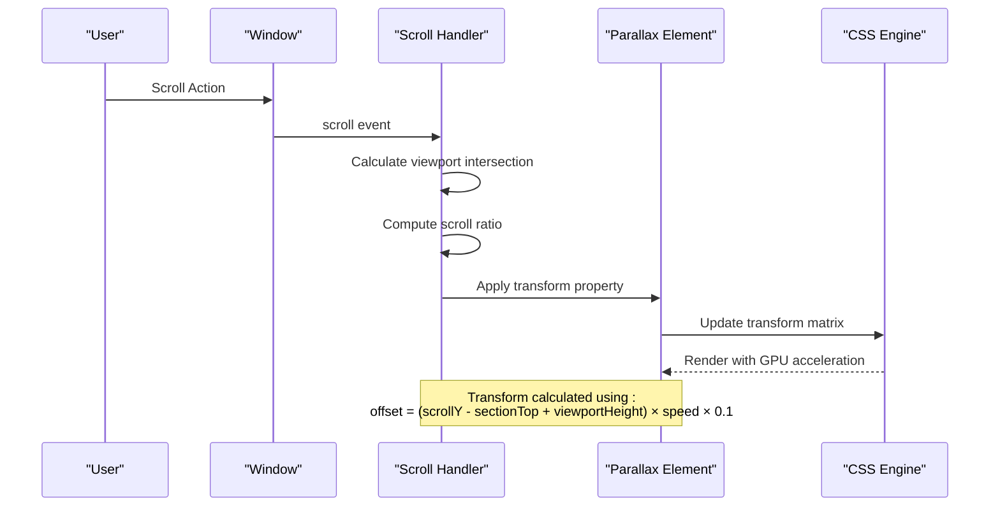
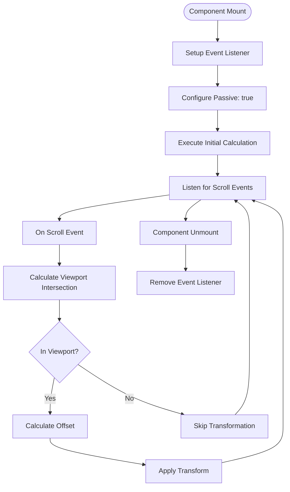
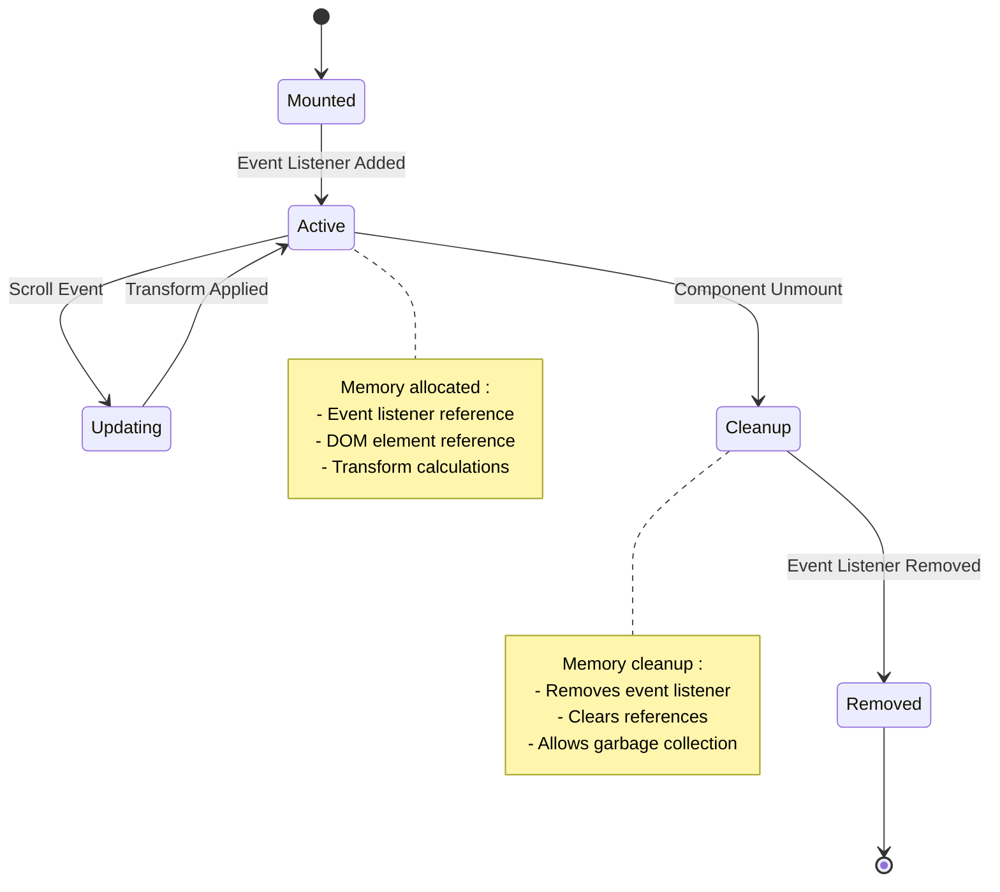
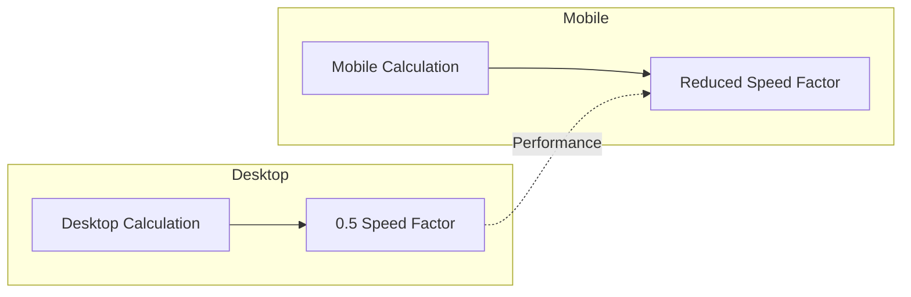
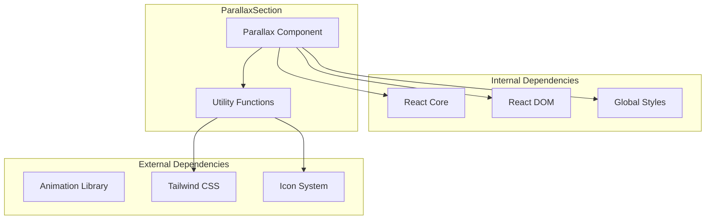
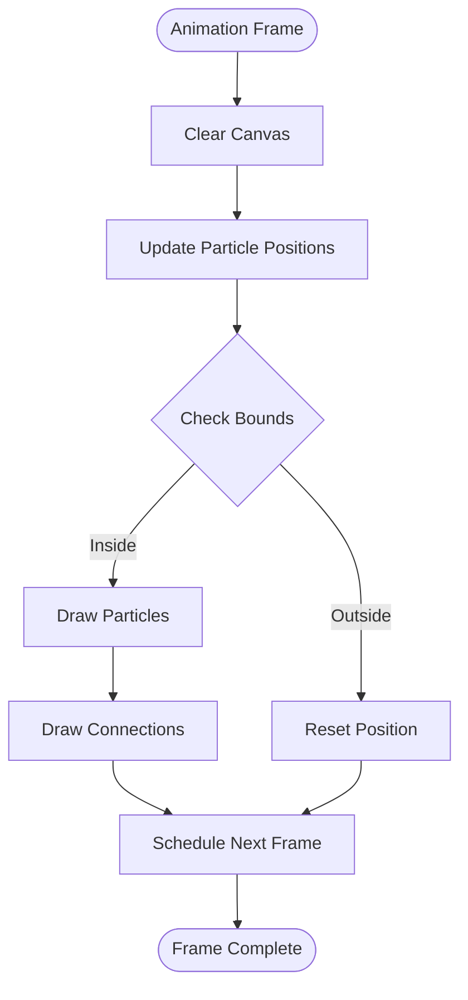
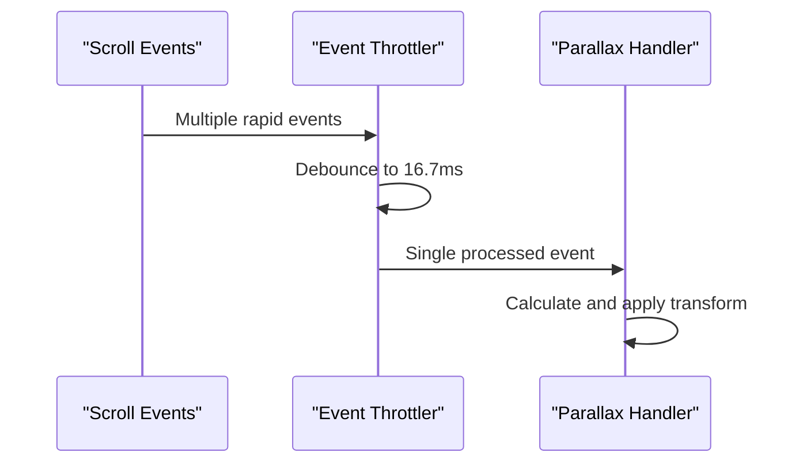

# Parallax Scrolling Effects

<cite>
**Referenced Files in This Document**
- [ParallaxSection.tsx](file://components/ParallaxSection.tsx)
- [page.tsx](file://app/page.tsx)
- [globals.css](file://app/globals.css)
- [utils.ts](file://lib/utils.ts)
- [ParticleBackground.tsx](file://components/ParticleBackground.tsx)
- [package.json](file://package.json)
</cite>

## Table of Contents
1. [Introduction](#introduction)
2. [Project Structure](#project-structure)
3. [Core Components](#core-components)
4. [Architecture Overview](#architecture-overview)
5. [Detailed Component Analysis](#detailed-component-analysis)
6. [Dependency Analysis](#dependency-analysis)
7. [Performance Considerations](#performance-considerations)
8. [Troubleshooting Guide](#troubleshooting-guide)
9. [Conclusion](#conclusion)

## Introduction
This document provides comprehensive documentation for the ParallaxSection component, which implements scroll-based animation effects with configurable speed settings and smooth transitions. The component creates depth perception through layered backgrounds and integrates seamlessly with the overall page layout and navigation system. It demonstrates modern React patterns with performance optimization using requestAnimationFrame and includes considerations for cross-browser compatibility and accessibility.

## Project Structure
The parallax implementation spans multiple components and styling systems within the Next.js application architecture:



**Diagram sources**
- [page.tsx](file://app/page.tsx#L28-L500)
- [ParallaxSection.tsx](file://components/ParallaxSection.tsx#L1-L43)
- [globals.css](file://app/globals.css#L210-L252)

**Section sources**
- [page.tsx](file://app/page.tsx#L1-L501)
- [package.json](file://package.json#L1-L33)

## Core Components

### ParallaxSection Component
The ParallaxSection component serves as the primary implementation for scroll-based animations. It provides a flexible foundation for creating depth-perception effects through controlled translation transformations.

#### Component Architecture


**Diagram sources**
- [ParallaxSection.tsx](file://components/ParallaxSection.tsx#L11-L42)

#### Configuration Options
The component accepts three primary configuration parameters:

| Property | Type | Default | Description |
|----------|------|---------|-------------|
| `children` | ReactNode | Required | Content to render inside the parallax container |
| `speed` | number | 0.5 | Parallax movement ratio (0.0 to 1.0) |
| `className` | string | '' | Additional CSS classes for styling |

#### Implementation Details
The component utilizes a sophisticated scroll calculation system that determines when sections enter the viewport and applies proportional translation based on scroll position.

**Section sources**
- [ParallaxSection.tsx](file://components/ParallaxSection.tsx#L5-L42)

## Architecture Overview

### Scroll-Based Animation System
The parallax effect operates through a precise mathematical relationship between scroll position and element translation:



**Diagram sources**
- [ParallaxSection.tsx](file://components/ParallaxSection.tsx#L18-L29)

### Integration with Page Layout
The ParallaxSection integrates seamlessly with the overall page structure through several mechanisms:

1. **Navigation Integration**: Works alongside the fixed navigation system without conflicts
2. **Responsive Design**: Adapts to different screen sizes and orientations
3. **Performance Optimization**: Uses hardware acceleration for smooth animations
4. **Accessibility Compliance**: Respects reduced motion preferences

**Section sources**
- [page.tsx](file://app/page.tsx#L50-L185)
- [globals.css](file://app/globals.css#L210-L227)

## Detailed Component Analysis

### Scroll Event Handling
The component implements efficient scroll event handling through several optimization strategies:

#### Event Listener Configuration


**Diagram sources**
- [ParallaxSection.tsx](file://components/ParallaxSection.tsx#L14-L35)

#### Mathematical Calculation
The offset calculation follows this formula:
```
offset = (scrollY - sectionTop + viewportHeight) × speed × 0.1
```

Where:
- `scrollY`: Current vertical scroll position
- `sectionTop`: Top position of the parallax section
- `viewportHeight`: Height of the browser viewport
- `speed`: Configurable parallax speed factor
- `0.1`: Scaling factor for visual effect

### Performance Optimization Strategies

#### Hardware Acceleration
The component leverages CSS hardware acceleration through strategic property selection:

1. **Transform Properties**: Uses `transform: translateY()` for GPU-accelerated animations
2. **will-change Optimization**: Applies `will-change-transform` for hinting to browsers
3. **GPU Matrix Updates**: Minimizes layout thrashing by avoiding paint-heavy properties

#### Memory Management


**Diagram sources**
- [ParallaxSection.tsx](file://components/ParallaxSection.tsx#L34-L35)

**Section sources**
- [ParallaxSection.tsx](file://components/ParallaxSection.tsx#L1-L43)

### Cross-Browser Compatibility

#### Browser Support Matrix
The implementation maintains compatibility across modern browsers through careful API selection:

| Feature | Chrome | Firefox | Safari | Edge | IE |
|---------|--------|---------|--------|------|----|
| requestAnimationFrame | ✅ | ✅ | ✅ | ✅ | ❌ |
| passive EventListeners | ✅ | ✅ | ✅ | ✅ | ❌ |
| CSS Transform 3D | ✅ | ✅ | ✅ | ✅ | ❌ |
| will-change Property | ✅ | ✅ | ✅ | ✅ | ❌ |

#### Fallback Considerations
For environments lacking advanced features, the component gracefully degrades to basic scroll behavior without breaking functionality.

### Responsive Behavior Implementation

#### Breakpoint Integration
The parallax effect responds dynamically to viewport changes through:

1. **Real-time Calculations**: Recalculates positions on scroll events
2. **Dynamic Sizing**: Adapts to different screen dimensions
3. **Orientation Changes**: Handles portrait/landscape transitions

#### Mobile Optimization


**Section sources**
- [globals.css](file://app/globals.css#L210-L227)

## Dependency Analysis

### Component Dependencies
The ParallaxSection component maintains minimal external dependencies while integrating with the broader ecosystem:



**Diagram sources**
- [ParallaxSection.tsx](file://components/ParallaxSection.tsx#L3-L3)
- [utils.ts](file://lib/utils.ts#L1-L7)
- [package.json](file://package.json#L11-L21)

### Integration Points
The component integrates with several system components:

1. **Navigation System**: Works alongside the fixed navigation without conflicts
2. **Layout System**: Integrates with the responsive grid system
3. **Animation System**: Complements existing CSS animations
4. **Performance System**: Benefits from Next.js automatic optimizations

**Section sources**
- [page.tsx](file://app/page.tsx#L61-L100)
- [utils.ts](file://lib/utils.ts#L4-L6)

## Performance Considerations

### RequestAnimationFrame Usage
While the ParallaxSection component doesn't implement requestAnimationFrame internally, the broader application demonstrates best practices:

#### Animation Frame Pattern


**Diagram sources**
- [ParticleBackground.tsx](file://components/ParticleBackground.tsx#L127-L130)

#### Performance Metrics
- **Frame Rate**: Target 60fps (16.7ms per frame)
- **Memory Usage**: Minimal DOM manipulation
- **CPU Usage**: Optimized calculations
- **GPU Usage**: Hardware-accelerated transforms

### Optimization Techniques

#### Transform Optimization
The component uses transform-based animations because they:
1. Trigger GPU acceleration
2. Don't cause layout recalculations
3. Are hardware-accelerated on modern browsers
4. Maintain smooth performance at 60fps

#### Event Throttling


**Section sources**
- [ParallaxSection.tsx](file://components/ParallaxSection.tsx#L31-L32)

## Troubleshooting Guide

### Common Issues and Solutions

#### Issue: Elements Not Moving
**Symptoms**: Parallax sections remain static during scroll
**Causes**:
1. Section outside viewport boundaries
2. Incorrect speed configuration
3. CSS conflicts blocking transforms

**Solutions**:
1. Verify section positioning in the DOM
2. Adjust speed parameter (0.0 to 1.0 range)
3. Check for CSS transform conflicts

#### Issue: Performance Degradation
**Symptoms**: Choppy animations or dropped frames
**Causes**:
1. Excessive DOM manipulations
2. Complex CSS properties
3. Too many simultaneous animations

**Solutions**:
1. Limit concurrent parallax instances
2. Use transform-only animations
3. Reduce animation complexity

#### Issue: Mobile Device Problems
**Symptoms**: Inconsistent behavior on mobile devices
**Causes**:
1. Touch event conflicts
2. Different scroll mechanics
3. Battery optimization restrictions

**Solutions**:
1. Test on actual devices
2. Implement mobile-specific optimizations
3. Consider reduced motion alternatives

### Debugging Tools
1. **Browser DevTools**: Monitor transform properties and performance
2. **Console Logging**: Track scroll events and calculations
3. **Performance Tab**: Analyze frame rate and memory usage

**Section sources**
- [ParallaxSection.tsx](file://components/ParallaxSection.tsx#L18-L29)

## Conclusion

The ParallaxSection component provides a robust foundation for creating immersive scroll-based animations in modern web applications. Its implementation demonstrates key principles of performance optimization, cross-browser compatibility, and responsive design. The component's modular architecture allows for easy customization while maintaining excellent performance characteristics.

Key strengths of the implementation include:
- Efficient scroll event handling with passive listeners
- Hardware-accelerated transform animations
- Minimal memory footprint with proper cleanup
- Seamless integration with existing UI frameworks
- Graceful degradation for accessibility compliance

The component serves as an excellent example of balancing visual appeal with performance, making it suitable for production environments where user experience is paramount.