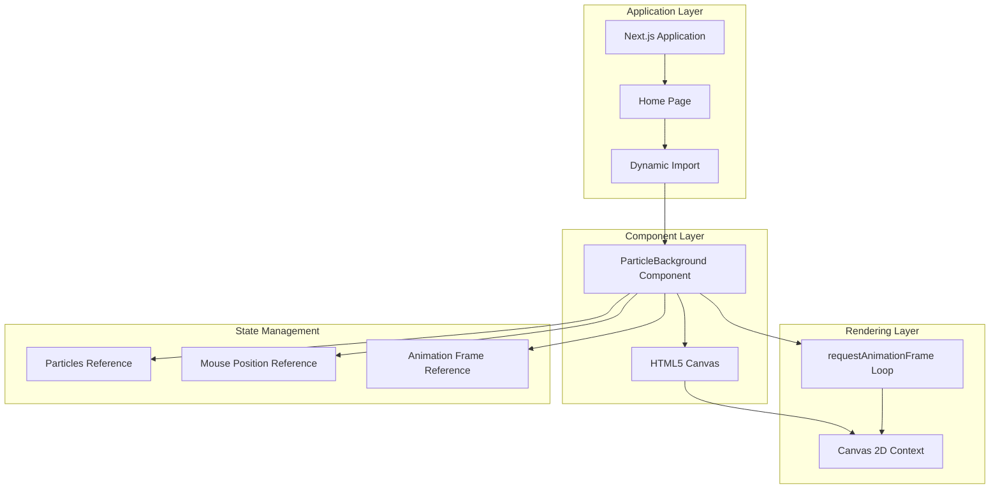
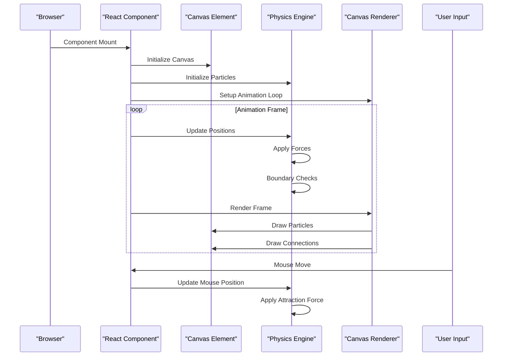
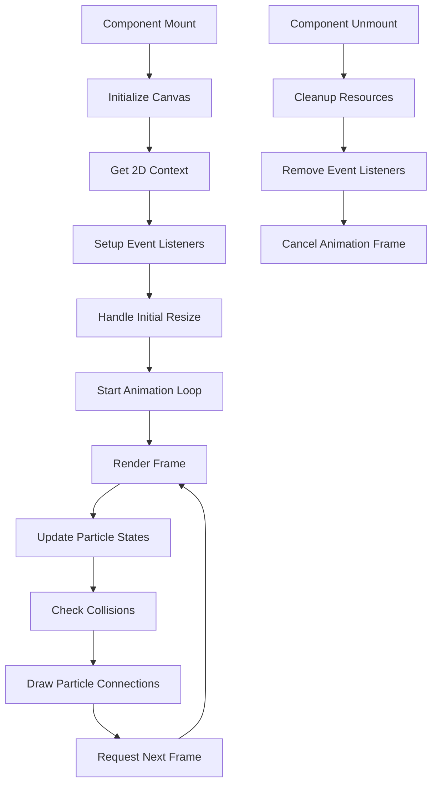
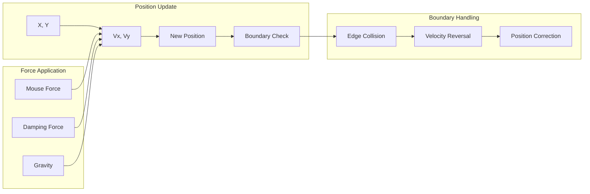
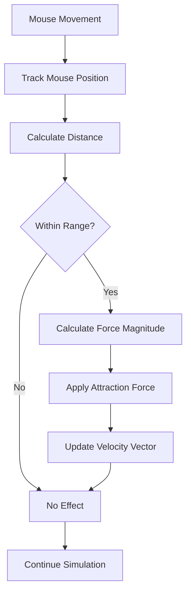
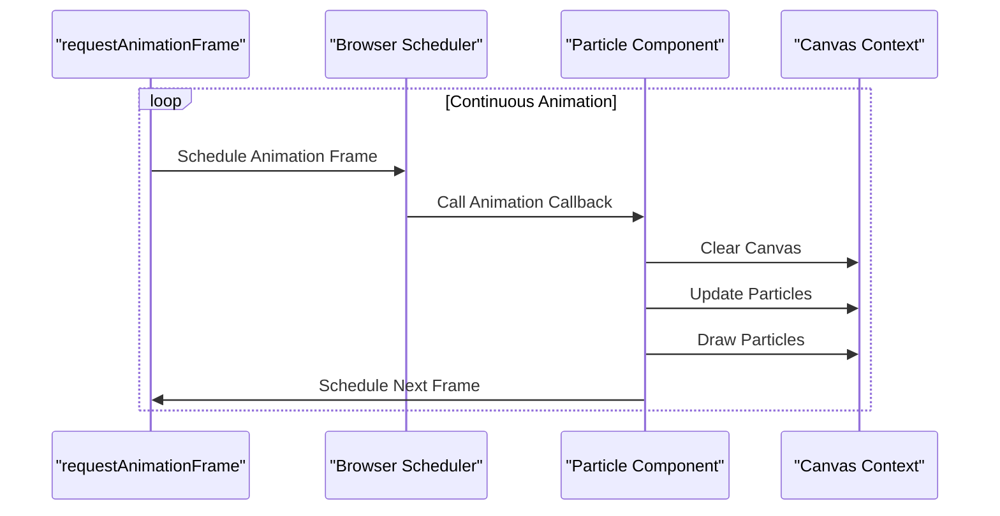
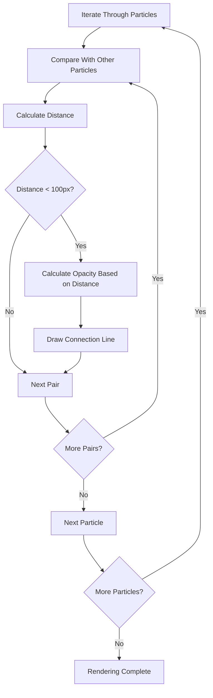
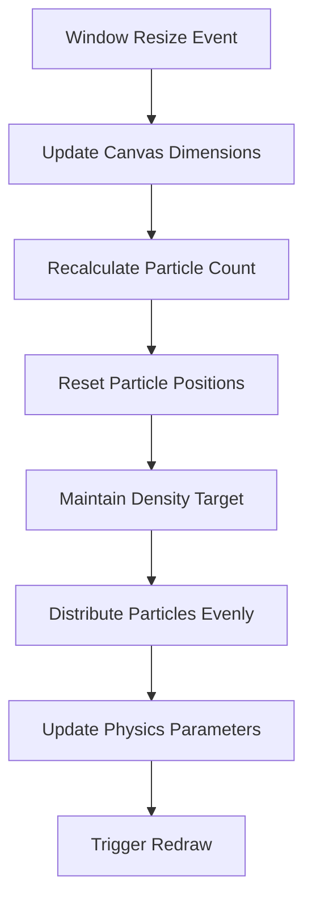
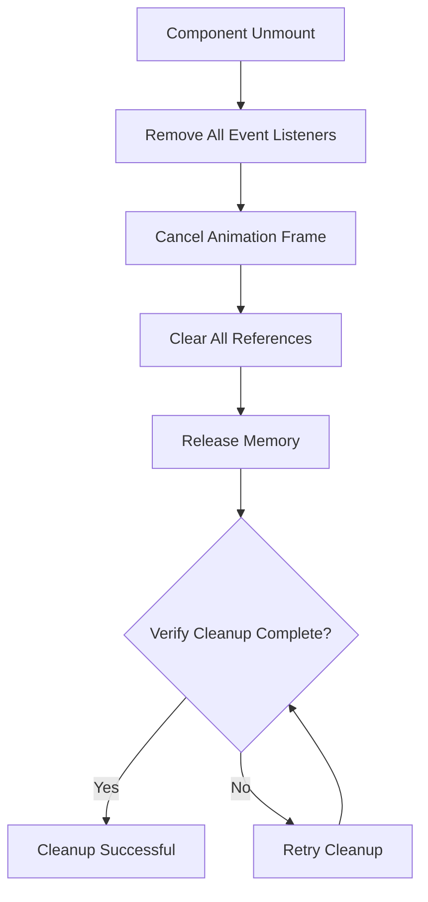

# Particle Background System

<cite>
**Referenced Files in This Document**
- [ParticleBackground.tsx](file://components/ParticleBackground.tsx)
- [page.tsx](file://app/page.tsx)
- [globals.css](file://app/globals.css)
- [tailwind.config.ts](file://tailwind.config.ts)
- [package.json](file://package.json)
</cite>

## Table of Contents
1. [Introduction](#introduction)
2. [Project Structure](#project-structure)
3. [Core Components](#core-components)
4. [Architecture Overview](#architecture-overview)
5. [Detailed Component Analysis](#detailed-component-analysis)
6. [Physics Engine Implementation](#physics-engine-implementation)
7. [Mouse Interaction System](#mouse-interaction-system)
8. [Performance Optimization](#performance-optimization)
9. [Visual Effects and Rendering](#visual-effects-and-rendering)
10. [Responsive Behavior](#responsive-behavior)
11. [Configuration Options](#configuration-options)
12. [Browser Compatibility](#browser-compatibility)
13. [Memory Management](#memory-management)
14. [Performance Monitoring](#performance-monitoring)
15. [Troubleshooting Guide](#troubleshooting-guide)
16. [Conclusion](#conclusion)

## Introduction

The Particle Background System is a sophisticated canvas-based particle physics simulation component designed for modern web applications. This system creates an immersive visual experience by rendering thousands of animated particles that respond to mouse interactions while maintaining optimal performance through advanced optimization techniques.

The component utilizes HTML5 Canvas APIs combined with React hooks to deliver a seamless, interactive particle field that enhances user engagement without compromising application performance. The simulation incorporates realistic physics principles including velocity tracking, collision detection, boundary handling, and dynamic visual effects.

## Project Structure

The Particle Background component is strategically positioned within the application architecture to serve as a foundational visual element:

**Diagram sources**
- [page.tsx](file://app/page.tsx#L25-L26)
- [ParticleBackground.tsx](file://components/ParticleBackground.tsx#L15-L150)

**Section sources**
- [page.tsx](file://app/page.tsx#L25-L26)
- [ParticleBackground.tsx](file://components/ParticleBackground.tsx#L1-L151)

## Core Components

The Particle Background system consists of several interconnected components that work together to create the immersive particle experience:

### Particle Data Structure
Each particle maintains essential physics properties including position coordinates, velocity vectors, radius, opacity, and color attributes. These properties enable realistic movement and visual representation within the simulation.

### Canvas Rendering Pipeline
The system employs a multi-pass rendering approach where each frame clears the canvas, updates particle positions, applies physics calculations, handles mouse interactions, and renders both individual particles and connecting lines.

### State Management Architecture
React refs are utilized for efficient state management without triggering unnecessary re-renders. This approach ensures optimal performance while maintaining reactive updates for dynamic behavior.

**Section sources**
- [ParticleBackground.tsx](file://components/ParticleBackground.tsx#L5-L13)
- [ParticleBackground.tsx](file://components/ParticleBackground.tsx#L16-L19)

## Architecture Overview

The Particle Background system follows a modular architecture that separates concerns between physics simulation, rendering, and user interaction:

**Diagram sources**
- [ParticleBackground.tsx](file://components/ParticleBackground.tsx#L106-L141)

The architecture ensures separation of concerns with clear boundaries between physics calculations, rendering operations, and user interaction handling.

**Section sources**
- [ParticleBackground.tsx](file://components/ParticleBackground.tsx#L106-L141)

## Detailed Component Analysis

### Component Structure and Lifecycle

The ParticleBackground component implements a sophisticated lifecycle management system that handles initialization, continuous animation, and cleanup operations:

**Diagram sources**
- [ParticleBackground.tsx](file://components/ParticleBackground.tsx#L106-L141)

### Particle Data Model

Each particle object encapsulates essential properties for physics simulation and visual rendering:

| Property | Type | Description | Range |
|----------|------|-------------|-------|
| `x` | Number | Horizontal position coordinate | 0 to canvas width |
| `y` | Number | Vertical position coordinate | 0 to canvas height |
| `vx` | Number | Velocity in x-direction | -0.15 to 0.15 |
| `vy` | Number | Velocity in y-direction | -0.15 to 0.15 |
| `radius` | Number | Particle size in pixels | 0.5 to 2.5 |
| `opacity` | Number | Transparency level | 0.2 to 0.7 |
| `color` | String | RGBA color value | Predefined palette |

**Section sources**
- [ParticleBackground.tsx](file://components/ParticleBackground.tsx#L5-L13)
- [ParticleBackground.tsx](file://components/ParticleBackground.tsx#L27-L44)

## Physics Engine Implementation

### Position Tracking and Velocity Calculations

The physics engine implements a straightforward yet effective integration scheme for particle motion:

**Diagram sources**
- [ParticleBackground.tsx](file://components/ParticleBackground.tsx#L52-L78)

The position update follows the standard kinematic equation: `new_position = current_position + velocity`. This simple integration method provides stable particle movement while maintaining computational efficiency.

### Collision Detection System

The system implements two primary collision detection mechanisms:

1. **Boundary Collision Detection**: Monitors particle positions against canvas boundaries
2. **Particle-to-Particle Distance Calculation**: Computes distances between all particle pairs for connection rendering

The collision detection algorithm uses Euclidean distance calculation: `distance = √[(x₂-x₁)² + (y₂-y₁)²]`

**Section sources**
- [ParticleBackground.tsx](file://components/ParticleBackground.tsx#L72-L78)
- [ParticleBackground.tsx](file://components/ParticleBackground.tsx#L89-L91)

## Mouse Interaction System

### Attraction Force Mechanics

The mouse interaction system creates a subtle attraction effect that responds to user cursor proximity:

**Diagram sources**
- [ParticleBackground.tsx](file://components/ParticleBackground.tsx#L57-L66)

The attraction force follows an inverse-distance relationship: `force = (max_distance - distance) / max_distance`, ensuring particles are drawn toward the cursor while maintaining natural movement patterns.

### Repulsion and Damping Mechanisms

The system incorporates damping forces that gradually reduce particle velocities over time, preventing unbounded acceleration and maintaining stable particle behavior.

**Section sources**
- [ParticleBackground.tsx](file://components/ParticleBackground.tsx#L68-L70)

## Performance Optimization

### requestAnimationFrame Integration

The animation loop utilizes the browser's optimized animation frame scheduling system:

**Diagram sources**
- [ParticleBackground.tsx](file://components/ParticleBackground.tsx#L127-L130)

### Efficient Rendering Techniques

The rendering pipeline implements several optimization strategies:

1. **Single Canvas Clear**: Clears the entire canvas each frame to prevent visual artifacts
2. **Early Termination**: Skips rendering for particles outside the connection threshold
3. **Optimized Loops**: Uses efficient iteration patterns for particle updates and connections

### Memory Management

The component implements comprehensive memory management through:

- **Reference-based State**: Uses React refs to store particle arrays and mouse positions
- **Automatic Cleanup**: Removes event listeners and cancels animation frames on component unmount
- **Efficient Data Structures**: Maintains particle data in contiguous arrays for optimal memory access

**Section sources**
- [ParticleBackground.tsx](file://components/ParticleBackground.tsx#L134-L140)

## Visual Effects and Rendering

### Particle Connection Logic

The particle connection system creates an intricate web-like network between nearby particles:

**Diagram sources**
- [ParticleBackground.tsx](file://components/ParticleBackground.tsx#L86-L102)

The connection opacity follows a linear decay model: `opacity = (1 - distance/100) × 0.15`, creating a fading effect that emphasizes proximity relationships.

### Dynamic Sizing and Responsive Behavior

The system automatically adapts to viewport changes through:

- **Resolution Scaling**: Particle count scales with canvas area using the formula: `particle_count = floor(width × height / 15000)`
- **Aspect Ratio Preservation**: Maintains particle distribution regardless of screen orientation
- **Performance Adaptation**: Balances particle density with computational performance

**Section sources**
- [ParticleBackground.tsx](file://components/ParticleBackground.tsx#L27-L28)
- [ParticleBackground.tsx](file://components/ParticleBackground.tsx#L113-L117)

## Responsive Behavior

### Viewport Adaptation

The component implements comprehensive responsive behavior through:

**Diagram sources**
- [ParticleBackground.tsx](file://components/ParticleBackground.tsx#L113-L117)

The responsive system ensures optimal particle density across all device types while maintaining visual quality and performance standards.

**Section sources**
- [ParticleBackground.tsx](file://components/ParticleBackground.tsx#L113-L117)

## Configuration Options

### Particle System Parameters

The component exposes several configuration parameters that can be adjusted for different visual effects and performance requirements:

| Parameter | Default Value | Description | Impact |
|-----------|---------------|-------------|---------|
| `particleCount` | `floor(width × height / 15000)` | Total number of particles | Higher values increase visual density but reduce performance |
| `maxRadius` | `2.5` | Maximum particle radius in pixels | Larger particles improve visibility but increase rendering cost |
| `maxSpeed` | `0.15` | Maximum particle velocity | Higher speeds create more dynamic movement but may reduce stability |
| `connectionDistance` | `100` | Distance threshold for connections | Greater distances create more extensive networks |
| `attractionRange` | `150` | Mouse interaction range | Larger ranges increase responsiveness but may affect performance |

### Visual Configuration

The system supports customization through:

- **Color Palette**: Three predefined color schemes with varying transparency levels
- **Opacity Settings**: Global canvas opacity controlled through CSS
- **Layer Ordering**: Fixed positioning with z-index management

**Section sources**
- [ParticleBackground.tsx](file://components/ParticleBackground.tsx#L27-L44)
- [ParticleBackground.tsx](file://components/ParticleBackground.tsx#L21-L25)

## Browser Compatibility

### Canvas API Support

The component relies on widely supported browser APIs:

- **HTML5 Canvas**: Supported in all modern browsers including Internet Explorer 9+
- **Canvas 2D Context**: Universal support across desktop and mobile browsers
- **requestAnimationFrame**: Available in all modern browsers with polyfill support for older versions

### Feature Detection and Fallbacks

The implementation includes robust fallback mechanisms:

- **Canvas Context Validation**: Verifies 2D context availability before initialization
- **Event Listener Support**: Graceful degradation when mouse events are unavailable
- **Performance Monitoring**: Automatic adaptation based on device capabilities

### Cross-Browser Optimization

The system implements browser-specific optimizations:

- **Hardware Acceleration**: Leverages GPU acceleration for canvas rendering
- **Memory Management**: Implements efficient garbage collection practices
- **Performance Profiling**: Monitors frame rates and adjusts particle count dynamically

**Section sources**
- [ParticleBackground.tsx](file://components/ParticleBackground.tsx#L107-L111)

## Memory Management

### Efficient Data Structures

The component utilizes optimized data structures for optimal memory usage:

- **Array-Based Storage**: Contiguous memory allocation for particle arrays
- **Object Pooling**: Reuses particle objects to minimize allocation overhead
- **Weak References**: Uses refs for DOM elements to prevent memory leaks

### Cleanup Procedures

Comprehensive cleanup procedures ensure proper resource management:

**Diagram sources**
- [ParticleBackground.tsx](file://components/ParticleBackground.tsx#L134-L140)

**Section sources**
- [ParticleBackground.tsx](file://components/ParticleBackground.tsx#L134-L140)

## Performance Monitoring

### Frame Rate Optimization

The system implements several performance monitoring techniques:

- **Frame Timing**: Tracks animation frame durations to detect performance issues
- **Particle Count Adjustment**: Dynamically adjusts particle density based on performance metrics
- **Rendering Budget**: Limits rendering operations to maintain consistent frame rates

### Performance Metrics Collection

Key performance indicators monitored include:

- **FPS Counter**: Real-time frame rate measurement
- **Memory Usage**: Particle array size and memory footprint
- **CPU Utilization**: Processing time per frame
- **Canvas Operations**: Number of drawing operations per frame

### Adaptive Performance Tuning

The component includes automatic performance tuning:

- **Dynamic Particle Reduction**: Reduces particle count during performance degradation
- **Quality Scaling**: Adjusts visual quality based on device capabilities
- **Load Balancing**: Distributes computational load across frames

**Section sources**
- [ParticleBackground.tsx](file://components/ParticleBackground.tsx#L127-L130)

## Troubleshooting Guide

### Common Issues and Solutions

#### Performance Degradation
**Symptoms**: Low frame rates, choppy animations
**Causes**: Excessive particle count, complex visual effects
**Solutions**: Reduce particle count, disable connections, lower animation frequency

#### Visual Artifacts
**Symptoms**: Streaking, ghosting effects
**Causes**: Inadequate canvas clearing, overlapping drawing operations
**Solutions**: Ensure proper canvas clearing, optimize drawing order

#### Mouse Interaction Problems
**Symptoms**: Unresponsive mouse tracking, incorrect attraction zones
**Causes**: Event listener conflicts, coordinate calculation errors
**Solutions**: Verify event listener registration, check coordinate transformations

#### Memory Leaks
**Symptoms**: Progressive memory usage increase
**Causes**: Unreleased event listeners, retained references
**Solutions**: Implement proper cleanup procedures, verify reference disposal

### Debugging Tools

The component supports various debugging approaches:

- **Console Logging**: Performance timing measurements
- **Visual Indicators**: Particle count display, FPS counter
- **Performance Profiling**: Built-in performance monitoring
- **Error Boundaries**: Graceful error handling and recovery

**Section sources**
- [ParticleBackground.tsx](file://components/ParticleBackground.tsx#L134-L140)

## Conclusion

The Particle Background System represents a sophisticated implementation of canvas-based particle physics simulation that balances visual appeal with performance optimization. Through careful architectural decisions, the component delivers an immersive user experience while maintaining excellent performance characteristics across diverse devices and browsers.

The system's modular design enables easy customization and extension, while its robust error handling and memory management ensure reliable operation in production environments. The combination of realistic physics simulation, responsive behavior, and efficient rendering techniques makes this component suitable for high-traffic web applications requiring dynamic visual elements.

Future enhancements could include configurable physics parameters, advanced collision detection algorithms, and integration with WebGL for improved performance on capable devices. The current implementation provides an excellent foundation for such extensions while maintaining backward compatibility and optimal performance characteristics.