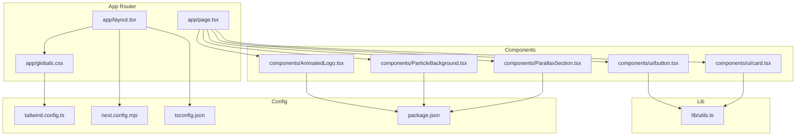
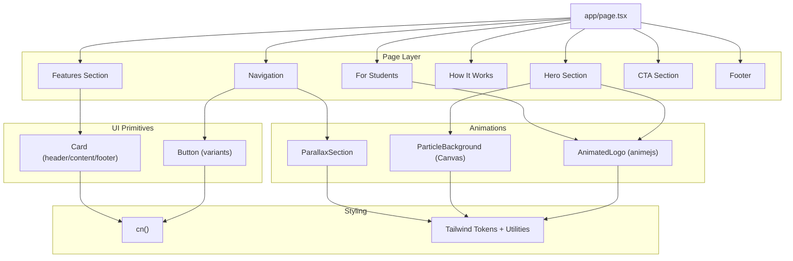
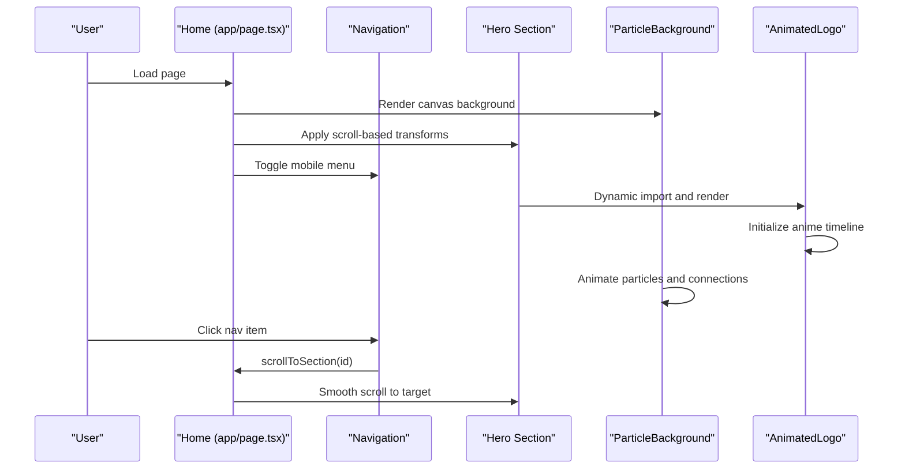
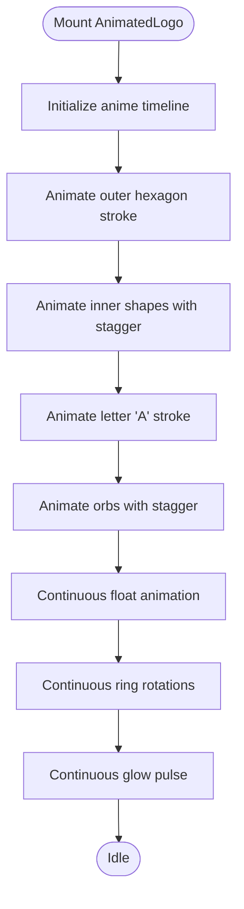
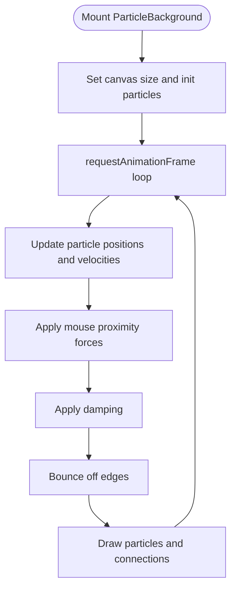
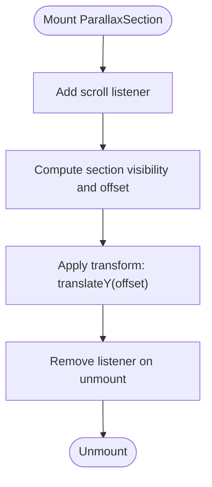
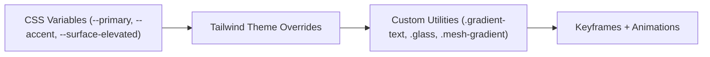
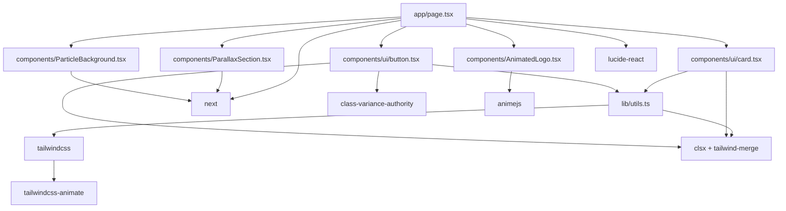

# Architecture Overview

<cite>
**Referenced Files in This Document**
- [app/layout.tsx](file://app/layout.tsx)
- [app/page.tsx](file://app/page.tsx)
- [app/globals.css](file://app/globals.css)
- [components/AnimatedLogo.tsx](file://components/AnimatedLogo.tsx)
- [components/ParallaxSection.tsx](file://components/ParallaxSection.tsx)
- [components/ParticleBackground.tsx](file://components/ParticleBackground.tsx)
- [components/ui/button.tsx](file://components/ui/button.tsx)
- [components/ui/card.tsx](file://components/ui/card.tsx)
- [lib/utils.ts](file://lib/utils.ts)
- [tailwind.config.ts](file://tailwind.config.ts)
- [next.config.mjs](file://next.config.mjs)
- [tsconfig.json](file://tsconfig.json)
- [package.json](file://package.json)
</cite>

## Table of Contents
1. [Introduction](#introduction)
2. [Project Structure](#project-structure)
3. [Core Components](#core-components)
4. [Architecture Overview](#architecture-overview)
5. [Detailed Component Analysis](#detailed-component-analysis)
6. [Dependency Analysis](#dependency-analysis)
7. [Performance Considerations](#performance-considerations)
8. [Troubleshooting Guide](#troubleshooting-guide)
9. [Conclusion](#conclusion)

## Introduction
This document describes the frontend architecture of AlterLabs built with Next.js 14 App Router. It focuses on the component-based structure, design patterns, animation system integration, performance optimizations, and responsive design approach. The project emphasizes a modern, visually rich educational landing page with animated UI elements, interactive backgrounds, and a cohesive design system powered by Tailwind CSS and custom utilities.

## Project Structure
The project follows a clean, modular structure aligned with Next.js 14 App Router conventions:
- app/: Route handlers and shared layout for the application
- components/: Reusable UI components and animations
- lib/: Utility functions for class composition and Tailwind integration
- Tailwind CSS configuration and global styles define the design system and animations



**Diagram sources**
- [app/layout.tsx](file://app/layout.tsx#L1-L29)
- [app/page.tsx](file://app/page.tsx#L1-L501)
- [app/globals.css](file://app/globals.css#L1-L252)
- [components/ui/button.tsx](file://components/ui/button.tsx#L1-L57)
- [components/ui/card.tsx](file://components/ui/card.tsx#L1-L79)
- [components/AnimatedLogo.tsx](file://components/AnimatedLogo.tsx#L1-L243)
- [components/ParallaxSection.tsx](file://components/ParallaxSection.tsx#L1-L43)
- [components/ParticleBackground.tsx](file://components/ParticleBackground.tsx#L1-L151)
- [lib/utils.ts](file://lib/utils.ts#L1-L7)
- [tailwind.config.ts](file://tailwind.config.ts#L1-L108)
- [next.config.mjs](file://next.config.mjs#L1-L7)
- [tsconfig.json](file://tsconfig.json#L1-L42)
- [package.json](file://package.json#L1-L33)

**Section sources**
- [app/layout.tsx](file://app/layout.tsx#L1-L29)
- [app/page.tsx](file://app/page.tsx#L1-L501)
- [app/globals.css](file://app/globals.css#L1-L252)
- [tailwind.config.ts](file://tailwind.config.ts#L1-L108)
- [next.config.mjs](file://next.config.mjs#L1-L7)
- [tsconfig.json](file://tsconfig.json#L1-L42)
- [package.json](file://package.json#L1-L33)

## Core Components
- Root layout and metadata: Defines the application’s metadata and root HTML wrapper.
- Page component: Implements the main marketing page with navigation, hero, features, process, student-focused section, CTA, and footer.
- UI primitives: Button and Card components with variant-driven styling and consistent props.
- Animation and background components: AnimatedLogo (animejs), ParticleBackground (Canvas), and ParallaxSection (scroll-driven motion).
- Utilities: cn function for merging Tailwind classes safely.

Key architectural decisions:
- Functional components with hooks for state and effects.
- Client directive on components requiring browser APIs.
- Dynamic imports for client-only components to reduce server bundle size.
- Tailwind CSS for atomic styling and custom utilities for gradients, glows, and animations.
- Anime.js for precise, performant SVG animations.

**Section sources**
- [app/layout.tsx](file://app/layout.tsx#L1-L29)
- [app/page.tsx](file://app/page.tsx#L1-L501)
- [components/ui/button.tsx](file://components/ui/button.tsx#L1-L57)
- [components/ui/card.tsx](file://components/ui/card.tsx#L1-L79)
- [components/AnimatedLogo.tsx](file://components/AnimatedLogo.tsx#L1-L243)
- [components/ParticleBackground.tsx](file://components/ParticleBackground.tsx#L1-L151)
- [components/ParallaxSection.tsx](file://components/ParallaxSection.tsx#L1-L43)
- [lib/utils.ts](file://lib/utils.ts#L1-L7)

## Architecture Overview
The architecture centers on a single-page marketing site rendered by Next.js App Router. The page composes reusable UI components and specialized animation/background components. Styling is driven by Tailwind CSS with custom tokens and animations. The design system is consistent across components via shared utilities and variants.



**Diagram sources**
- [app/page.tsx](file://app/page.tsx#L1-L501)
- [components/ui/button.tsx](file://components/ui/button.tsx#L1-L57)
- [components/ui/card.tsx](file://components/ui/card.tsx#L1-L79)
- [components/AnimatedLogo.tsx](file://components/AnimatedLogo.tsx#L1-L243)
- [components/ParticleBackground.tsx](file://components/ParticleBackground.tsx#L1-L151)
- [components/ParallaxSection.tsx](file://components/ParallaxSection.tsx#L1-L43)
- [lib/utils.ts](file://lib/utils.ts#L1-L7)
- [app/globals.css](file://app/globals.css#L1-L252)

## Detailed Component Analysis

### Page Component (Marketing Site)
The page orchestrates the entire user experience:
- Navigation with mobile menu toggle and smooth scrolling.
- Hero section with animated background elements and parallax offsets.
- Feature cards with hover effects.
- Step-by-step process with decorative arrows.
- Student-focused section with animated rings and floating stats.
- Call-to-action with gradient and glow variants.
- Footer with grid layout and links.



**Diagram sources**
- [app/page.tsx](file://app/page.tsx#L1-L501)
- [components/ParticleBackground.tsx](file://components/ParticleBackground.tsx#L1-L151)
- [components/AnimatedLogo.tsx](file://components/AnimatedLogo.tsx#L1-L243)

**Section sources**
- [app/page.tsx](file://app/page.tsx#L1-L501)

### UI Primitives: Button and Card
- Button: Uses class-variance-authority for variant-driven styling and integrates with cn for safe class merging. Supports multiple sizes and variants (default, glow, glass, outline, etc.).
- Card: Provides header, title, description, content, and footer slots with consistent spacing and transitions.

```mermaid
classDiagram
class Button {
+variant : "default|glow|glass|outline|secondary|ghost|link"
+size : "default|sm|lg|xl|icon"
+className : string
+asChild : boolean
}
class Card {
+className : string
}
class CardHeader {
+className : string
}
class CardTitle {
+className : string
}
class CardDescription {
+className : string
}
class CardContent {
+className : string
}
class CardFooter {
+className : string
}
Button --> Utils as "cn()"
Card --> Utils as "cn()"
Card --> CardHeader
Card --> CardTitle
Card --> CardDescription
Card --> CardContent
Card --> CardFooter
```

**Diagram sources**
- [components/ui/button.tsx](file://components/ui/button.tsx#L1-L57)
- [components/ui/card.tsx](file://components/ui/card.tsx#L1-L79)
- [lib/utils.ts](file://lib/utils.ts#L1-L7)

**Section sources**
- [components/ui/button.tsx](file://components/ui/button.tsx#L1-L57)
- [components/ui/card.tsx](file://components/ui/card.tsx#L1-L79)
- [lib/utils.ts](file://lib/utils.ts#L1-L7)

### Animation System: AnimatedLogo (animejs)
- Client-only component that initializes an anime timeline to animate SVG elements.
- Staggered inner shapes, pulsating glow, rotating rings, and continuous floating orbs.
- Uses refs to manage DOM elements and a single initialization guard.



**Diagram sources**
- [components/AnimatedLogo.tsx](file://components/AnimatedLogo.tsx#L1-L243)

**Section sources**
- [components/AnimatedLogo.tsx](file://components/AnimatedLogo.tsx#L1-L243)

### Background Animation: ParticleBackground (Canvas)
- Manages a canvas with dynamically generated particles.
- Implements mouse interaction, damping, edge bouncing, and particle connections.
- Uses requestAnimationFrame for smooth animation loop.



**Diagram sources**
- [components/ParticleBackground.tsx](file://components/ParticleBackground.tsx#L1-L151)

**Section sources**
- [components/ParticleBackground.tsx](file://components/ParticleBackground.tsx#L1-L151)

### Scroll-Driven Motion: ParallaxSection
- Computes parallax offset based on scroll position and section visibility.
- Applies transform to create depth with configurable speed.



**Diagram sources**
- [components/ParallaxSection.tsx](file://components/ParallaxSection.tsx#L1-L43)

**Section sources**
- [components/ParallaxSection.tsx](file://components/ParallaxSection.tsx#L1-L43)

### Design System and Theming
- Tailwind CSS with custom tokens for a dark theme and electric cyan/violet accents.
- Custom utilities for gradients, glows, glass effects, mesh gradients, geometric patterns, and animations.
- Global CSS defines base tokens and layer utilities.



**Diagram sources**
- [app/globals.css](file://app/globals.css#L1-L252)
- [tailwind.config.ts](file://tailwind.config.ts#L1-L108)

**Section sources**
- [app/globals.css](file://app/globals.css#L1-L252)
- [tailwind.config.ts](file://tailwind.config.ts#L1-L108)

## Dependency Analysis
External libraries and integrations:
- Next.js 14 App Router runtime and dynamic imports.
- Tailwind CSS with tailwindcss-animate plugin for animation utilities.
- class-variance-authority, clsx, tailwind-merge for variant-driven class composition.
- lucide-react for UI icons.
- animejs for precise SVG animations.



**Diagram sources**
- [app/page.tsx](file://app/page.tsx#L1-L501)
- [components/AnimatedLogo.tsx](file://components/AnimatedLogo.tsx#L1-L243)
- [components/ParticleBackground.tsx](file://components/ParticleBackground.tsx#L1-L151)
- [components/ParallaxSection.tsx](file://components/ParallaxSection.tsx#L1-L43)
- [components/ui/button.tsx](file://components/ui/button.tsx#L1-L57)
- [components/ui/card.tsx](file://components/ui/card.tsx#L1-L79)
- [lib/utils.ts](file://lib/utils.ts#L1-L7)
- [package.json](file://package.json#L1-L33)

**Section sources**
- [package.json](file://package.json#L1-L33)

## Performance Considerations
- Client-only components: Dynamic imports prevent SSR overhead for browser-only features (AnimatedLogo, ParticleBackground).
- Passive scroll listeners: Reduces layout thrashing during scroll handling.
- requestAnimationFrame: Ensures smooth animation loops for Canvas and scroll-driven effects.
- Tailwind utilities: Atomic classes minimize CSS payload while enabling rapid prototyping.
- Minimal state updates: Local state is scoped to components that require it (navigation, scroll).
- CSS transforms: Prefer transform-based animations for GPU acceleration.

[No sources needed since this section provides general guidance]

## Troubleshooting Guide
- Canvas not rendering: Verify canvas context availability and ensure component mounts before drawing.
- Scroll events lagging: Confirm passive event listeners and throttle heavy computations inside scroll handlers.
- Animejs not animating: Ensure client directive and that timeline runs only once using a ref guard.
- Tailwind utilities missing: Confirm content paths in Tailwind config include components and app directories.

**Section sources**
- [components/ParticleBackground.tsx](file://components/ParticleBackground.tsx#L1-L151)
- [components/ParallaxSection.tsx](file://components/ParallaxSection.tsx#L1-L43)
- [components/AnimatedLogo.tsx](file://components/AnimatedLogo.tsx#L1-L243)
- [tailwind.config.ts](file://tailwind.config.ts#L1-L108)

## Conclusion
AlterLabs employs a clean, component-driven architecture with Next.js 14 App Router. The design system is unified through Tailwind CSS and custom utilities, while specialized components deliver rich animations and interactions. The integration of animejs, Canvas-based particle systems, and scroll-driven parallax enhances the user experience without compromising performance. The modular structure supports maintainability and scalability for future enhancements.