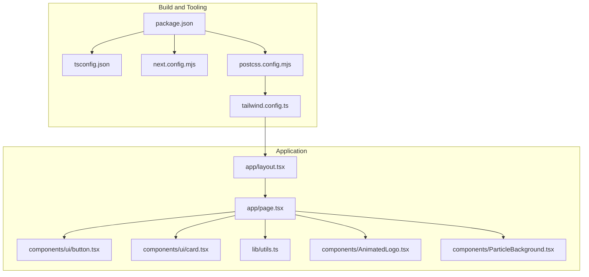
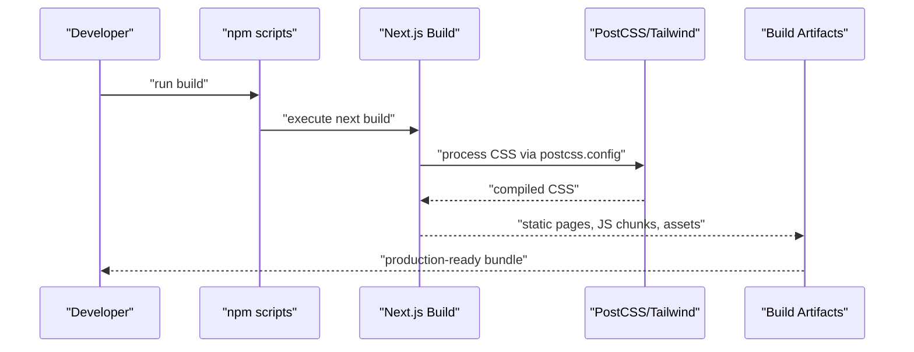
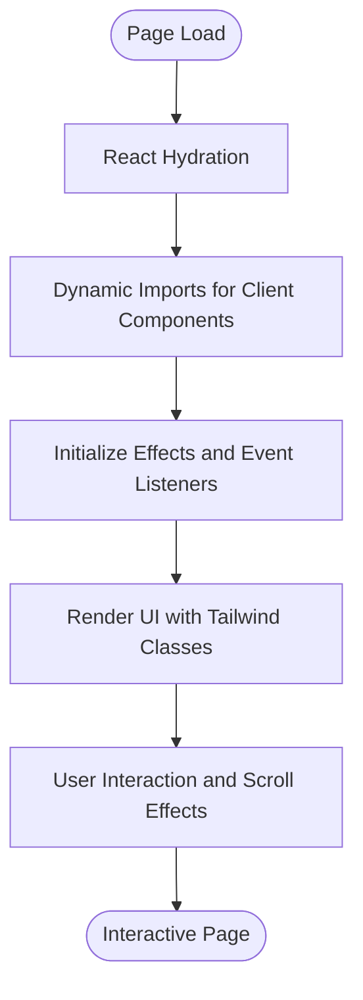
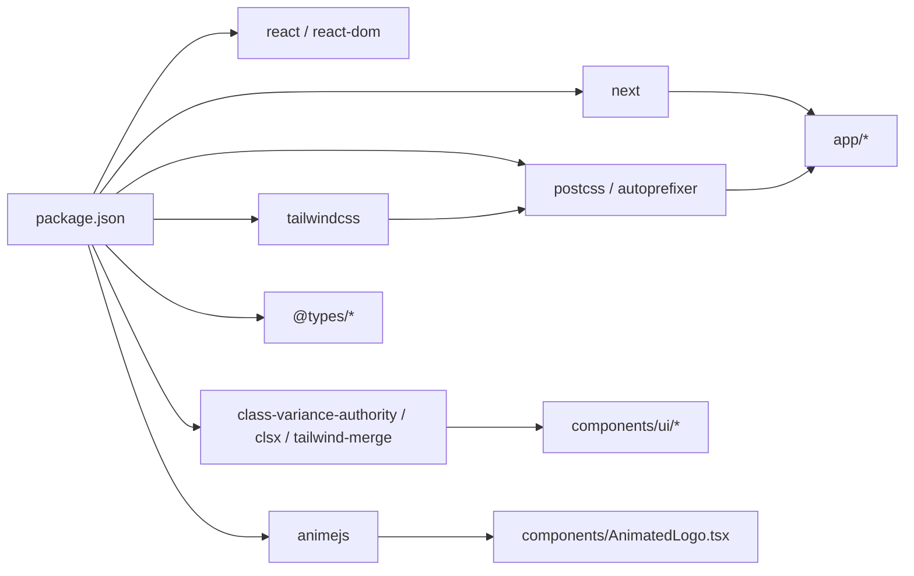

# Deployment and Build Process

<cite>
**Referenced Files in This Document**
- [next.config.mjs](file://next.config.mjs)
- [package.json](file://package.json)
- [tailwind.config.ts](file://tailwind.config.ts)
- [postcss.config.mjs](file://postcss.config.mjs)
- [tsconfig.json](file://tsconfig.json)
- [app/layout.tsx](file://app/layout.tsx)
- [app/page.tsx](file://app/page.tsx)
- [components/AnimatedLogo.tsx](file://components/AnimatedLogo.tsx)
- [components/ParticleBackground.tsx](file://components/ParticleBackground.tsx)
- [components/ui/button.tsx](file://components/ui/button.tsx)
- [components/ui/card.tsx](file://components/ui/card.tsx)
- [lib/utils.ts](file://lib/utils.ts)
- [next-env.d.ts](file://next-env.d.ts)
</cite>

## Table of Contents
1. [Introduction](#introduction)
2. [Project Structure](#project-structure)
3. [Core Components](#core-components)
4. [Architecture Overview](#architecture-overview)
5. [Detailed Component Analysis](#detailed-component-analysis)
6. [Dependency Analysis](#dependency-analysis)
7. [Performance Considerations](#performance-considerations)
8. [Troubleshooting Guide](#troubleshooting-guide)
9. [Conclusion](#conclusion)
10. [Appendices](#appendices)

## Introduction
This document explains the AlterLabs deployment and build process for a Next.js application. It covers build configuration, environment variables setup, deployment strategies, build optimization, static generation capabilities, production deployment options, CI/CD guidance, environment configuration management, performance monitoring, build artifacts, asset optimization, and troubleshooting procedures. It also provides examples for different hosting platforms and deployment scenarios.

## Project Structure
The project follows a conventional Next.js App Router structure with TypeScript, Tailwind CSS, and PostCSS. Key configuration files define build behavior, styling, and type safety. Application pages and components leverage client-side rendering and dynamic imports for interactive elements.

**Diagram sources**
- [package.json](file://package.json#L1-L33)
- [tsconfig.json](file://tsconfig.json#L1-L42)
- [next.config.mjs](file://next.config.mjs#L1-L7)
- [postcss.config.mjs](file://postcss.config.mjs#L1-L10)
- [tailwind.config.ts](file://tailwind.config.ts#L1-L108)
- [app/layout.tsx](file://app/layout.tsx#L1-L29)
- [app/page.tsx](file://app/page.tsx#L1-L501)
- [components/ui/button.tsx](file://components/ui/button.tsx#L1-L57)
- [components/ui/card.tsx](file://components/ui/card.tsx#L1-L79)
- [lib/utils.ts](file://lib/utils.ts#L1-L7)
- [components/AnimatedLogo.tsx](file://components/AnimatedLogo.tsx#L1-L243)
- [components/ParticleBackground.tsx](file://components/ParticleBackground.tsx#L1-L151)

**Section sources**
- [package.json](file://package.json#L1-L33)
- [tsconfig.json](file://tsconfig.json#L1-L42)
- [next.config.mjs](file://next.config.mjs#L1-L7)
- [postcss.config.mjs](file://postcss.config.mjs#L1-L10)
- [tailwind.config.ts](file://tailwind.config.ts#L1-L108)
- [app/layout.tsx](file://app/layout.tsx#L1-L29)
- [app/page.tsx](file://app/page.tsx#L1-L501)

## Core Components
- Build scripts and runtime commands are defined in the package manifest for development, production build, and server start.
- Next.js configuration enables strict mode and minimal customization.
- Tailwind CSS is configured with content paths, dark mode, custom animations, gradients, and a plugin for enhanced motion effects.
- PostCSS composes Tailwind and Autoprefixer for CSS processing.
- TypeScript configuration enforces strictness, bundler module resolution, and path aliases.
- Application layout defines metadata and global font loading.
- The home page uses client directives, dynamic imports for SSR-disabled components, and interactive UI elements.

**Section sources**
- [package.json](file://package.json#L5-L10)
- [next.config.mjs](file://next.config.mjs#L2-L4)
- [tailwind.config.ts](file://tailwind.config.ts#L3-L105)
- [postcss.config.mjs](file://postcss.config.mjs#L2-L6)
- [tsconfig.json](file://tsconfig.json#L2-L29)
- [app/layout.tsx](file://app/layout.tsx#L7-L16)
- [app/page.tsx](file://app/page.tsx#L22-L28)

## Architecture Overview
The build pipeline transforms TypeScript sources into optimized JavaScript assets, processes CSS with Tailwind and PostCSS, and bundles the application for Next.js runtime. Client-side components rely on dynamic imports to defer heavy libraries until after hydration.

**Diagram sources**
- [package.json](file://package.json#L5-L10)
- [postcss.config.mjs](file://postcss.config.mjs#L1-L10)
- [tailwind.config.ts](file://tailwind.config.ts#L1-L108)

## Detailed Component Analysis

### Next.js Build Configuration
- Strict mode is enabled to catch potential issues during builds and development.
- The configuration is minimal, allowing Next.js defaults for output traces, experimental features, and asset optimization.

**Section sources**
- [next.config.mjs](file://next.config.mjs#L2-L4)

### TypeScript Configuration
- Enforces strict type checking and emits no standalone JavaScript.
- Uses bundler module resolution for modern ESM workflows.
- Includes path alias @/* mapped to the repository root for concise imports.
- Integrates Next.js TypeScript plugins for app directory support.

**Section sources**
- [tsconfig.json](file://tsconfig.json#L2-L29)

### Tailwind CSS Setup
- Dark mode uses class strategy.
- Content scanning includes pages, components, app, and src directories.
- Extends theme with custom colors, radii, fonts, keyframes, animations, gradients, and background patterns.
- Adds a motion plugin for enhanced animations.

**Section sources**
- [tailwind.config.ts](file://tailwind.config.ts#L3-L105)

### PostCSS Pipeline
- Composes Tailwind and Autoprefixer for vendor prefixing and purging.
- Ensures compatibility across browsers and reduces CSS payload.

**Section sources**
- [postcss.config.mjs](file://postcss.config.mjs#L2-L6)

### Application Layout and Metadata
- Defines site metadata and Open Graph properties for SEO and social sharing.
- Loads Inter font for global typography.

**Section sources**
- [app/layout.tsx](file://app/layout.tsx#L7-L16)

### Home Page and Client-Side Rendering
- Uses client directive for interactivity.
- Dynamically imports animated components to disable SSR and reduce server load.
- Implements scroll-aware effects, smooth navigation, and responsive layouts.

**Diagram sources**
- [app/page.tsx](file://app/page.tsx#L22-L47)
- [components/AnimatedLogo.tsx](file://components/AnimatedLogo.tsx#L1-L243)
- [components/ParticleBackground.tsx](file://components/ParticleBackground.tsx#L1-L151)

**Section sources**
- [app/page.tsx](file://app/page.tsx#L22-L47)

### UI Components and Utilities
- Button and Card components use variant systems and class merging utilities.
- Utility function merges Tailwind classes safely, reducing duplication and errors.

**Section sources**
- [components/ui/button.tsx](file://components/ui/button.tsx#L5-L35)
- [components/ui/card.tsx](file://components/ui/card.tsx#L4-L16)
- [lib/utils.ts](file://lib/utils.ts#L4-L6)

### Asset and Animation Components
- AnimatedLogo leverages a third-party animation library and SVG graphics with timelines and continuous motions.
- ParticleBackground renders a canvas-based particle system with mouse interaction and connection lines.

**Section sources**
- [components/AnimatedLogo.tsx](file://components/AnimatedLogo.tsx#L11-L96)
- [components/ParticleBackground.tsx](file://components/ParticleBackground.tsx#L27-L104)

## Dependency Analysis
The project’s build and runtime dependencies are declared in the package manifest. The TypeScript compiler options integrate with Next.js, while Tailwind and PostCSS form the styling pipeline. The application imports UI primitives and utility helpers.

**Diagram sources**
- [package.json](file://package.json#L11-L31)
- [postcss.config.mjs](file://postcss.config.mjs#L2-L6)
- [tailwind.config.ts](file://tailwind.config.ts#L104-L104)
- [app/page.tsx](file://app/page.tsx#L22-L28)
- [components/AnimatedLogo.tsx](file://components/AnimatedLogo.tsx#L4-L4)

**Section sources**
- [package.json](file://package.json#L11-L31)

## Performance Considerations
- Client-side heavy components are dynamically imported to avoid SSR overhead and reduce initial server bundle size.
- Tailwind’s content scanning ensures unused styles are removed in production builds.
- Canvas-based particle system is scoped to client rendering and cleaned up on unmount.
- Strict TypeScript configuration helps prevent runtime errors and improves build reliability.
- Next.js default optimizations apply, including automatic code splitting and static export readiness.

[No sources needed since this section provides general guidance]

## Troubleshooting Guide
- Missing type routes after build: Ensure Next.js TypeScript plugin is active and dev types are generated.
- Tailwind classes not applied: Verify content paths in Tailwind configuration and rebuild.
- Dynamic imports failing in SSR: Confirm client directive usage and SSR opt-outs for client-only components.
- Canvas or animation issues: Validate browser support and event listener cleanup on component unmount.
- PostCSS/Tailwind pipeline errors: Re-check PostCSS configuration and plugin versions.

**Section sources**
- [next-env.d.ts](file://next-env.d.ts#L1-L7)
- [tailwind.config.ts](file://tailwind.config.ts#L5-L10)
- [app/page.tsx](file://app/page.tsx#L22-L28)
- [components/ParticleBackground.tsx](file://components/ParticleBackground.tsx#L134-L141)
- [postcss.config.mjs](file://postcss.config.mjs#L2-L6)

## Conclusion
AlterLabs leverages a clean Next.js configuration with Tailwind CSS and PostCSS for a modern, performant frontend. Client-side dynamic imports and strict TypeScript settings contribute to a robust build and runtime experience. The guidance herein supports local development, CI/CD automation, environment management, and production deployments across common platforms.

[No sources needed since this section summarizes without analyzing specific files]

## Appendices

### Build Scripts Reference
- Development server: runs the Next.js dev server.
- Production build: compiles the application for production.
- Production start: serves the compiled application.
- Lint: runs type checking and linting.

**Section sources**
- [package.json](file://package.json#L5-L10)

### Environment Variables Setup
- Define environment variables in your hosting provider’s dashboard or CI secrets.
- Use a .env.local file for local development and ensure it is excluded from version control.
- For CI/CD, pass variables at build time and ensure they are available during next build and start.

[No sources needed since this section provides general guidance]

### Static Generation and ISR
- Pages render server-side by default; enable static generation or incremental static regeneration as needed.
- For ISR, configure revalidation intervals per page route.
- Optimize images using Next.js Image component and consider image optimization settings.

[No sources needed since this section provides general guidance]

### Production Deployment Options
- Vercel: Recommended for seamless Next.js deployments with automatic static generation and ISR.
- Netlify: Supports static exports and serverless functions; configure build command and publish directory.
- GitHub Pages: Suitable for fully static sites; export static pages and host under gh-pages branch.
- AWS Amplify: Configure build settings and environment variables for serverless deployments.
- Azure Static Web Apps: Ideal for static exports with backend API routing.

[No sources needed since this section provides general guidance]

### CI/CD Pipeline Guidance
- Install dependencies and run linting.
- Execute the production build script.
- Upload build artifacts to your hosting provider.
- Configure environment variables per environment (staging/production).
- Add caching for node_modules and Next.js build cache to speed up pipelines.

[No sources needed since this section provides general guidance]

### Performance Monitoring in Production
- Use built-in metrics from your hosting provider.
- Add external monitoring for Core Web Vitals and error tracking.
- Monitor bundle sizes and asset delivery using CDN analytics.
- Track user interactions for client-side components to identify bottlenecks.

[No sources needed since this section provides general guidance]

### Build Artifacts and Asset Optimization
- Build artifacts include static pages, JavaScript chunks, and optimized assets.
- Tailwind purges unused CSS in production.
- Next.js automatically optimizes images and code-splitting.
- Ensure image optimization settings align with your hosting provider’s capabilities.

[No sources needed since this section provides general guidance]