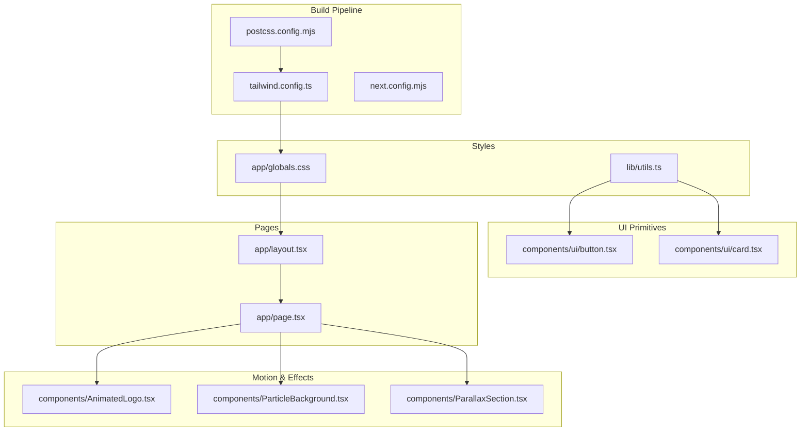
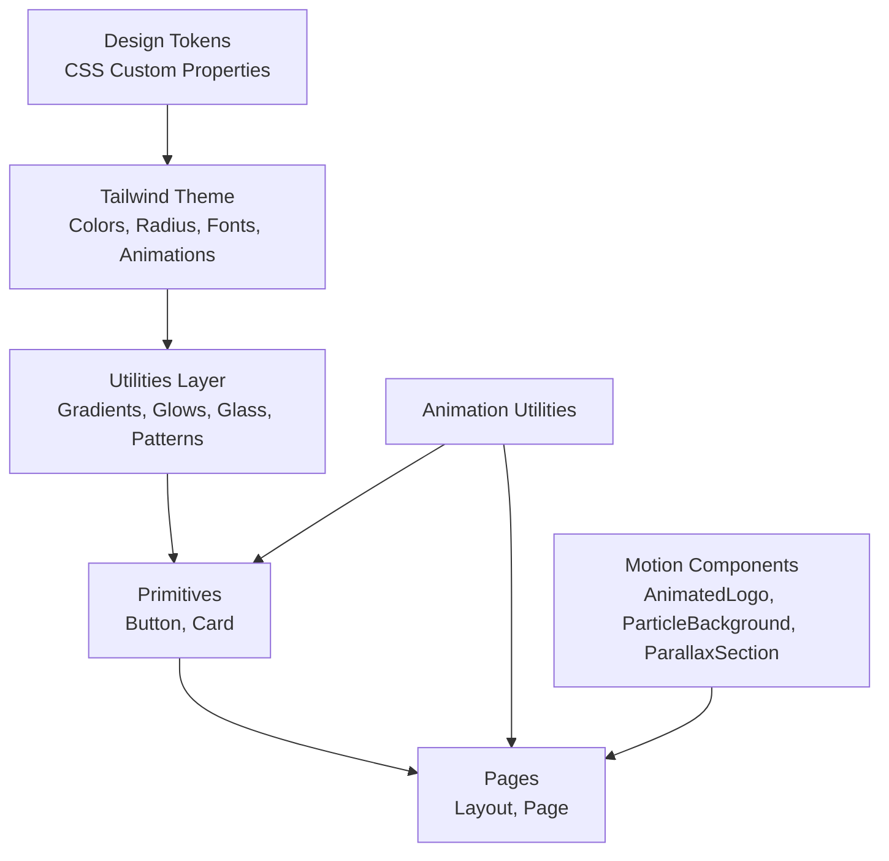
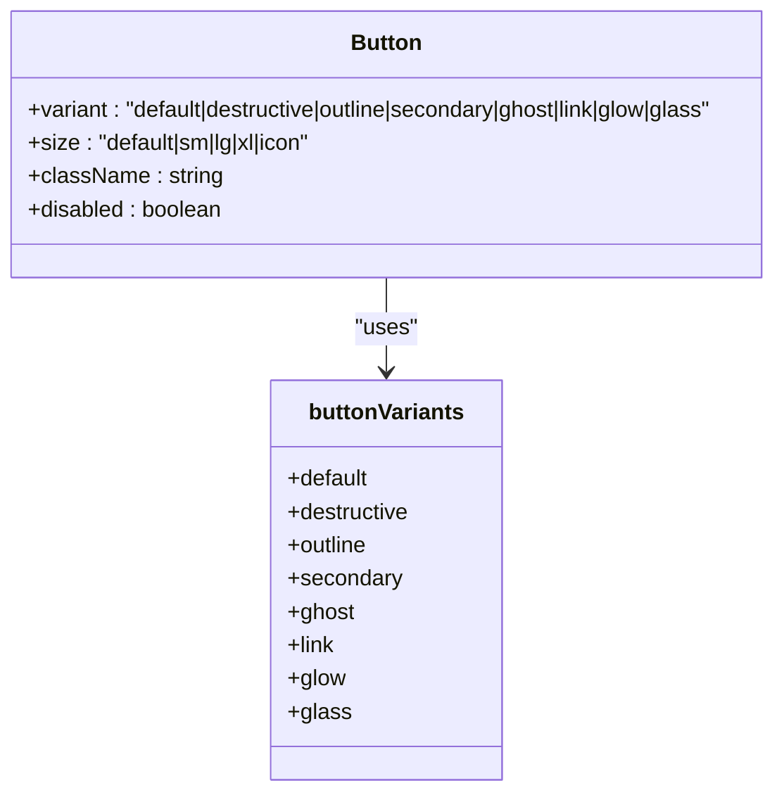
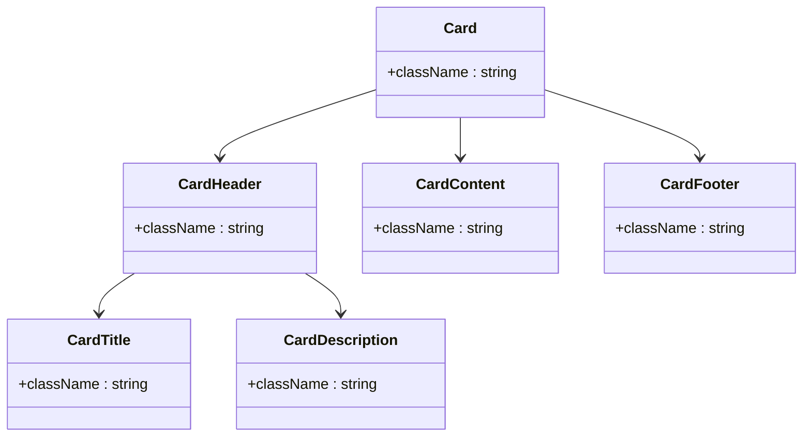
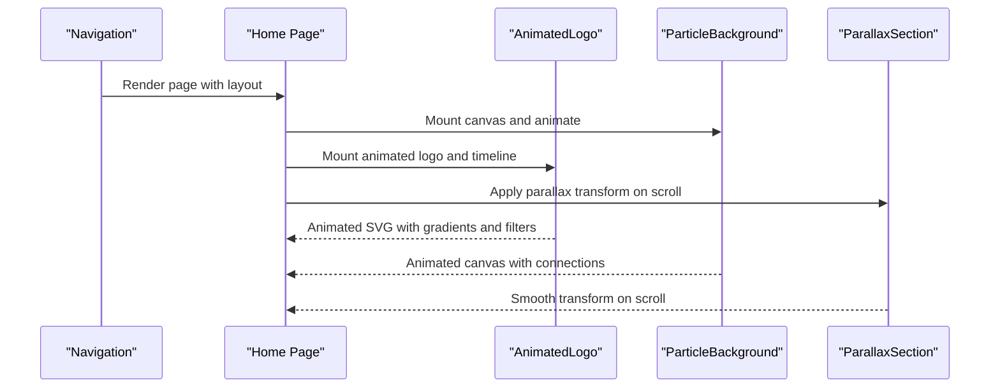
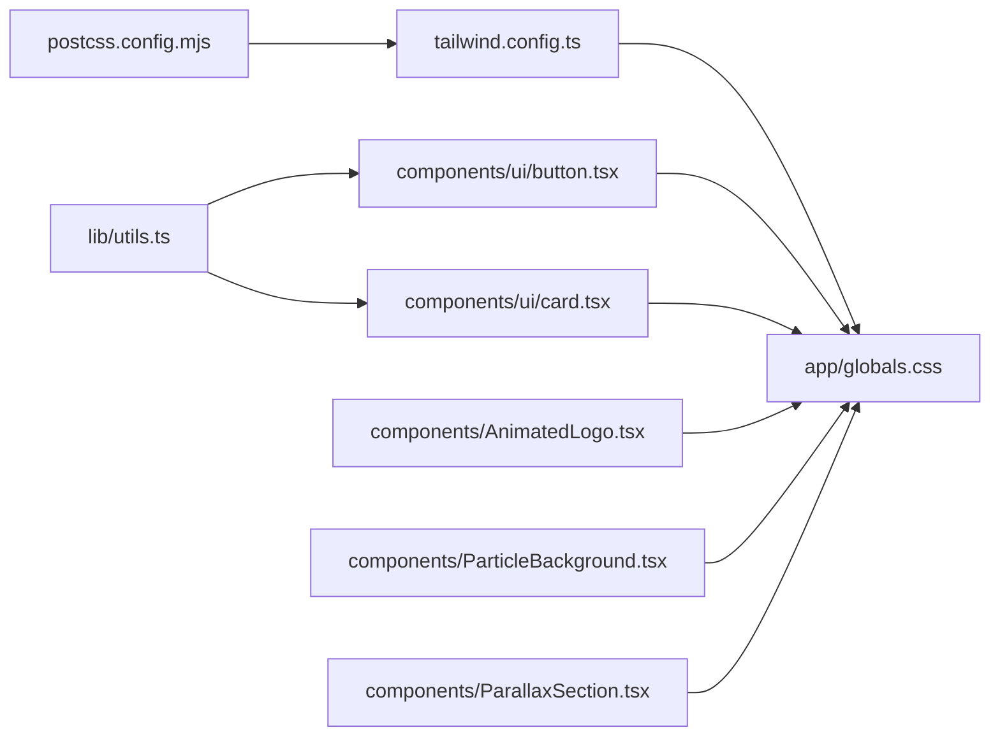

# Design System

<cite>
**Referenced Files in This Document**
- [tailwind.config.ts](file://tailwind.config.ts)
- [app/globals.css](file://app/globals.css)
- [postcss.config.mjs](file://postcss.config.mjs)
- [package.json](file://package.json)
- [lib/utils.ts](file://lib/utils.ts)
- [components/ui/button.tsx](file://components/ui/button.tsx)
- [components/ui/card.tsx](file://components/ui/card.tsx)
- [components/AnimatedLogo.tsx](file://components/AnimatedLogo.tsx)
- [components/ParticleBackground.tsx](file://components/ParticleBackground.tsx)
- [components/ParallaxSection.tsx](file://components/ParallaxSection.tsx)
- [app/layout.tsx](file://app/layout.tsx)
- [app/page.tsx](file://app/page.tsx)
</cite>

## Table of Contents
1. [Introduction](#introduction)
2. [Project Structure](#project-structure)
3. [Core Components](#core-components)
4. [Architecture Overview](#architecture-overview)
5. [Detailed Component Analysis](#detailed-component-analysis)
6. [Dependency Analysis](#dependency-analysis)
7. [Performance Considerations](#performance-considerations)
8. [Troubleshooting Guide](#troubleshooting-guide)
9. [Conclusion](#conclusion)
10. [Appendices](#appendices)

## Introduction
This document describes the AlterLabs design system built with Next.js, Tailwind CSS, and PostCSS. It covers the Tailwind configuration, custom color palette, typography system, spacing scale, glass morphism design language, gradient effects, responsive design, and motion design. It also provides guidelines for maintaining design consistency, theming components, extending the design system, and using CSS custom properties and animation utilities effectively.

## Project Structure
The design system is organized around a modern Next.js application with a dedicated Tailwind configuration and global CSS layering. Key areas:
- Tailwind configuration defines design tokens, animations, gradients, and plugin integrations.
- Global CSS establishes the dark theme and exposes CSS custom properties for design tokens.
- UI primitives (Button, Card) encapsulate consistent styles and variants.
- Motion utilities and components implement glass morphism, gradients, and parallax effects.

**Diagram sources**
- [postcss.config.mjs](file://postcss.config.mjs#L1-L10)
- [tailwind.config.ts](file://tailwind.config.ts#L1-L108)
- [app/globals.css](file://app/globals.css#L1-L252)
- [lib/utils.ts](file://lib/utils.ts#L1-L7)
- [components/ui/button.tsx](file://components/ui/button.tsx#L1-L57)
- [components/ui/card.tsx](file://components/ui/card.tsx#L1-L79)
- [components/AnimatedLogo.tsx](file://components/AnimatedLogo.tsx#L1-L243)
- [components/ParticleBackground.tsx](file://components/ParticleBackground.tsx#L1-L151)
- [components/ParallaxSection.tsx](file://components/ParallaxSection.tsx#L1-L43)
- [app/layout.tsx](file://app/layout.tsx#L1-L29)
- [app/page.tsx](file://app/page.tsx#L1-L501)

**Section sources**
- [postcss.config.mjs](file://postcss.config.mjs#L1-L10)
- [tailwind.config.ts](file://tailwind.config.ts#L1-L108)
- [app/globals.css](file://app/globals.css#L1-L252)
- [lib/utils.ts](file://lib/utils.ts#L1-L7)
- [components/ui/button.tsx](file://components/ui/button.tsx#L1-L57)
- [components/ui/card.tsx](file://components/ui/card.tsx#L1-L79)
- [components/AnimatedLogo.tsx](file://components/AnimatedLogo.tsx#L1-L243)
- [components/ParticleBackground.tsx](file://components/ParticleBackground.tsx#L1-L151)
- [components/ParallaxSection.tsx](file://components/ParallaxSection.tsx#L1-L43)
- [app/layout.tsx](file://app/layout.tsx#L1-L29)
- [app/page.tsx](file://app/page.tsx#L1-L501)

## Core Components
- Tailwind configuration: Defines dark mode, content scanning paths, container sizing, custom colors, border radius tokens, fonts, keyframes, animations, and background images.
- Global CSS: Establishes the dark theme with CSS custom properties, base layer styles, and utility classes for gradients, glows, glass, mesh backgrounds, noise overlays, animations, parallax layers, geometric patterns, and hover effects.
- Utilities: A centralized cn function merges Tailwind classes safely.
- UI primitives: Button and Card components expose consistent variants and sizes, leveraging design tokens and motion utilities.

**Section sources**
- [tailwind.config.ts](file://tailwind.config.ts#L1-L108)
- [app/globals.css](file://app/globals.css#L1-L252)
- [lib/utils.ts](file://lib/utils.ts#L1-L7)
- [components/ui/button.tsx](file://components/ui/button.tsx#L1-L57)
- [components/ui/card.tsx](file://components/ui/card.tsx#L1-L79)

## Architecture Overview
The design system architecture integrates Tailwind’s JIT engine with PostCSS and Next.js. CSS custom properties define the theme tokens, which are consumed by Tailwind’s color palette and utilities. Motion utilities and components implement advanced visual effects while maintaining performance.

**Diagram sources**
- [app/globals.css](file://app/globals.css#L5-L45)
- [tailwind.config.ts](file://tailwind.config.ts#L20-L102)
- [components/ui/button.tsx](file://components/ui/button.tsx#L5-L35)
- [components/ui/card.tsx](file://components/ui/card.tsx#L1-L79)
- [app/page.tsx](file://app/page.tsx#L103-L185)

## Detailed Component Analysis

### Tailwind Configuration
- Dark mode: Controlled via a class strategy for seamless theme switching.
- Content scanning: Scans pages, components, app, and src directories to purge unused styles.
- Container: Centered containers with padding and a max-width for larger screens.
- Colors: Uses HSL values via CSS variables for dynamic theming and light/dark variants.
- Border radius: Exposes a radius token mapped to Tailwind’s border radius scale.
- Typography: Sets Inter as the default sans font family.
- Animations: Provides keyframes and animation utilities for accordion, fade-in, scale-in, plus custom motion utilities.
- Background images: Radial gradient and grid pattern utilities.
- Plugins: Integrates tailwindcss-animate for enhanced animation support.

**Section sources**
- [tailwind.config.ts](file://tailwind.config.ts#L3-L108)

### Global CSS and Design Tokens
- Base layer: Applies border, smooth scrolling, and font feature settings.
- CSS custom properties: Define the dark theme palette, including background, foreground, primary/accent/secondary palettes, borders, input, ring, and radius.
- Utilities:
  - Gradient utilities: Primary, text gradient, and bordered gradient.
  - Glow effects: Primary/accent glows and text glow.
  - Glass morphism: Standard and strong glass with backdrop blur and semi-transparent borders.
  - Mesh gradient background: Radial gradient composition for ambient visuals.
  - Noise texture overlay: Subtle SVG noise overlay.
  - Animation utilities: Float, pulse glow, gradient shift, slow spin, orbit, shimmer, and breathe.
  - Parallax layers: Perspective and layered transforms.
  - Geometric patterns: Dual gradient pattern tiles.
  - Hover lift: Elevated card hover effect.

**Section sources**
- [app/globals.css](file://app/globals.css#L5-L252)

### Button Component
- Variants: default, destructive, outline, secondary, ghost, link, glow, glass.
- Sizes: default, sm, lg, xl, icon.
- Motion: Hover effects include glow, scaling, and elevation.
- Theming: Leverages design tokens for colors, borders, and shadows.

**Diagram sources**
- [components/ui/button.tsx](file://components/ui/button.tsx#L5-L35)

**Section sources**
- [components/ui/button.tsx](file://components/ui/button.tsx#L1-L57)

### Card Component
- Composition: Card, CardHeader, CardTitle, CardDescription, CardContent, CardFooter.
- Motion: Transition and duration for smooth state changes.
- Theming: Inherits background, foreground, and border tokens.

**Diagram sources**
- [components/ui/card.tsx](file://components/ui/card.tsx#L4-L78)

**Section sources**
- [components/ui/card.tsx](file://components/ui/card.tsx#L1-L79)

### Motion Utilities and Effects
- AnimatedLogo: Uses animejs to orchestrate strokes, scales, opacity, and continuous floating/orbit/pulse effects with SVG gradients and filters.
- ParticleBackground: Canvas-based particle system with mouse interaction, connection lines, and dynamic initialization based on viewport.
- ParallaxSection: Scroll-driven parallax translation with configurable speed and will-change optimization.

**Diagram sources**
- [app/page.tsx](file://app/page.tsx#L25-L27)
- [components/AnimatedLogo.tsx](file://components/AnimatedLogo.tsx#L11-L96)
- [components/ParticleBackground.tsx](file://components/ParticleBackground.tsx#L106-L141)
- [components/ParallaxSection.tsx](file://components/ParallaxSection.tsx#L14-L35)

**Section sources**
- [components/AnimatedLogo.tsx](file://components/AnimatedLogo.tsx#L1-L243)
- [components/ParticleBackground.tsx](file://components/ParticleBackground.tsx#L1-L151)
- [components/ParallaxSection.tsx](file://components/ParallaxSection.tsx#L1-L43)

### Responsive Design and Breakpoints
- Container: Centered container with padding and a max-width for larger screens.
- Typography: Inter as the default sans font; headings and body text sizes scale across breakpoints.
- Navigation: Mobile menu toggles and responsive spacing adjustments.
- Layout: Grid-based sections with responsive column layouts and spacing.

**Section sources**
- [tailwind.config.ts](file://tailwind.config.ts#L13-L19)
- [app/page.tsx](file://app/page.tsx#L61-L100)

### CSS Custom Properties and Token Usage
- Tokens: background, foreground, primary, secondary, accent, destructive, muted, card, popover, border, input, ring, radius, glow-primary, glow-secondary, surface-elevated.
- Consumption: Tailwind colors map to HSL values via CSS variables; utilities apply HSL values directly for gradients, glows, and borders.

**Section sources**
- [app/globals.css](file://app/globals.css#L6-L44)
- [tailwind.config.ts](file://tailwind.config.ts#L21-L62)

### Animation Utilities
- Built-in animations: Accordion down/up, fade-in, scale-in.
- Custom animations: Float, pulse glow, gradient shift, spin slow, orbit, shimmer, breathe.
- Usage: Applied via utility classes on components and pages.

**Section sources**
- [tailwind.config.ts](file://tailwind.config.ts#L89-L94)
- [app/globals.css](file://app/globals.css#L144-L209)

### Glass Morphism Design Language
- Standard glass: Semi-transparent background with backdrop blur and low-opacity border.
- Strong glass: Higher opacity background and stronger blur with accent-based borders.
- Usage: Applied to navigation, cards, CTAs, and floating stats.

**Section sources**
- [app/globals.css](file://app/globals.css#L107-L121)
- [app/page.tsx](file://app/page.tsx#L61-L100)

### Gradient Effects Implementation
- Primary gradient: Linear gradient from primary to accent.
- Text gradient: Multi-stop gradient text effect with background-clip.
- Border gradient: Pseudo-element border with mask technique for gradient outline.
- Mesh gradient: Radial gradient composition for ambient background.
- Surface gradient: Used in process section for layered transitions.

**Section sources**
- [app/globals.css](file://app/globals.css#L63-L132)
- [app/page.tsx](file://app/page.tsx#L261)

### Extending the Design System
- Add new tokens: Extend CSS custom properties in the base layer.
- Tailwind colors: Add new named colors in the Tailwind theme and map to tokens.
- Animations: Define new keyframes and animation utilities in Tailwind.
- Utilities: Add new utility classes in the utilities layer for consistent reuse.
- Components: Use the existing Button/Card patterns to introduce new primitives.

**Section sources**
- [app/globals.css](file://app/globals.css#L5-L45)
- [tailwind.config.ts](file://tailwind.config.ts#L20-L102)
- [lib/utils.ts](file://lib/utils.ts#L4-L6)

## Dependency Analysis
- Build pipeline: PostCSS loads Tailwind and Autoprefixer; Next.js manages SSR and static generation.
- UI primitives: Button and Card depend on the cn utility for safe class merging.
- Motion: Components rely on external libraries (animejs) and Tailwind animations.

**Diagram sources**
- [postcss.config.mjs](file://postcss.config.mjs#L1-L10)
- [tailwind.config.ts](file://tailwind.config.ts#L1-L108)
- [app/globals.css](file://app/globals.css#L1-L252)
- [lib/utils.ts](file://lib/utils.ts#L1-L7)
- [components/ui/button.tsx](file://components/ui/button.tsx#L1-L57)
- [components/ui/card.tsx](file://components/ui/card.tsx#L1-L79)
- [components/AnimatedLogo.tsx](file://components/AnimatedLogo.tsx#L1-L243)
- [components/ParticleBackground.tsx](file://components/ParticleBackground.tsx#L1-L151)
- [components/ParallaxSection.tsx](file://components/ParallaxSection.tsx#L1-L43)

**Section sources**
- [package.json](file://package.json#L11-L31)
- [postcss.config.mjs](file://postcss.config.mjs#L1-L10)
- [tailwind.config.ts](file://tailwind.config.ts#L1-L108)
- [lib/utils.ts](file://lib/utils.ts#L1-L7)

## Performance Considerations
- Use CSS custom properties for dynamic theming without rebuilding styles.
- Prefer utility classes over ad-hoc CSS to leverage Tailwind’s purging.
- Limit heavy JavaScript animations to essential components; use GPU-friendly transforms and opacity.
- Optimize canvas particle count based on viewport area.
- Use will-change and transform for smooth parallax and hover effects.

[No sources needed since this section provides general guidance]

## Troubleshooting Guide
- Theme not updating: Verify dark mode class strategy and ensure tokens are defined in the base layer.
- Animations not playing: Confirm Tailwind animation utilities are enabled and keyframes are defined.
- Glass effect not visible: Check backdrop-filter support and ensure sufficient blur and border opacity.
- Gradient borders not appearing: Ensure pseudo-element masks and gradients are correctly applied.
- Motion components not rendering: Confirm client-side rendering and external library availability.

**Section sources**
- [tailwind.config.ts](file://tailwind.config.ts#L4)
- [app/globals.css](file://app/globals.css#L107-L121)
- [components/AnimatedLogo.tsx](file://components/AnimatedLogo.tsx#L1-L243)

## Conclusion
The AlterLabs design system combines a robust Tailwind configuration, a cohesive dark theme with CSS custom properties, and expressive motion utilities to deliver a modern, accessible, and visually consistent experience. By adhering to the established patterns for tokens, variants, and utilities, teams can extend the system reliably while maintaining design integrity across components and pages.

[No sources needed since this section summarizes without analyzing specific files]

## Appendices

### Maintaining Design Consistency
- Use tokens: Reference CSS custom properties for all colors, radii, and opacities.
- Prefer variants: Choose from Button/Card variants rather than creating ad-hoc styles.
- Reuse utilities: Apply gradient, glow, and glass utilities consistently.
- Follow motion patterns: Use built-in animation utilities for micro-interactions.

**Section sources**
- [app/globals.css](file://app/globals.css#L6-L44)
- [components/ui/button.tsx](file://components/ui/button.tsx#L8-L34)
- [components/ui/card.tsx](file://components/ui/card.tsx#L10-L13)

### Applying Design Principles Across Components and Pages
- Navigation: Use glass-strong for transparency and blur; gradient-text for branding.
- Cards: Apply glass with hover lift; gradient-primary accents for icons.
- Hero: Combine mesh-gradient, geometric-pattern, and glow effects; animate with breathe and pulse-glow.
- CTAs: Use glow variants with directional hover animations.

**Section sources**
- [app/page.tsx](file://app/page.tsx#L61-L100)
- [app/page.tsx](file://app/page.tsx#L242-L254)
- [app/page.tsx](file://app/page.tsx#L103-L185)
- [app/page.tsx](file://app/page.tsx#L398-L437)