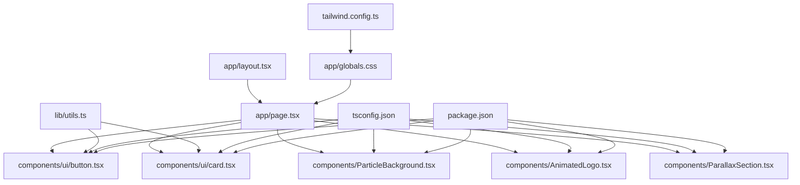
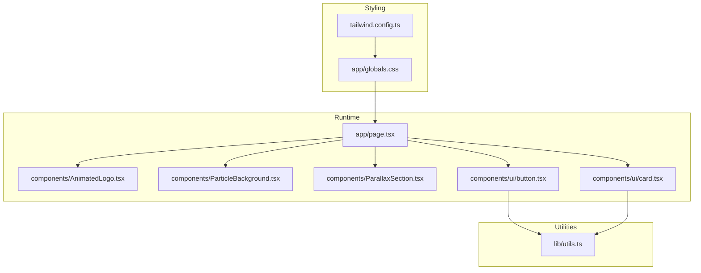
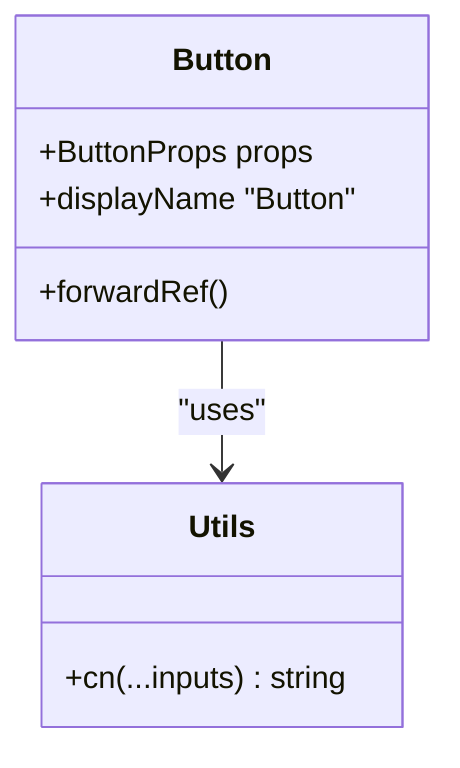
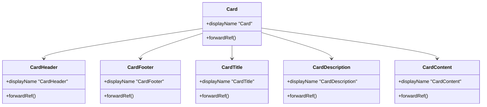
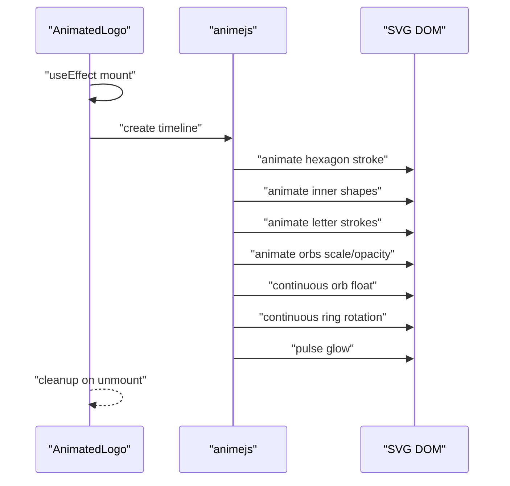
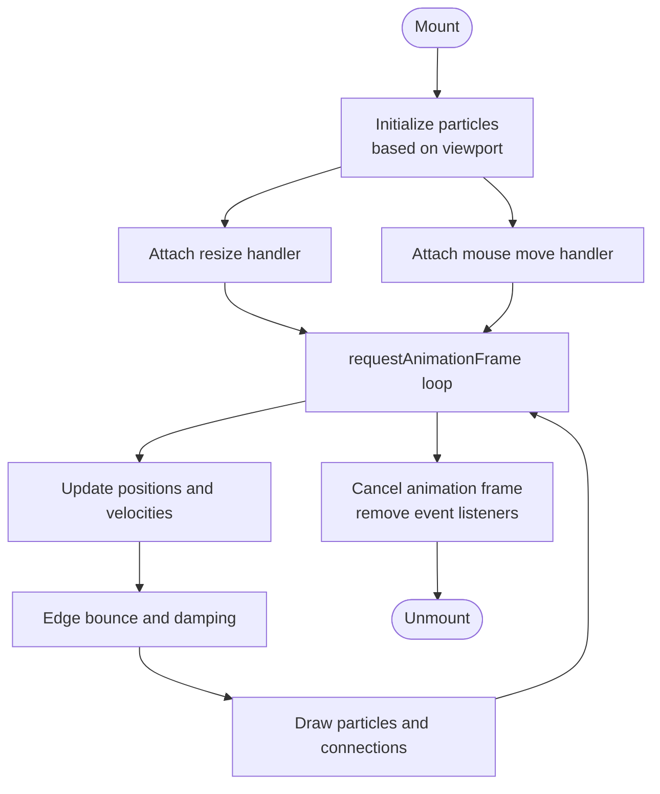
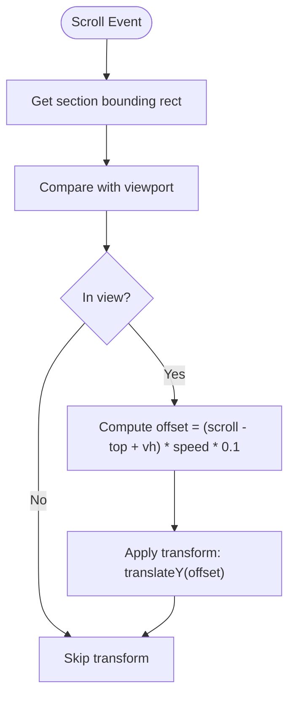
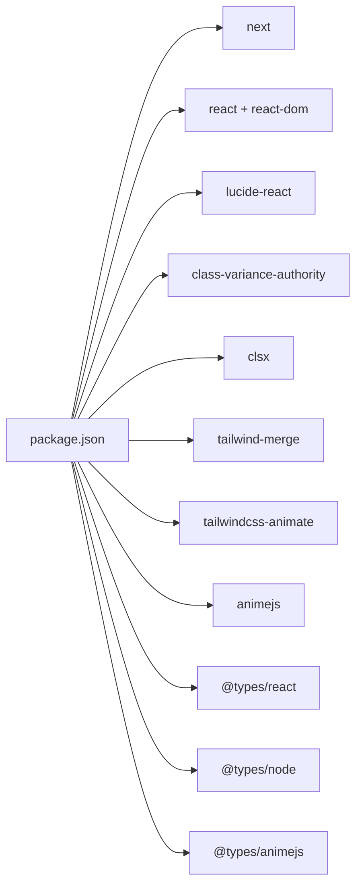

# Development Guidelines

<cite>
**Referenced Files in This Document**
- [package.json](file://package.json)
- [tsconfig.json](file://tsconfig.json)
- [tailwind.config.ts](file://tailwind.config.ts)
- [next.config.mjs](file://next.config.mjs)
- [app/layout.tsx](file://app/layout.tsx)
- [app/page.tsx](file://app/page.tsx)
- [app/globals.css](file://app/globals.css)
- [lib/utils.ts](file://lib/utils.ts)
- [components/ui/button.tsx](file://components/ui/button.tsx)
- [components/ui/card.tsx](file://components/ui/card.tsx)
- [components/AnimatedLogo.tsx](file://components/AnimatedLogo.tsx)
- [components/ParallaxSection.tsx](file://components/ParallaxSection.tsx)
- [components/ParticleBackground.tsx](file://components/ParticleBackground.tsx)
</cite>

## Table of Contents
1. [Introduction](#introduction)
2. [Project Structure](#project-structure)
3. [Core Components](#core-components)
4. [Architecture Overview](#architecture-overview)
5. [Detailed Component Analysis](#detailed-component-analysis)
6. [Dependency Analysis](#dependency-analysis)
7. [Performance Considerations](#performance-considerations)
8. [Troubleshooting Guide](#troubleshooting-guide)
9. [Conclusion](#conclusion)
10. [Appendices](#appendices)

## Introduction
This document defines development guidelines for the AlterLabs project. It covers code style standards, component development patterns, animation best practices, testing strategies, architectural principles, naming conventions, folder structure, and extension/modification guidelines. It also documents TypeScript usage patterns, utility function development, and integration with the design system built on Tailwind CSS and custom animations.

## Project Structure
The project follows a Next.js App Router structure with a clear separation of concerns:
- app: Application shell, routing, and pages
- components: Reusable UI components and animation helpers
- lib: Shared utilities (e.g., class merging)
- Styles: Global CSS and Tailwind configuration define the design system

**Diagram sources**
- [app/layout.tsx](file://app/layout.tsx#L1-L29)
- [app/page.tsx](file://app/page.tsx#L1-L501)
- [lib/utils.ts](file://lib/utils.ts#L1-L7)
- [components/ui/button.tsx](file://components/ui/button.tsx#L1-L57)
- [components/ui/card.tsx](file://components/ui/card.tsx#L1-L79)
- [components/ParticleBackground.tsx](file://components/ParticleBackground.tsx#L1-L151)
- [components/AnimatedLogo.tsx](file://components/AnimatedLogo.tsx#L1-L243)
- [components/ParallaxSection.tsx](file://components/ParallaxSection.tsx#L1-L43)
- [app/globals.css](file://app/globals.css#L1-L252)
- [tailwind.config.ts](file://tailwind.config.ts#L1-L108)
- [tsconfig.json](file://tsconfig.json#L1-L42)
- [package.json](file://package.json#L1-L33)

**Section sources**
- [app/layout.tsx](file://app/layout.tsx#L1-L29)
- [app/page.tsx](file://app/page.tsx#L1-L501)
- [lib/utils.ts](file://lib/utils.ts#L1-L7)
- [tailwind.config.ts](file://tailwind.config.ts#L1-L108)
- [app/globals.css](file://app/globals.css#L1-L252)
- [tsconfig.json](file://tsconfig.json#L1-L42)
- [package.json](file://package.json#L1-L33)

## Core Components
- Design System Utilities
  - cn: A composable class merging utility that merges and deduplicates Tailwind classes.
  - Integration: Used across UI components to compose variant classes safely.

- UI Primitive Components
  - Button: Variants and sizes defined via class-variance-authority, with forwardRef and proper typings.
  - Card: Composite component with header, footer, title, description, and content slots.

- Animation and Effects
  - AnimatedLogo: Complex SVG animation using animejs with timelines and continuous effects.
  - ParticleBackground: Canvas-based particle system with mouse interaction and connection drawing.
  - ParallaxSection: Scroll-driven parallax transform with performance-conscious event handling.

- Page Composition
  - app/page.tsx orchestrates navigation, hero, features, process, student-focused sections, CTA, and footer, integrating all components and animations.

**Section sources**
- [lib/utils.ts](file://lib/utils.ts#L1-L7)
- [components/ui/button.tsx](file://components/ui/button.tsx#L1-L57)
- [components/ui/card.tsx](file://components/ui/card.tsx#L1-L79)
- [components/AnimatedLogo.tsx](file://components/AnimatedLogo.tsx#L1-L243)
- [components/ParticleBackground.tsx](file://components/ParticleBackground.tsx#L1-L151)
- [components/ParallaxSection.tsx](file://components/ParallaxSection.tsx#L1-L43)
- [app/page.tsx](file://app/page.tsx#L1-L501)

## Architecture Overview
The project adheres to a component-driven architecture with:
- Strong typing via TypeScript
- Utility-driven composition with cn and class-variance-authority
- Tailwind-based design tokens and animations
- Client-side-only components for animations and interactions
- Dynamic imports for client-only components to avoid SSR mismatches

**Diagram sources**
- [app/page.tsx](file://app/page.tsx#L1-L501)
- [components/AnimatedLogo.tsx](file://components/AnimatedLogo.tsx#L1-L243)
- [components/ParticleBackground.tsx](file://components/ParticleBackground.tsx#L1-L151)
- [components/ParallaxSection.tsx](file://components/ParallaxSection.tsx#L1-L43)
- [components/ui/button.tsx](file://components/ui/button.tsx#L1-L57)
- [components/ui/card.tsx](file://components/ui/card.tsx#L1-L79)
- [lib/utils.ts](file://lib/utils.ts#L1-L7)
- [app/globals.css](file://app/globals.css#L1-L252)
- [tailwind.config.ts](file://tailwind.config.ts#L1-L108)

## Detailed Component Analysis

### Button Component
- Purpose: Unified button primitive with variants and sizes.
- Pattern:
  - Uses class-variance-authority for variant/sizing logic.
  - Accepts native button attributes and ref forwarding.
  - Composes with cn for safe class merging.
- Extending:
  - Add new variant in buttonVariants with consistent Tailwind tokens.
  - Export new size and update defaultVariants if needed.

**Diagram sources**
- [components/ui/button.tsx](file://components/ui/button.tsx#L1-L57)
- [lib/utils.ts](file://lib/utils.ts#L1-L7)

**Section sources**
- [components/ui/button.tsx](file://components/ui/button.tsx#L1-L57)
- [lib/utils.ts](file://lib/utils.ts#L1-L7)

### Card Component Family
- Purpose: Semantic card building blocks (Card, CardHeader, CardTitle, CardDescription, CardContent, CardFooter).
- Pattern:
  - Each slot is a forwardRef component accepting HTML attributes.
  - Uses cn for consistent spacing and transitions.
- Extending:
  - Add new variants via additional class sets and export new named components.

**Diagram sources**
- [components/ui/card.tsx](file://components/ui/card.tsx#L1-L79)

**Section sources**
- [components/ui/card.tsx](file://components/ui/card.tsx#L1-L79)

### AnimatedLogo Component
- Purpose: Brand-centric animated logo with SVG and animejs.
- Pattern:
  - Uses timeline and staggered animations.
  - Continuous floating and rotation loops.
  - Uses Tailwind-based gradients and filters.
- Best Practices:
  - Guard against re-initialization with a ref flag.
  - Use passive scroll listeners and cleanup on unmount.
  - Keep DOM queries minimal inside effects.

**Diagram sources**
- [components/AnimatedLogo.tsx](file://components/AnimatedLogo.tsx#L1-L243)

**Section sources**
- [components/AnimatedLogo.tsx](file://components/AnimatedLogo.tsx#L1-L243)

### ParticleBackground Component
- Purpose: Canvas-based animated particle system with mouse interaction and connections.
- Pattern:
  - Initializes particles proportional to viewport area.
  - Mouse interaction applies subtle forces.
  - Draws connections between close particles.
  - Uses requestAnimationFrame loop.
- Best Practices:
  - Debounce resize handling.
  - Cancel animation frame on unmount.
  - Keep draw logic efficient (avoid per-frame allocations).

**Diagram sources**
- [components/ParticleBackground.tsx](file://components/ParticleBackground.tsx#L1-L151)

**Section sources**
- [components/ParticleBackground.tsx](file://components/ParticleBackground.tsx#L1-L151)

### ParallaxSection Component
- Purpose: Scroll-driven parallax translation for layered sections.
- Pattern:
  - Calculates section visibility and offset.
  - Applies transform with will-change hint.
  - Uses passive scroll listener.
- Best Practices:
  - Keep speed factor reasonable for performance.
  - Avoid heavy DOM reads in scroll handlers.

**Diagram sources**
- [components/ParallaxSection.tsx](file://components/ParallaxSection.tsx#L1-L43)

**Section sources**
- [components/ParallaxSection.tsx](file://components/ParallaxSection.tsx#L1-L43)

### Page Composition (app/page.tsx)
- Purpose: Orchestrates navigation, hero, features, process, student-focused sections, CTA, and footer.
- Pattern:
  - Uses dynamic imports for client-only components.
  - Integrates UI primitives and animations.
  - Leverages Tailwind utilities and design tokens.

**Section sources**
- [app/page.tsx](file://app/page.tsx#L1-L501)

## Dependency Analysis
External libraries and their roles:
- next: Framework runtime and routing
- react, react-dom: UI rendering
- lucide-react: Icons
- class-variance-authority, clsx, tailwind-merge: Variant composition and class merging
- tailwindcss-animate: Animation plugin
- animejs: Advanced SVG/element animations
- Types: @types/react, @types/node, @types/animejs

**Diagram sources**
- [package.json](file://package.json#L1-L33)

**Section sources**
- [package.json](file://package.json#L1-L33)

## Performance Considerations
- Prefer lightweight client-only components and dynamic imports to avoid SSR overhead.
- Use passive event listeners for scroll and resize where possible.
- Limit DOM reads/writes in animation loops; batch updates when feasible.
- Use requestAnimationFrame for smooth animations; cancel on unmount.
- Keep particle counts proportional to viewport area; cap maximum particle count.
- Avoid unnecessary re-renders by memoizing callbacks with useCallback/useMemo where appropriate.
- Use Tailwind utilities for layout and transitions to minimize custom CSS.

## Troubleshooting Guide
- SSR Hydration Mismatch
  - Symptom: Client/server markup mismatch for client-only components.
  - Fix: Wrap client-only components with dynamic import and disable SSR for those components.

- Animation Not Starting
  - Symptom: Animations do not play after initial load.
  - Fix: Ensure the component is mounted on the client and guards prevent re-initialization.

- Canvas Performance Issues
  - Symptom: Low FPS or laggy particle movement.
  - Fix: Reduce particle count, simplify draw logic, and ensure animation frame is canceled on unmount.

- Tailwind Classes Not Applying
  - Symptom: Variant classes not taking effect.
  - Fix: Verify cn composition and ensure class-variance-authority variants are correctly exported and used.

**Section sources**
- [app/page.tsx](file://app/page.tsx#L24-L27)
- [components/AnimatedLogo.tsx](file://components/AnimatedLogo.tsx#L11-L13)
- [components/ParticleBackground.tsx](file://components/ParticleBackground.tsx#L134-L141)
- [lib/utils.ts](file://lib/utils.ts#L1-L7)
- [components/ui/button.tsx](file://components/ui/button.tsx#L43-L53)

## Conclusion
These guidelines establish a consistent approach to developing, extending, and maintaining AlterLabs. By leveraging the design system, following component composition patterns, and applying animation best practices, contributors can deliver high-quality UI enhancements while preserving performance and maintainability.

## Appendices

### Code Style Standards
- TypeScript
  - Strict mode enabled; avoid unsafe any types.
  - Use forwardRef for components that accept refs.
  - Export typed props/interfaces for components.
- CSS/Tailwind
  - Use design tokens from CSS variables and Tailwind theme.
  - Favor utility classes over custom CSS when possible.
  - Keep custom animations scoped and reusable.
- Component Composition
  - Use cn for composing classes; avoid string concatenation.
  - Export variants and sizes via class-variance-authority.
  - Provide clear defaults and consistent prop interfaces.

### Naming Conventions
- Components: PascalCase (Button, Card, AnimatedLogo).
- Variants/Sizes: camelCase (variant names like glow, glass; sizes like sm, lg).
- Files: PascalCase for components, kebab-case for utilities (e.g., utils.ts).
- Constants/Tokens: UPPER_SNAKE_CASE for design tokens (e.g., PRIMARY_COLOR).

### Folder Organization
- app/: Next.js app router pages and layout
- components/: UI primitives and feature-specific components
- lib/: shared utilities (e.g., cn)
- app/globals.css and tailwind.config.ts: global styles and design system

### Testing Strategies
- Unit Tests
  - Test pure functions (e.g., cn composition) in isolation.
  - Mock external libraries (animejs) for deterministic behavior.
- Integration Tests
  - Verify component composition and variant application.
  - Validate dynamic imports and client-only behavior.
- Visual Regression
  - Capture key states of animated components (logo states, particle distribution).
- Accessibility
  - Ensure keyboard navigation and semantic markup in interactive components.

### Extending Existing Components
- Adding a Button Variant
  - Define variant in buttonVariants.
  - Export new variant and update defaultVariants if needed.
  - Use cn to merge variant classes in the component.
- Adding a Card Slot
  - Create a new forwardRef component with appropriate HTML tag.
  - Use cn for consistent spacing and transitions.
  - Export the new component alongside existing ones.
- Introducing a New Animation Component
  - Use dynamic import for client-only components.
  - Implement cleanup in useEffect; cancel animation frames.
  - Compose with Tailwind utilities for styling and motion.

### Templates and Examples
- Button Template
  - Use class-variance-authority for variants and sizes.
  - Forward ref and spread remaining props.
  - Example path: [components/ui/button.tsx](file://components/ui/button.tsx#L1-L57)
- Card Template
  - Create a slot component with forwardRef.
  - Use cn for consistent spacing and transitions.
  - Example path: [components/ui/card.tsx](file://components/ui/card.tsx#L1-L79)
- Animation Component Template
  - Use useEffect for initialization and cleanup.
  - Guard against re-initialization.
  - Example path: [components/AnimatedLogo.tsx](file://components/AnimatedLogo.tsx#L1-L243)
- Particle System Template
  - Initialize particles based on viewport.
  - Use requestAnimationFrame loop.
  - Example path: [components/ParticleBackground.tsx](file://components/ParticleBackground.tsx#L1-L151)
- Parallax Template
  - Compute offset based on scroll and section geometry.
  - Use passive listeners and will-change.
  - Example path: [components/ParallaxSection.tsx](file://components/ParallaxSection.tsx#L1-L43)