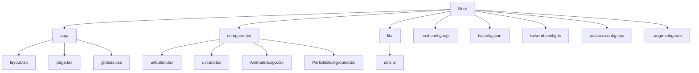
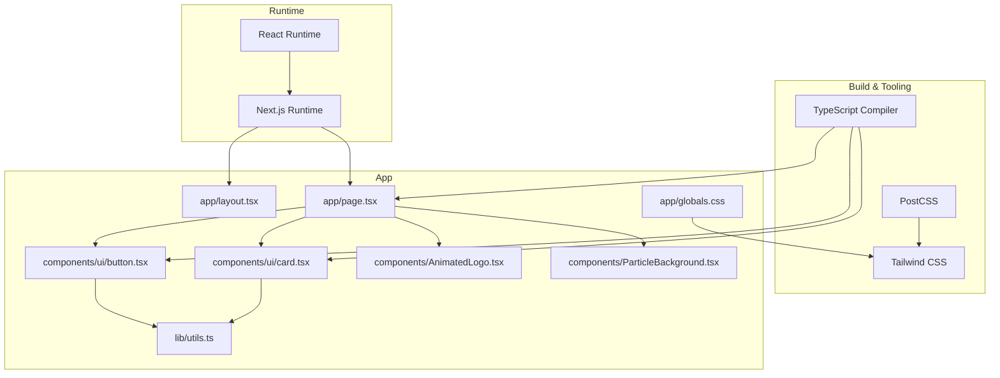
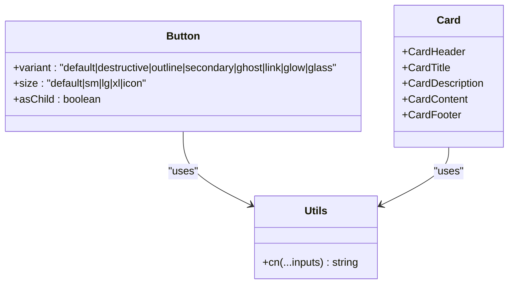
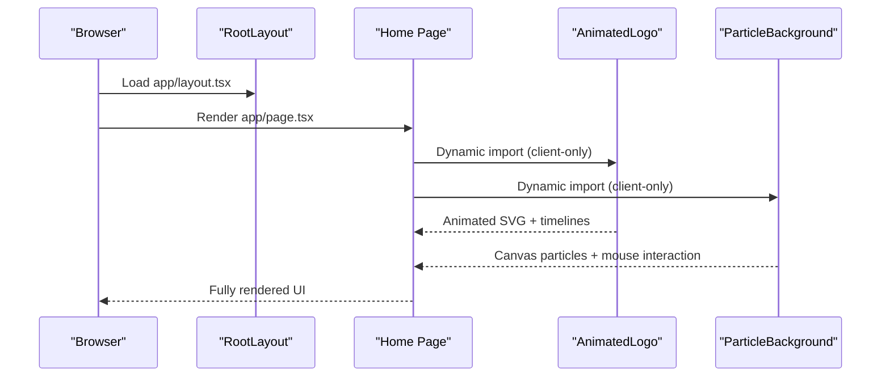
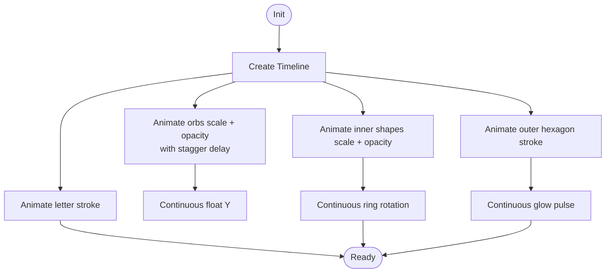
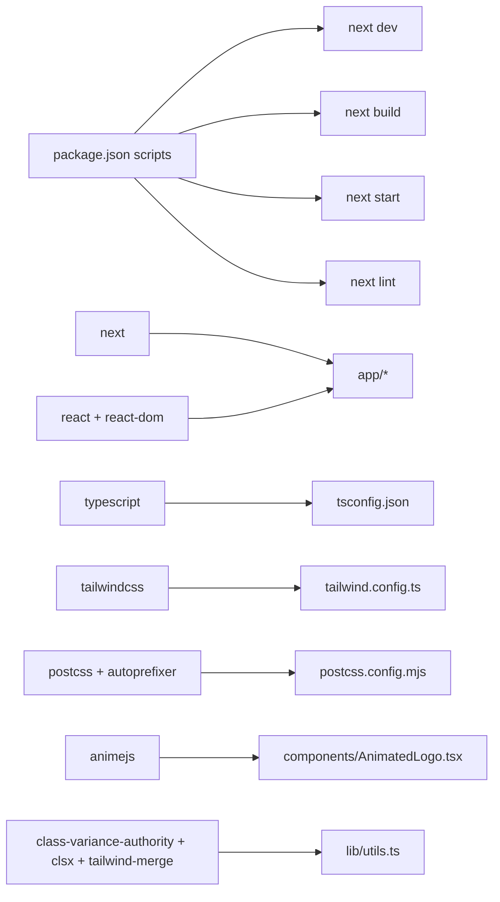

# Getting Started

<cite>
**Referenced Files in This Document**
- [package.json](file://package.json)
- [next.config.mjs](file://next.config.mjs)
- [tsconfig.json](file://tsconfig.json)
- [tailwind.config.ts](file://tailwind.config.ts)
- [postcss.config.mjs](file://postcss.config.mjs)
- [next-env.d.ts](file://next-env.d.ts)
- [app/layout.tsx](file://app/layout.tsx)
- [app/page.tsx](file://app/page.tsx)
- [app/globals.css](file://app/globals.css)
- [.augmentignore](file://.augmentignore)
- [components/ui/button.tsx](file://components/ui/button.tsx)
- [components/ui/card.tsx](file://components/ui/card.tsx)
- [lib/utils.ts](file://lib/utils.ts)
- [components/AnimatedLogo.tsx](file://components/AnimatedLogo.tsx)
- [components/ParticleBackground.tsx](file://components/ParticleBackground.tsx)
</cite>

## Table of Contents
1. [Introduction](#introduction)
2. [Project Structure](#project-structure)
3. [Core Components](#core-components)
4. [Architecture Overview](#architecture-overview)
5. [Detailed Component Analysis](#detailed-component-analysis)
6. [Dependency Analysis](#dependency-analysis)
7. [Performance Considerations](#performance-considerations)
8. [Troubleshooting Guide](#troubleshooting-guide)
9. [Conclusion](#conclusion)
10. [Appendices](#appendices)

## Introduction
This guide helps you install, configure, and run the AlterLabs frontend application locally. It covers prerequisites, environment setup, development workflow, and verification steps. The project is a Next.js application using React, TypeScript, Tailwind CSS, and PostCSS with Tailwind CSS animations.

## Project Structure
The repository follows a Next.js App Router layout with a small, focused component library and shared utilities.

**Diagram sources**
- [app/layout.tsx](file://app/layout.tsx#L1-L29)
- [app/page.tsx](file://app/page.tsx#L1-L501)
- [app/globals.css](file://app/globals.css#L1-L252)
- [components/ui/button.tsx](file://components/ui/button.tsx#L1-L57)
- [components/ui/card.tsx](file://components/ui/card.tsx#L1-L79)
- [components/AnimatedLogo.tsx](file://components/AnimatedLogo.tsx#L1-L243)
- [components/ParticleBackground.tsx](file://components/ParticleBackground.tsx#L1-L151)
- [lib/utils.ts](file://lib/utils.ts#L1-L7)
- [next.config.mjs](file://next.config.mjs#L1-L7)
- [tsconfig.json](file://tsconfig.json#L1-L42)
- [tailwind.config.ts](file://tailwind.config.ts#L1-L108)
- [postcss.config.mjs](file://postcss.config.mjs#L1-L10)
- [.augmentignore](file://.augmentignore#L1-L80)

**Section sources**
- [app/layout.tsx](file://app/layout.tsx#L1-L29)
- [app/page.tsx](file://app/page.tsx#L1-L501)
- [app/globals.css](file://app/globals.css#L1-L252)
- [components/ui/button.tsx](file://components/ui/button.tsx#L1-L57)
- [components/ui/card.tsx](file://components/ui/card.tsx#L1-L79)
- [lib/utils.ts](file://lib/utils.ts#L1-L7)
- [next.config.mjs](file://next.config.mjs#L1-L7)
- [tsconfig.json](file://tsconfig.json#L1-L42)
- [tailwind.config.ts](file://tailwind.config.ts#L1-L108)
- [postcss.config.mjs](file://postcss.config.mjs#L1-L10)
- [.augmentignore](file://.augmentignore#L1-L80)

## Core Components
- Application shell and metadata are defined in the root layout.
- The homepage composes reusable UI components and animated visuals.
- Shared UI primitives (Button, Card) and utility helpers enable consistent styling and behavior.
- Animation and particle effects are encapsulated in dedicated client components.

Key implementation references:
- Root layout and metadata: [app/layout.tsx](file://app/layout.tsx#L1-L29)
- Homepage composition and client-side components: [app/page.tsx](file://app/page.tsx#L1-L501)
- Reusable UI components: [components/ui/button.tsx](file://components/ui/button.tsx#L1-L57), [components/ui/card.tsx](file://components/ui/card.tsx#L1-L79)
- Utility class merging: [lib/utils.ts](file://lib/utils.ts#L1-L7)
- Animated logo: [components/AnimatedLogo.tsx](file://components/AnimatedLogo.tsx#L1-L243)
- Particle background: [components/ParticleBackground.tsx](file://components/ParticleBackground.tsx#L1-L151)

**Section sources**
- [app/layout.tsx](file://app/layout.tsx#L1-L29)
- [app/page.tsx](file://app/page.tsx#L1-L501)
- [components/ui/button.tsx](file://components/ui/button.tsx#L1-L57)
- [components/ui/card.tsx](file://components/ui/card.tsx#L1-L79)
- [lib/utils.ts](file://lib/utils.ts#L1-L7)
- [components/AnimatedLogo.tsx](file://components/AnimatedLogo.tsx#L1-L243)
- [components/ParticleBackground.tsx](file://components/ParticleBackground.tsx#L1-L151)

## Architecture Overview
The application uses Next.js App Router with a strict mode configuration. TypeScript enforces type safety, Tailwind CSS provides utility-first styling, and PostCSS compiles Tailwind and autoprefixing. The homepage dynamically imports client-only components to leverage browser APIs safely.

**Diagram sources**
- [app/layout.tsx](file://app/layout.tsx#L1-L29)
- [app/page.tsx](file://app/page.tsx#L1-L501)
- [components/ui/button.tsx](file://components/ui/button.tsx#L1-L57)
- [components/ui/card.tsx](file://components/ui/card.tsx#L1-L79)
- [lib/utils.ts](file://lib/utils.ts#L1-L7)
- [components/AnimatedLogo.tsx](file://components/AnimatedLogo.tsx#L1-L243)
- [components/ParticleBackground.tsx](file://components/ParticleBackground.tsx#L1-L151)
- [app/globals.css](file://app/globals.css#L1-L252)
- [tsconfig.json](file://tsconfig.json#L1-L42)
- [tailwind.config.ts](file://tailwind.config.ts#L1-L108)
- [postcss.config.mjs](file://postcss.config.mjs#L1-L10)

**Section sources**
- [app/layout.tsx](file://app/layout.tsx#L1-L29)
- [app/page.tsx](file://app/page.tsx#L1-L501)
- [components/ui/button.tsx](file://components/ui/button.tsx#L1-L57)
- [components/ui/card.tsx](file://components/ui/card.tsx#L1-L79)
- [lib/utils.ts](file://lib/utils.ts#L1-L7)
- [components/AnimatedLogo.tsx](file://components/AnimatedLogo.tsx#L1-L243)
- [components/ParticleBackground.tsx](file://components/ParticleBackground.tsx#L1-L151)
- [app/globals.css](file://app/globals.css#L1-L252)
- [tsconfig.json](file://tsconfig.json#L1-L42)
- [tailwind.config.ts](file://tailwind.config.ts#L1-L108)
- [postcss.config.mjs](file://postcss.config.mjs#L1-L10)

## Detailed Component Analysis

### UI Component Library
The UI library defines Button and Card primitives with variant and size support, and a shared cn utility for merging Tailwind classes.

**Diagram sources**
- [components/ui/button.tsx](file://components/ui/button.tsx#L1-L57)
- [components/ui/card.tsx](file://components/ui/card.tsx#L1-L79)
- [lib/utils.ts](file://lib/utils.ts#L1-L7)

**Section sources**
- [components/ui/button.tsx](file://components/ui/button.tsx#L1-L57)
- [components/ui/card.tsx](file://components/ui/card.tsx#L1-L79)
- [lib/utils.ts](file://lib/utils.ts#L1-L7)

### Homepage Composition and Client Effects
The homepage orchestrates navigation, hero content, feature highlights, process steps, student-focused content, and a call-to-action. It dynamically imports client-only components for animations and particle effects.

**Diagram sources**
- [app/layout.tsx](file://app/layout.tsx#L1-L29)
- [app/page.tsx](file://app/page.tsx#L1-L501)
- [components/AnimatedLogo.tsx](file://components/AnimatedLogo.tsx#L1-L243)
- [components/ParticleBackground.tsx](file://components/ParticleBackground.tsx#L1-L151)

**Section sources**
- [app/page.tsx](file://app/page.tsx#L1-L501)
- [components/AnimatedLogo.tsx](file://components/AnimatedLogo.tsx#L1-L243)
- [components/ParticleBackground.tsx](file://components/ParticleBackground.tsx#L1-L151)

### Animation and Particle Systems
The animation system uses a timeline to orchestrate strokes, scaling, and continuous floating/rotating effects. The particle system simulates physics-based movement with mouse proximity and edge bouncing.

**Diagram sources**
- [components/AnimatedLogo.tsx](file://components/AnimatedLogo.tsx#L11-L96)

**Section sources**
- [components/AnimatedLogo.tsx](file://components/AnimatedLogo.tsx#L1-L243)

## Dependency Analysis
The project relies on Next.js for routing and SSR/SSG, React for UI, Tailwind CSS for styling, and AnimeJS for animations. TypeScript and PostCSS/Tailwind are configured for compile-time checks and CSS generation.

**Diagram sources**
- [package.json](file://package.json#L1-L33)
- [tsconfig.json](file://tsconfig.json#L1-L42)
- [tailwind.config.ts](file://tailwind.config.ts#L1-L108)
- [postcss.config.mjs](file://postcss.config.mjs#L1-L10)
- [lib/utils.ts](file://lib/utils.ts#L1-L7)
- [components/AnimatedLogo.tsx](file://components/AnimatedLogo.tsx#L1-L243)

**Section sources**
- [package.json](file://package.json#L1-L33)
- [tsconfig.json](file://tsconfig.json#L1-L42)
- [tailwind.config.ts](file://tailwind.config.ts#L1-L108)
- [postcss.config.mjs](file://postcss.config.mjs#L1-L10)
- [lib/utils.ts](file://lib/utils.ts#L1-L7)
- [components/AnimatedLogo.tsx](file://components/AnimatedLogo.tsx#L1-L243)

## Performance Considerations
- Client-only dynamic imports defer heavy client-side libraries until runtime, reducing server bundle size.
- Tailwind CSS purging is configured via content globs to minimize CSS footprint.
- Strict mode and incremental builds improve reliability and speed during development.
- Avoid unnecessary re-renders by leveraging memoization and stable callbacks in client components.

[No sources needed since this section provides general guidance]

## Troubleshooting Guide
Common setup and runtime issues:

- Node.js version mismatch
  - Symptom: Build errors or incompatible package features.
  - Action: Ensure a modern LTS Node.js version compatible with the project’s dependency constraints.

- Missing dependencies after clone
  - Symptom: Module not found errors.
  - Action: Install dependencies using your preferred package manager.

- TypeScript diagnostics blocking dev server
  - Symptom: Type errors prevent starting the dev server.
  - Action: Fix reported type issues or temporarily disable strictness in tsconfig.json for local iteration.

- Tailwind utilities not applied
  - Symptom: Styles missing despite correct class names.
  - Action: Verify Tailwind directives are present in globals.css and content globs in tailwind.config.ts include your component paths.

- Dynamic imports causing SSR warnings
  - Symptom: Warnings about client-only components during SSR.
  - Action: Confirm dynamic imports with SSR disabled are used only on the client side.

- PostCSS pipeline errors
  - Symptom: Build fails due to Tailwind/Autoprefixer configuration.
  - Action: Validate postcss.config.mjs and ensure Tailwind plugin is enabled.

- Dev environment type generation
  - Symptom: Missing route types or Next.js types.
  - Action: Ensure next-env.d.ts is present and included by tsconfig.json.

Verification steps:
- Run the development server and confirm the homepage renders with interactive elements.
- Open the browser’s developer tools and verify Tailwind classes are generated and animations are playing.
- Test navigation and mobile menu behavior.

**Section sources**
- [tsconfig.json](file://tsconfig.json#L1-L42)
- [tailwind.config.ts](file://tailwind.config.ts#L1-L108)
- [postcss.config.mjs](file://postcss.config.mjs#L1-L10)
- [next-env.d.ts](file://next-env.d.ts#L1-L7)
- [app/page.tsx](file://app/page.tsx#L1-L501)

## Conclusion
You now have the essentials to install, run, and iterate on the AlterLabs frontend. Use the provided commands to develop locally, verify your setup, and follow the troubleshooting tips for common issues. Extend the UI library and components thoughtfully, keeping performance and accessibility in mind.

[No sources needed since this section summarizes without analyzing specific files]

## Appendices

### System Requirements
- Operating systems: Windows, macOS, Linux
- Node.js: Modern LTS recommended (align with dependency constraints)
- Package manager: npm, yarn, or pnpm (your choice)

**Section sources**
- [package.json](file://package.json#L1-L33)

### Prerequisite Knowledge
- React fundamentals (components, hooks, JSX)
- Next.js basics (App Router, pages, metadata)
- TypeScript basics (types, interfaces, generics)
- Tailwind CSS utility classes and configuration

**Section sources**
- [tsconfig.json](file://tsconfig.json#L1-L42)
- [tailwind.config.ts](file://tailwind.config.ts#L1-L108)
- [app/layout.tsx](file://app/layout.tsx#L1-L29)

### Step-by-Step Setup
1. Install dependencies
   - Example command: npm install
2. Start the development server
   - Example command: npm run dev
3. Open the site in your browser
   - Default URL: http://localhost:3000
4. Verify
   - Confirm homepage loads, animations play, and navigation works.

**Section sources**
- [package.json](file://package.json#L5-L10)
- [app/layout.tsx](file://app/layout.tsx#L1-L29)

### Environment Setup
- TypeScript configuration is centralized in tsconfig.json.
- Next.js configuration is in next.config.mjs with strict mode enabled.
- Tailwind CSS is configured in tailwind.config.ts with content globs covering app, components, and pages.
- PostCSS is configured in postcss.config.mjs to apply Tailwind and Autoprefixer.

**Section sources**
- [tsconfig.json](file://tsconfig.json#L1-L42)
- [next.config.mjs](file://next.config.mjs#L1-L7)
- [tailwind.config.ts](file://tailwind.config.ts#L1-L108)
- [postcss.config.mjs](file://postcss.config.mjs#L1-L10)

### Initial Project Configuration
- Path aliases: "@/*" mapped to project root for clean imports.
- Strict mode: Enabled in Next.js for robust development.
- Tailwind base/components/utilities layers: Defined in app/globals.css.
- Content paths: Updated in tailwind.config.ts to scan app, components, and pages.

**Section sources**
- [tsconfig.json](file://tsconfig.json#L25-L29)
- [next.config.mjs](file://next.config.mjs#L3-L3)
- [app/globals.css](file://app/globals.css#L1-L3)
- [tailwind.config.ts](file://tailwind.config.ts#L5-L10)

### Commands Reference
- Development: npm run dev
- Production build: npm run build
- Production start: npm run start
- Lint: npm run lint

**Section sources**
- [package.json](file://package.json#L5-L10)

### IDE Recommendations
- VS Code with official extensions for TypeScript, Tailwind CSS, and Next.js.
- Enable format-on-save and lint-on-save for consistent code quality.
- Configure path aliases to resolve "@/*" correctly.

**Section sources**
- [tsconfig.json](file://tsconfig.json#L25-L29)

### Development Workflow Best Practices
- Keep client-only code in client components and load with dynamic imports.
- Add new UI components under components/ui and export them from a barrel.
- Use the cn utility for composing Tailwind classes.
- Extend animations and effects in dedicated components to maintain separation of concerns.

**Section sources**
- [lib/utils.ts](file://lib/utils.ts#L1-L7)
- [components/AnimatedLogo.tsx](file://components/AnimatedLogo.tsx#L1-L243)
- [components/ParticleBackground.tsx](file://components/ParticleBackground.tsx#L1-L151)