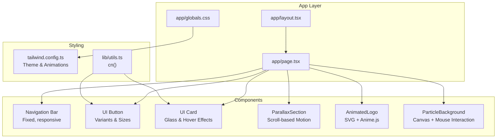
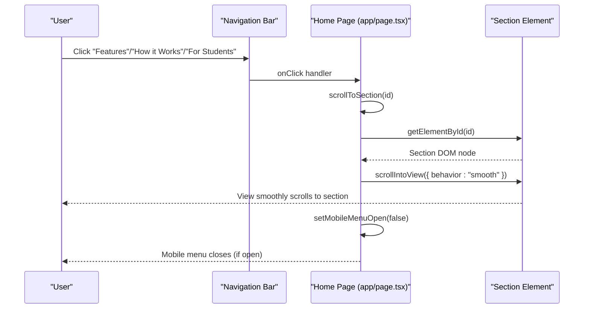
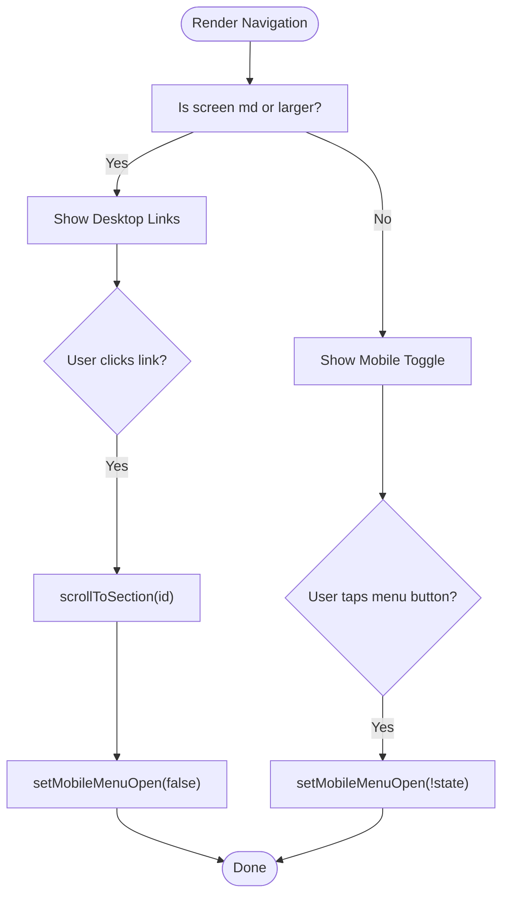
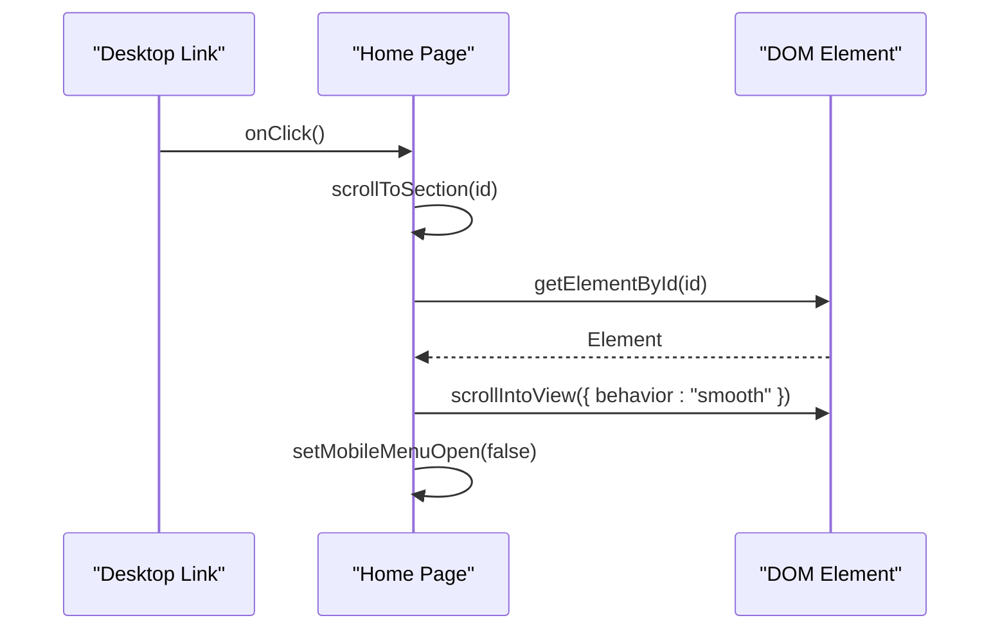
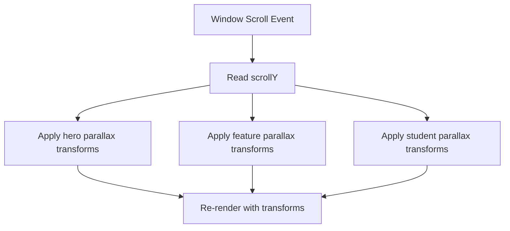
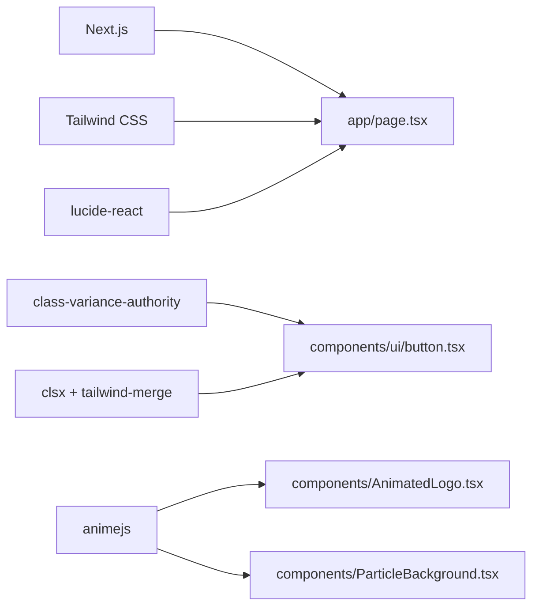

# Navigation and User Experience

<cite>
**Referenced Files in This Document**
- [app/layout.tsx](file://app/layout.tsx)
- [app/page.tsx](file://app/page.tsx)
- [app/globals.css](file://app/globals.css)
- [tailwind.config.ts](file://tailwind.config.ts)
- [lib/utils.ts](file://lib/utils.ts)
- [components/ui/button.tsx](file://components/ui/button.tsx)
- [components/ui/card.tsx](file://components/ui/card.tsx)
- [components/ParallaxSection.tsx](file://components/ParallaxSection.tsx)
- [components/AnimatedLogo.tsx](file://components/AnimatedLogo.tsx)
- [components/ParticleBackground.tsx](file://components/ParticleBackground.tsx)
- [package.json](file://package.json)
</cite>

## Table of Contents
1. [Introduction](#introduction)
2. [Project Structure](#project-structure)
3. [Core Components](#core-components)
4. [Architecture Overview](#architecture-overview)
5. [Detailed Component Analysis](#detailed-component-analysis)
6. [Dependency Analysis](#dependency-analysis)
7. [Performance Considerations](#performance-considerations)
8. [Troubleshooting Guide](#troubleshooting-guide)
9. [Conclusion](#conclusion)
10. [Appendices](#appendices)

## Introduction
This document explains the navigation and user experience features of AlterLabs, focusing on the responsive navigation system, mobile-first design, smooth scrolling, and interactive elements. It covers navigation state management, menu behavior, touch-friendly interactions, and the integration between navigation and page sections. It also provides guidelines for implementing new navigation patterns, optimizing user workflows, and maintaining accessibility standards, along with responsive breakpoint behaviors.

## Project Structure
The navigation and UX features are implemented primarily in the home page component with supporting UI primitives and global styles. The structure emphasizes:
- A fixed navigation bar with desktop and mobile views
- Smooth scrolling to page sections
- Responsive breakpoints using Tailwind utilities
- Interactive elements with animated feedback
- Global animations and visual effects

**Diagram sources**
- [app/page.tsx](file://app/page.tsx#L60-L100)
- [app/globals.css](file://app/globals.css#L1-L252)
- [tailwind.config.ts](file://tailwind.config.ts#L1-L108)
- [lib/utils.ts](file://lib/utils.ts#L1-L7)
- [components/ui/button.tsx](file://components/ui/button.tsx#L1-L57)
- [components/ui/card.tsx](file://components/ui/card.tsx#L1-L79)
- [components/ParallaxSection.tsx](file://components/ParallaxSection.tsx#L1-L43)
- [components/AnimatedLogo.tsx](file://components/AnimatedLogo.tsx#L1-L243)
- [components/ParticleBackground.tsx](file://components/ParticleBackground.tsx#L1-L151)

**Section sources**
- [app/layout.tsx](file://app/layout.tsx#L1-L29)
- [app/page.tsx](file://app/page.tsx#L1-L501)
- [app/globals.css](file://app/globals.css#L1-L252)
- [tailwind.config.ts](file://tailwind.config.ts#L1-L108)
- [lib/utils.ts](file://lib/utils.ts#L1-L7)

## Core Components
- Fixed navigation bar with brand identity, desktop links, and mobile menu toggle
- Smooth scrolling to sections via anchor IDs
- Responsive breakpoints (mobile-first) using Tailwind’s md and lg scales
- Interactive buttons with multiple variants and sizes
- Glass and glow effects for modern UI feel
- Scroll-based parallax motion and animated visuals

Key implementation references:
- Navigation state and scroll handling: [app/page.tsx](file://app/page.tsx#L29-L47)
- Smooth scrolling function: [app/page.tsx](file://app/page.tsx#L41-L47)
- Desktop/mobile nav rendering: [app/page.tsx](file://app/page.tsx#L71-L98)
- Button variants and sizes: [components/ui/button.tsx](file://components/ui/button.tsx#L5-L35)
- Card component with hover effects: [components/ui/card.tsx](file://components/ui/card.tsx#L1-L79)
- Global animations and utilities: [app/globals.css](file://app/globals.css#L62-L251)
- Tailwind theme and animations: [tailwind.config.ts](file://tailwind.config.ts#L20-L98)

**Section sources**
- [app/page.tsx](file://app/page.tsx#L29-L47)
- [app/page.tsx](file://app/page.tsx#L71-L98)
- [components/ui/button.tsx](file://components/ui/button.tsx#L5-L35)
- [components/ui/card.tsx](file://components/ui/card.tsx#L1-L79)
- [app/globals.css](file://app/globals.css#L62-L251)
- [tailwind.config.ts](file://tailwind.config.ts#L20-L98)

## Architecture Overview
The navigation system integrates tightly with page sections and scroll events. The fixed navigation remains visible during scroll, while smooth scrolling ensures precise section alignment. Mobile-first design ensures optimal touch interactions and readability across devices.

**Diagram sources**
- [app/page.tsx](file://app/page.tsx#L41-L47)
- [app/page.tsx](file://app/page.tsx#L71-L98)

## Detailed Component Analysis

### Navigation Bar and State Management
The navigation bar is fixed at the top with:
- Brand identity (icon + name)
- Desktop navigation links that trigger smooth scroll to sections
- Mobile menu toggle with animated state change
- Responsive sizing and spacing

State management:
- Local state tracks mobile menu visibility and scroll position
- Scroll event listener updates scrollY for parallax effects
- Smooth scroll function targets section IDs

Responsive behavior:
- Hidden on small screens, visible on medium and larger
- Mobile menu toggled via a button with Menu/X icons

Accessibility considerations:
- Focusable buttons with hover/focus states
- Clear visual feedback on hover and active states
- Touch-friendly target sizes

**Diagram sources**
- [app/page.tsx](file://app/page.tsx#L60-L100)
- [app/page.tsx](file://app/page.tsx#L29-L47)

**Section sources**
- [app/page.tsx](file://app/page.tsx#L29-L47)
- [app/page.tsx](file://app/page.tsx#L60-L100)

### Smooth Scrolling Implementation
Smooth scrolling is implemented using the native browser API with a smooth behavior option. The function:
- Retrieves the target element by ID
- Calls scrollIntoView with smooth behavior
- Ensures the mobile menu closes after navigation

Breakpoints and anchors:
- Sections are identified by id attributes
- Desktop links trigger smooth scroll to corresponding sections

**Diagram sources**
- [app/page.tsx](file://app/page.tsx#L41-L47)

**Section sources**
- [app/page.tsx](file://app/page.tsx#L41-L47)

### Mobile-First Design and Touch-Friendly Interactions
Mobile-first design is evident in:
- Hidden desktop navigation on smaller screens
- Prominent mobile menu toggle button
- Larger touch targets for buttons and links
- Responsive typography and spacing

Touch-friendly interactions:
- Large tap areas for navigation and CTAs
- Animated transitions for menu reveal
- Visual feedback on hover and focus

Responsive breakpoints:
- md threshold controls desktop vs mobile layouts
- lg threshold influences grid layouts and typography scaling

**Section sources**
- [app/page.tsx](file://app/page.tsx#L71-L98)
- [tailwind.config.ts](file://tailwind.config.ts#L16-L18)

### Interactive Elements and Visual Feedback
Interactive elements include:
- Buttons with multiple variants (default, glow, glass, outline)
- Cards with hover lift and glass effects
- Animated logos and particle backgrounds
- Scroll indicators and floating elements

Feedback mechanisms:
- Hover states with transitions and shadows
- Glow variants for emphasis
- Animated floats and pulses for engagement

**Section sources**
- [components/ui/button.tsx](file://components/ui/button.tsx#L5-L35)
- [components/ui/card.tsx](file://components/ui/card.tsx#L1-L79)
- [app/globals.css](file://app/globals.css#L108-L121)
- [app/globals.css](file://app/globals.css#L181-L209)
- [components/AnimatedLogo.tsx](file://components/AnimatedLogo.tsx#L1-L243)
- [components/ParticleBackground.tsx](file://components/ParticleBackground.tsx#L1-L151)

### Scroll-Based Interactions and Parallax
Scroll-based interactions enhance perceived depth and engagement:
- Hero section background layers move at different speeds
- Grid pattern overlay responds to scroll
- Feature and student sections include parallax layers
- ParallaxSection component demonstrates reusable scroll-driven motion

**Diagram sources**
- [app/page.tsx](file://app/page.tsx#L33-L39)
- [app/page.tsx](file://app/page.tsx#L105-L115)
- [app/page.tsx](file://app/page.tsx#L190-L195)
- [app/page.tsx](file://app/page.tsx#L312-L317)
- [components/ParallaxSection.tsx](file://components/ParallaxSection.tsx#L14-L35)

**Section sources**
- [app/page.tsx](file://app/page.tsx#L33-L39)
- [app/page.tsx](file://app/page.tsx#L105-L115)
- [app/page.tsx](file://app/page.tsx#L190-L195)
- [app/page.tsx](file://app/page.tsx#L312-L317)
- [components/ParallaxSection.tsx](file://components/ParallaxSection.tsx#L14-L35)

### Navigation and Page Section Integration
The navigation integrates with page sections through:
- Anchor IDs on sections
- Smooth scroll targeting these IDs
- Visual cues (scroll indicator) to encourage exploration

Best practices:
- Use consistent section IDs
- Ensure smooth scrolling aligns with viewport
- Provide clear visual feedback on active sections

**Section sources**
- [app/page.tsx](file://app/page.tsx#L187-L395)
- [app/page.tsx](file://app/page.tsx#L178-L184)

## Dependency Analysis
External libraries and their roles:
- Next.js: Framework for SSR, routing, and dynamic imports
- Tailwind CSS: Utility-first styling and responsive design
- class-variance-authority and clsx/tailwind-merge: Button variants and class merging
- lucide-react: Icons for navigation and UI elements
- animejs: SVG and canvas animations for visual effects

**Diagram sources**
- [package.json](file://package.json#L11-L21)
- [components/ui/button.tsx](file://components/ui/button.tsx#L1-L57)
- [components/AnimatedLogo.tsx](file://components/AnimatedLogo.tsx#L1-L243)
- [components/ParticleBackground.tsx](file://components/ParticleBackground.tsx#L1-L151)

**Section sources**
- [package.json](file://package.json#L11-L21)
- [components/ui/button.tsx](file://components/ui/button.tsx#L1-L57)

## Performance Considerations
- Passive scroll listeners reduce layout thrashing
- requestAnimationFrame used for canvas animations
- Dynamic imports defer heavy animations until client-side
- CSS transforms and will-change optimize render performance
- Minimal re-renders through local state management

Recommendations:
- Keep scroll handlers lightweight
- Debounce resize handlers if needed
- Prefer CSS animations over JavaScript where possible
- Lazy-load animations to improve initial load

**Section sources**
- [app/page.tsx](file://app/page.tsx#L33-L39)
- [components/ParticleBackground.tsx](file://components/ParticleBackground.tsx#L127-L130)
- [app/page.tsx](file://app/page.tsx#L25-L26)

## Troubleshooting Guide
Common issues and resolutions:
- Navigation does not scroll to sections
  - Verify section IDs match the anchor values
  - Confirm smooth scrolling function is invoked on click
  - Ensure mobile menu closes after navigation

- Mobile menu not closing after selection
  - Check that the close action is executed after scroll
  - Confirm state update occurs on click

- Scroll position not updating
  - Ensure scroll event listener is attached and cleaned up
  - Verify passive option is used for performance

- Parallax not working
  - Confirm scrollY is tracked and applied to transforms
  - Check that transforms are applied only when needed

- Animation performance issues
  - Use requestAnimationFrame consistently
  - Avoid layout thrashing in animation loops
  - Consider reducing particle count or animation complexity

**Section sources**
- [app/page.tsx](file://app/page.tsx#L33-L39)
- [app/page.tsx](file://app/page.tsx#L41-L47)
- [components/ParticleBackground.tsx](file://components/ParticleBackground.tsx#L127-L130)

## Conclusion
AlterLabs implements a modern, mobile-first navigation and user experience system centered on smooth scrolling, responsive design, and engaging visual feedback. The fixed navigation integrates seamlessly with page sections, while scroll-based parallax and animated elements elevate the perceived quality and interactivity. Following the guidelines and best practices outlined here will help maintain consistency, performance, and accessibility as new navigation patterns are introduced.

## Appendices

### Guidelines for Implementing New Navigation Patterns
- Use consistent anchor IDs and smooth scrolling behavior
- Maintain mobile-first breakpoints and touch-friendly targets
- Leverage existing button variants and card components for visual consistency
- Apply parallax and animations thoughtfully to avoid performance regressions
- Ensure accessibility: focus states, keyboard navigation, and ARIA roles where applicable

### Accessibility Standards Checklist
- Keyboard navigable menus and links
- Sufficient color contrast for text and interactive elements
- Focus outlines and visible focus states
- Semantic HTML and proper heading hierarchy
- Screen reader friendly labels and landmarks