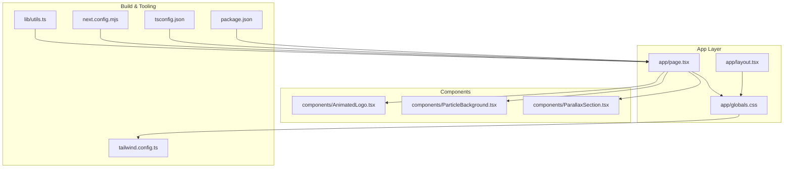
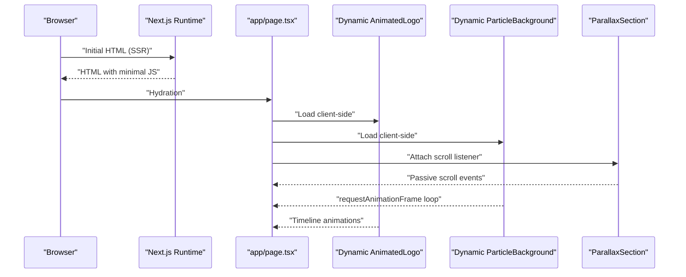
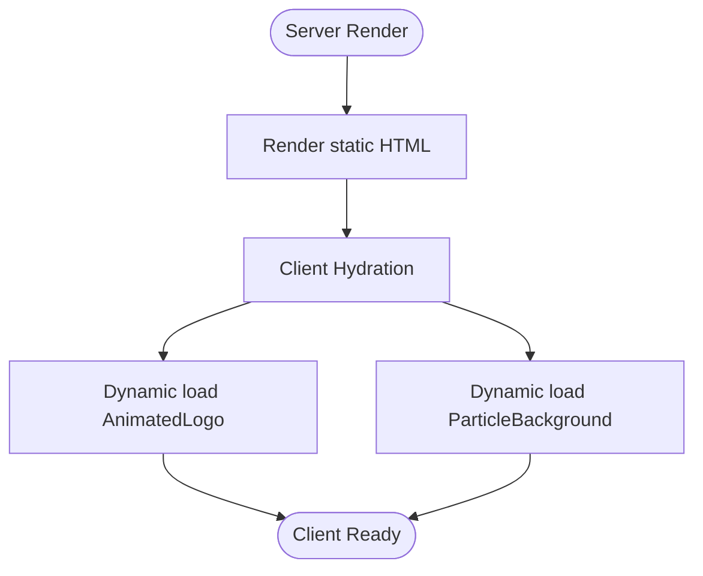
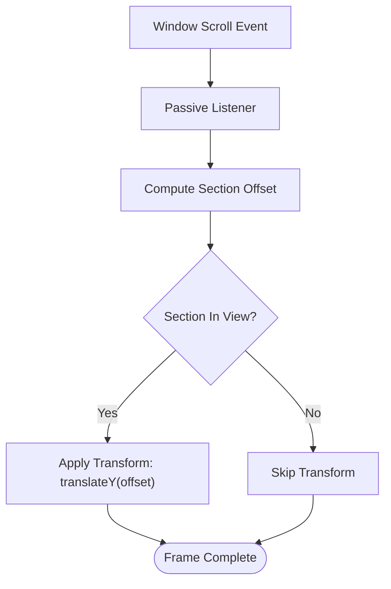
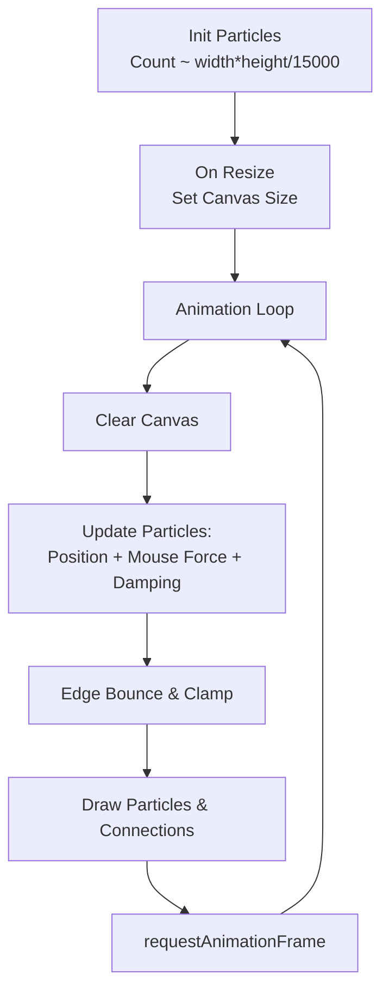
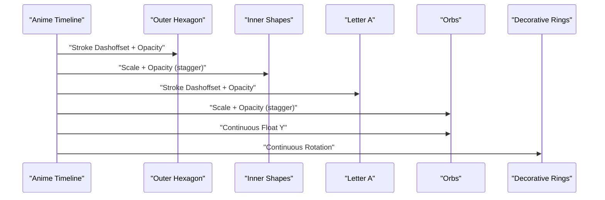
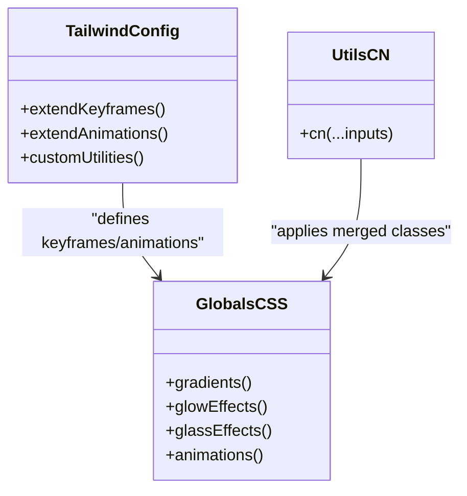
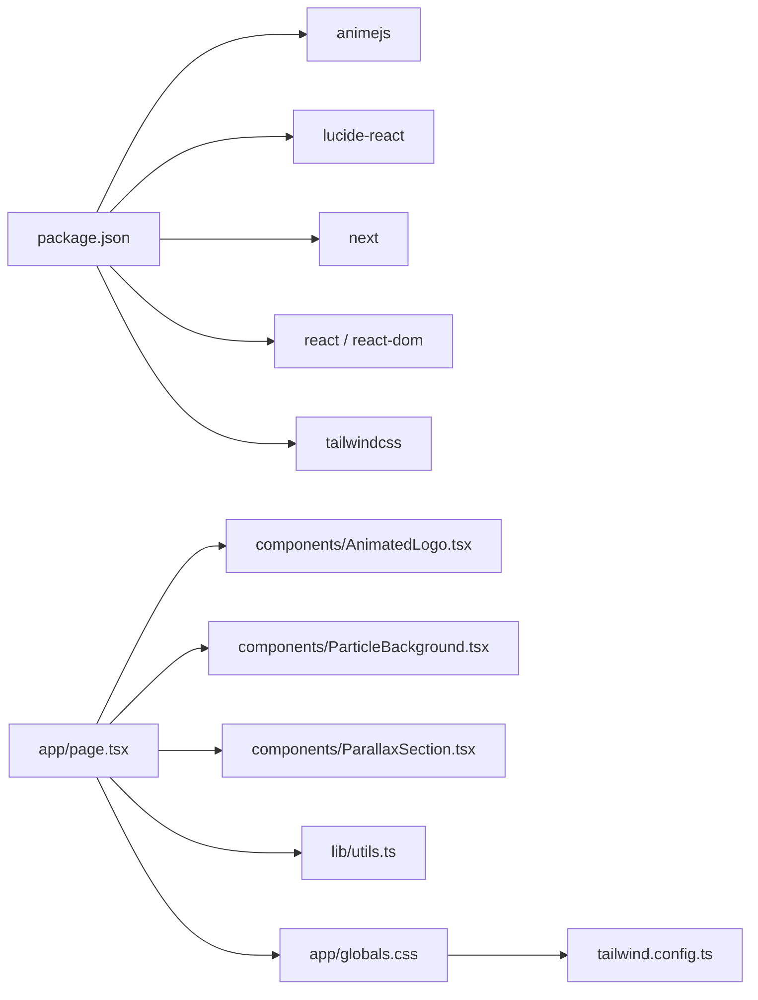

# Performance Optimization

<cite>
**Referenced Files in This Document**
- [app/page.tsx](file://app/page.tsx)
- [components/ParticleBackground.tsx](file://components/ParticleBackground.tsx)
- [components/ParallaxSection.tsx](file://components/ParallaxSection.tsx)
- [components/AnimatedLogo.tsx](file://components/AnimatedLogo.tsx)
- [next.config.mjs](file://next.config.mjs)
- [package.json](file://package.json)
- [lib/utils.ts](file://lib/utils.ts)
- [app/layout.tsx](file://app/layout.tsx)
- [app/globals.css](file://app/globals.css)
- [tailwind.config.ts](file://tailwind.config.ts)
- [tsconfig.json](file://tsconfig.json)
</cite>

## Table of Contents
1. [Introduction](#introduction)
2. [Project Structure](#project-structure)
3. [Core Components](#core-components)
4. [Architecture Overview](#architecture-overview)
5. [Detailed Component Analysis](#detailed-component-analysis)
6. [Dependency Analysis](#dependency-analysis)
7. [Performance Considerations](#performance-considerations)
8. [Troubleshooting Guide](#troubleshooting-guide)
9. [Conclusion](#conclusion)
10. [Appendices](#appendices)

## Introduction
This document provides a comprehensive guide to performance optimization strategies in AlterLabs. It focuses on dynamic import patterns, animation performance best practices, bundle size optimization techniques, and runtime performance monitoring. It also explains the implementation of performance-critical features such as particle physics rendering and scroll-based animations, and offers practical guidelines for measuring performance, identifying bottlenecks, and applying targeted optimizations. Next.js-specific optimizations, code splitting strategies, and caching mechanisms are documented alongside Tailwind CSS and utility helpers that influence runtime performance.

## Project Structure
AlterLabs follows a Next.js App Router structure with a small set of performance-sensitive components:
- app/page.tsx orchestrates client-side-only dynamic imports and scroll-driven motion.
- components/ParticleBackground.tsx implements a canvas-based particle system with physics.
- components/ParallaxSection.tsx demonstrates scroll-triggered parallax transforms.
- components/AnimatedLogo.tsx uses a third-party animation library for complex SVG animations.
- Styling and animations are defined in app/globals.css and configured via tailwind.config.ts.
- Utility helpers in lib/utils.ts streamline class composition for minimal re-renders.
- Next.js configuration and TypeScript settings are centralized in next.config.mjs and tsconfig.json.

**Diagram sources**
- [app/page.tsx](file://app/page.tsx#L1-L501)
- [components/AnimatedLogo.tsx](file://components/AnimatedLogo.tsx#L1-L243)
- [components/ParticleBackground.tsx](file://components/ParticleBackground.tsx#L1-L151)
- [components/ParallaxSection.tsx](file://components/ParallaxSection.tsx#L1-L43)
- [app/globals.css](file://app/globals.css#L1-L252)
- [app/layout.tsx](file://app/layout.tsx#L1-L29)
- [next.config.mjs](file://next.config.mjs#L1-L7)
- [tsconfig.json](file://tsconfig.json#L1-L42)
- [tailwind.config.ts](file://tailwind.config.ts#L1-L108)
- [lib/utils.ts](file://lib/utils.ts#L1-L7)
- [package.json](file://package.json#L1-L33)

**Section sources**
- [app/page.tsx](file://app/page.tsx#L1-L501)
- [app/layout.tsx](file://app/layout.tsx#L1-L29)
- [app/globals.css](file://app/globals.css#L1-L252)
- [tailwind.config.ts](file://tailwind.config.ts#L1-L108)
- [lib/utils.ts](file://lib/utils.ts#L1-L7)
- [next.config.mjs](file://next.config.mjs#L1-L7)
- [tsconfig.json](file://tsconfig.json#L1-L42)
- [package.json](file://package.json#L1-L33)

## Core Components
This section highlights the performance-critical parts of the application and how they are optimized.

- Dynamic Imports for Client-Side Only Components
  - app/page.tsx uses Next.js dynamic imports to defer loading AnimatedLogo and ParticleBackground until the client renders. This reduces server-rendered payload and defers heavy client-side work to after hydration.
  - Benefits: smaller SSR bundles, faster TTFB, and reduced initial JS for non-critical visuals.

- Scroll-Based Motion and Parallax
  - app/page.tsx tracks scroll position and applies transform-based motion to layered backgrounds and hero content.
  - components/ParallaxSection.tsx encapsulates a reusable scroll listener with passive event handling and a will-change-transform hint to encourage GPU acceleration.

- Canvas-Based Particle Physics
  - components/ParticleBackground.tsx implements a particle system on a canvas with per-frame updates, mouse interaction, damping, and edge bouncing. It uses requestAnimationFrame and cleans up listeners on unmount.

- SVG Animation with AnimeJS
  - components/AnimatedLogo.tsx uses a third-party animation library to orchestrate complex SVG animations with timelines and continuous loops. It avoids layout thrashing by animating transform and opacity on GPU-accelerated properties.

- Styling and Utilities
  - app/globals.css defines utility classes for gradients, glows, glass, and animations. Tailwind configuration tailwind.config.ts extends keyframes and animations for consistent performance.
  - lib/utils.ts consolidates class merging to minimize unnecessary DOM churn.

**Section sources**
- [app/page.tsx](file://app/page.tsx#L22-L39)
- [components/ParallaxSection.tsx](file://components/ParallaxSection.tsx#L11-L35)
- [components/ParticleBackground.tsx](file://components/ParticleBackground.tsx#L15-L141)
- [components/AnimatedLogo.tsx](file://components/AnimatedLogo.tsx#L6-L96)
- [app/globals.css](file://app/globals.css#L62-L251)
- [tailwind.config.ts](file://tailwind.config.ts#L71-L94)
- [lib/utils.ts](file://lib/utils.ts#L4-L6)

## Architecture Overview
The performance architecture centers on:
- Client-side-only rendering for heavy UI elements (dynamic imports).
- Scroll-driven transforms and GPU-friendly animations.
- Canvas for high-performance particle rendering.
- Tailwind utilities and CSS animations for lightweight motion.
- Minimal re-renders via efficient class composition.

**Diagram sources**
- [app/page.tsx](file://app/page.tsx#L22-L39)
- [components/AnimatedLogo.tsx](file://components/AnimatedLogo.tsx#L11-L96)
- [components/ParticleBackground.tsx](file://components/ParticleBackground.tsx#L106-L141)
- [components/ParallaxSection.tsx](file://components/ParallaxSection.tsx#L14-L35)

## Detailed Component Analysis

### Dynamic Import Strategy
- Purpose: Defer non-critical client-side components to reduce SSR payload and improve TTFB.
- Implementation: Next.js dynamic import with SSR disabled for AnimatedLogo and ParticleBackground.
- Impact: Smaller server bundle, faster initial render, and deferred heavy client work.

**Diagram sources**
- [app/page.tsx](file://app/page.tsx#L22-L27)

**Section sources**
- [app/page.tsx](file://app/page.tsx#L22-L27)

### Scroll-Based Animations and Parallax
- Passive scroll listeners prevent layout thrashing and improve scrolling performance.
- Transform-based motion leverages GPU acceleration; will-change hints further assist.
- ParallaxSection encapsulates scroll math and applies offsets only when the section is in view.

**Diagram sources**
- [components/ParallaxSection.tsx](file://components/ParallaxSection.tsx#L14-L35)
- [app/page.tsx](file://app/page.tsx#L103-L185)

**Section sources**
- [components/ParallaxSection.tsx](file://components/ParallaxSection.tsx#L11-L35)
- [app/page.tsx](file://app/page.tsx#L33-L47)
- [app/page.tsx](file://app/page.tsx#L103-L185)

### Canvas-Based Particle Physics Rendering
- Physics loop: position updates, mouse interaction, damping, edge bounce, and drawing connections.
- Optimizations: per-particle connection checks, bounded distance thresholds, and cleanup of animation frames on unmount.
- Performance considerations: adjust particle count based on viewport area to balance quality and performance.

**Diagram sources**
- [components/ParticleBackground.tsx](file://components/ParticleBackground.tsx#L27-L104)
- [components/ParticleBackground.tsx](file://components/ParticleBackground.tsx#L106-L141)

**Section sources**
- [components/ParticleBackground.tsx](file://components/ParticleBackground.tsx#L15-L141)

### SVG Animation with AnimeJS
- Timeline orchestration separates concerns for hexagon strokes, inner shapes, letters, and orbs.
- Continuous animations use looping and easing to maintain fluidity without recalculating layout.
- Best practices: avoid animating layout-affecting properties; prefer transform and opacity.

**Diagram sources**
- [components/AnimatedLogo.tsx](file://components/AnimatedLogo.tsx#L15-L96)

**Section sources**
- [components/AnimatedLogo.tsx](file://components/AnimatedLogo.tsx#L6-L96)

### Styling and Animation Utilities
- Tailwind configuration extends keyframes and animations for consistent performance.
- CSS utilities define gradients, glows, glass, and motion primitives used across components.
- lib/utils.ts merges classes efficiently to minimize re-renders.

**Diagram sources**
- [tailwind.config.ts](file://tailwind.config.ts#L71-L94)
- [app/globals.css](file://app/globals.css#L62-L251)
- [lib/utils.ts](file://lib/utils.ts#L4-L6)

**Section sources**
- [tailwind.config.ts](file://tailwind.config.ts#L71-L94)
- [app/globals.css](file://app/globals.css#L62-L251)
- [lib/utils.ts](file://lib/utils.ts#L4-L6)

## Dependency Analysis
- External libraries:
  - animejs: used for complex SVG animations in AnimatedLogo.
  - lucide-react: lightweight icons imported statically where needed.
  - next: framework enabling dynamic imports and SSR/SSG.
  - react and react-dom: core UI runtime.
  - tailwindcss and tailwind-merge: styling and class composition.
- Internal dependencies:
  - app/page.tsx depends on dynamic components and scroll utilities.
  - components rely on CSS utilities and Tailwind configuration.
  - lib/utils.ts is a shared helper for class merging.

**Diagram sources**
- [package.json](file://package.json#L11-L21)
- [app/page.tsx](file://app/page.tsx#L22-L27)
- [components/AnimatedLogo.tsx](file://components/AnimatedLogo.tsx#L4)
- [app/globals.css](file://app/globals.css#L1-L252)
- [tailwind.config.ts](file://tailwind.config.ts#L1-L108)
- [lib/utils.ts](file://lib/utils.ts#L1-L7)

**Section sources**
- [package.json](file://package.json#L11-L21)
- [app/page.tsx](file://app/page.tsx#L22-L27)

## Performance Considerations
- Dynamic Imports and Code Splitting
  - Use Next.js dynamic imports for client-only components to reduce initial bundle size and defer heavy client work.
  - Keep dynamic imports granular to enable better caching and incremental loading.

- Scroll Performance
  - Prefer passive event listeners for scroll handlers to avoid layout thrashing.
  - Use transform-based animations and GPU acceleration (will-change) for smooth motion.
  - Limit expensive computations inside scroll handlers; cache measurements when possible.

- Canvas Rendering
  - Control particle count relative to viewport area to balance quality and performance.
  - Minimize overdraw by clearing the canvas each frame and drawing only visible elements.
  - Cancel animation frames on unmount to prevent memory leaks and wasted CPU/GPU cycles.

- Animation Libraries
  - Use libraries like AnimeJS for complex animations while keeping layout-affecting properties out of the animation scope.
  - Prefer transform and opacity for GPU acceleration; avoid animating layout properties frequently.

- Bundle Size Optimization
  - Audit imports and remove unused dependencies.
  - Leverage tree-shaking by importing only what is needed from large libraries.
  - Consider lazy-loading heavy assets and fonts.

- Styling and Utilities
  - Tailwind utilities and pre-defined animations reduce runtime computation.
  - Consolidate class composition via utility functions to minimize re-renders.

- Monitoring and Measurement
  - Use browser DevTools Performance and Memory panels to identify bottlenecks.
  - Measure First Contentful Paint (FCP), Largest Contentful Paint (LCP), and Cumulative Layout Shift (CLS).
  - Track runtime metrics such as FPS during animations and scroll interactions.

[No sources needed since this section provides general guidance]

## Troubleshooting Guide
- Canvas Not Rendering or Low FPS
  - Verify canvas sizing and resize handling; ensure width/height match device pixels.
  - Reduce particle count or increase damping to improve performance.
  - Confirm animation loop is canceled on unmount.

- Scroll Jank or Stutter
  - Ensure scroll listeners are passive and avoid synchronous layout reads.
  - Limit DOM writes inside scroll handlers; batch updates when possible.

- Heavy Initial Load
  - Confirm dynamic imports are applied to heavy components.
  - Review Next.js build output and inspect bundle composition.

- Animation Quality vs. Performance
  - Adjust animation durations and easing to balance smoothness and resource usage.
  - Consider lowering the frequency of complex calculations in animation loops.

**Section sources**
- [components/ParticleBackground.tsx](file://components/ParticleBackground.tsx#L106-L141)
- [components/ParallaxSection.tsx](file://components/ParallaxSection.tsx#L14-L35)
- [app/page.tsx](file://app/page.tsx#L22-L27)

## Conclusion
AlterLabs employs a pragmatic mix of dynamic imports, GPU-accelerated animations, and canvas-based rendering to deliver a visually rich yet performant experience. By leveraging Next.js code splitting, passive scroll handling, and Tailwind utilities, the application achieves smooth interactions while maintaining a lean footprint. Adopting the measurement and optimization strategies outlined here will help sustain and further improve performance as the application evolves.

[No sources needed since this section summarizes without analyzing specific files]

## Appendices
- Next.js Configuration
  - Strict mode enabled to catch potential issues early.
  - Module resolution and bundler settings optimized for modern builds.

- TypeScript Settings
  - Strict mode and isolated modules for safer builds.
  - Bundler module resolution aligns with Next.js runtime expectations.

**Section sources**
- [next.config.mjs](file://next.config.mjs#L3)
- [tsconfig.json](file://tsconfig.json#L11-L18)