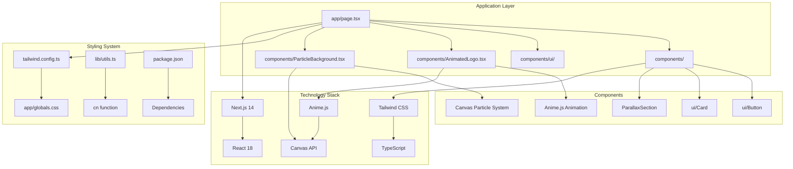
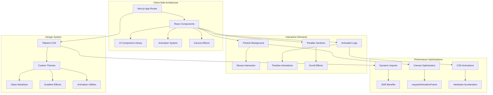
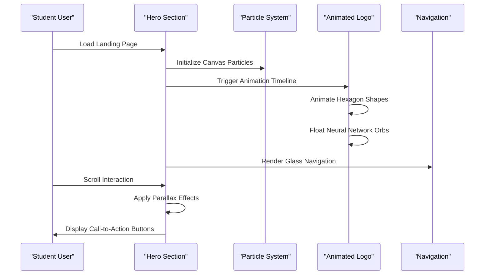
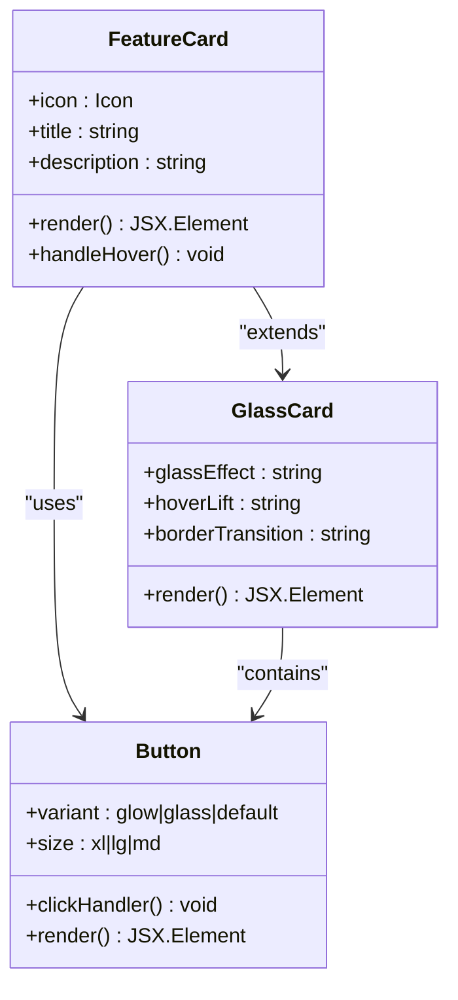
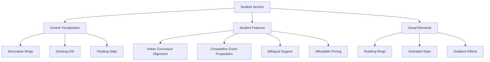
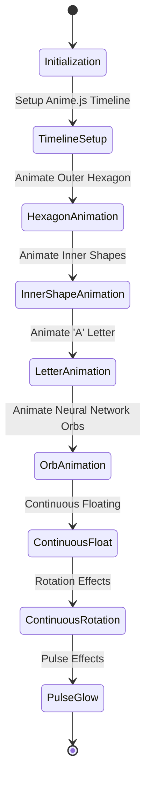
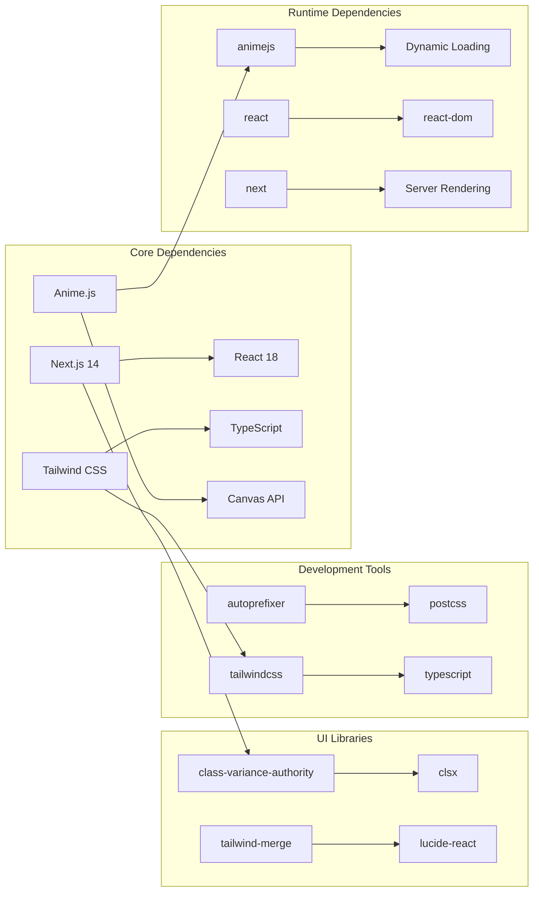

# Project Overview

<cite>
**Referenced Files in This Document**
- [package.json](file://package.json)
- [app/page.tsx](file://app/page.tsx)
- [app/layout.tsx](file://app/layout.tsx)
- [components/AnimatedLogo.tsx](file://components/AnimatedLogo.tsx)
- [components/ParticleBackground.tsx](file://components/ParticleBackground.tsx)
- [components/ParallaxSection.tsx](file://components/ParallaxSection.tsx)
- [components/ui/button.tsx](file://components/ui/button.tsx)
- [components/ui/card.tsx](file://components/ui/card.tsx)
- [lib/utils.ts](file://lib/utils.ts)
- [tailwind.config.ts](file://tailwind.config.ts)
- [app/globals.css](file://app/globals.css)
</cite>

## Table of Contents
1. [Introduction](#introduction)
2. [Project Structure](#project-structure)
3. [Core Components](#core-components)
4. [Architecture Overview](#architecture-overview)
5. [Detailed Component Analysis](#detailed-component-analysis)
6. [Dependency Analysis](#dependency-analysis)
7. [Performance Considerations](#performance-considerations)
8. [Troubleshooting Guide](#troubleshooting-guide)
9. [Conclusion](#conclusion)

## Introduction

AlterLabs is an AI-powered personalized learning platform specifically designed for Indian students preparing for competitive examinations like JEE and NEET. The platform represents a revolutionary approach to education through adaptive learning technology, creating customized study experiences that evolve with each student's unique learning patterns and pace.

### Mission Statement
AlterLabs aims to transform the educational landscape in India by making personalized, AI-driven learning accessible to every student. The platform's mission is to bridge the gap between traditional rote learning and modern, adaptive educational methodologies, particularly targeting the unique challenges faced by Indian students preparing for high-stakes competitive exams.

### Core Value Proposition
The platform delivers three fundamental value propositions:
- **Personalization**: AI algorithms analyze individual learning patterns to create customized study paths
- **Accessibility**: Free tier and affordable pricing models ensure education equity across economic backgrounds
- **Relevance**: Content specifically aligned with Indian education boards and competitive exam requirements

### Educational Impact
AlterLabs addresses critical educational challenges in the Indian market, including:
- Limited access to personalized tutoring resources
- One-size-fits-all teaching methodologies that fail to accommodate diverse learning styles
- Insufficient preparation materials for competitive examinations like JEE and NEET
- Geographic and economic barriers to quality education

## Project Structure

The AlterLabs codebase follows a modern Next.js architecture with a focus on performance, accessibility, and user experience. The structure emphasizes component modularity and design system consistency.

**Diagram sources**
- [app/page.tsx](file://app/page.tsx#L1-L501)
- [components/AnimatedLogo.tsx](file://components/AnimatedLogo.tsx#L1-L243)
- [components/ParticleBackground.tsx](file://components/ParticleBackground.tsx#L1-L151)
- [tailwind.config.ts](file://tailwind.config.ts#L1-L108)

**Section sources**
- [package.json](file://package.json#L1-L33)
- [app/page.tsx](file://app/page.tsx#L1-L501)

## Core Components

### Technology Vision and Innovation

AlterLabs leverages cutting-edge technologies to deliver an immersive educational experience:

**Modern Frontend Architecture**
- Next.js 14 for server-side rendering and optimal performance
- React 18 with concurrent features for enhanced user experience
- Tailwind CSS for utility-first styling and design system consistency
- TypeScript for type safety and developer productivity

**Immersive User Experience Technologies**
- Anime.js for sophisticated animations and micro-interactions
- Canvas API for dynamic particle systems and visual effects
- Advanced CSS animations for parallax scrolling and glass morphism effects

**Section sources**
- [package.json](file://package.json#L11-L21)
- [app/layout.tsx](file://app/layout.tsx#L1-L29)

### Platform Capabilities

The platform encompasses six core capabilities that form the foundation of its AI-powered learning ecosystem:

**Adaptive Learning System**
Real-time content adaptation based on individual learning patterns and performance metrics

**Personalized Study Path Creation**
Customized curriculum development aligned with specific exam objectives and student proficiency levels

**Instant Feedback Mechanisms**
Immediate response systems providing alternative approaches and explanations when students encounter difficulties

**Progress Analytics Dashboard**
Comprehensive performance tracking with predictive analytics and improvement insights

**Rich Content Library**
Extensive collection of questions, video lessons, and practice materials covering all subjects and difficulty levels

**Collaborative Learning Environment**
Peer interaction systems enabling study groups, discussions, and collective problem-solving

**Section sources**
- [app/page.tsx](file://app/page.tsx#L209-L255)

## Architecture Overview

The AlterLabs architecture combines modern web technologies with innovative educational paradigms to create a seamless learning experience.

**Diagram sources**
- [app/page.tsx](file://app/page.tsx#L25-L26)
- [components/ParticleBackground.tsx](file://components/ParticleBackground.tsx#L106-L141)
- [components/AnimatedLogo.tsx](file://components/AnimatedLogo.tsx#L11-L96)

## Detailed Component Analysis

### Hero Section and Brand Experience

The hero section exemplifies AlterLabs' commitment to creating an immersive brand experience through sophisticated animations and interactive elements.

**Diagram sources**
- [app/page.tsx](file://app/page.tsx#L103-L185)
- [components/ParticleBackground.tsx](file://components/ParticleBackground.tsx#L106-L141)
- [components/AnimatedLogo.tsx](file://components/AnimatedLogo.tsx#L11-L96)

The hero section integrates multiple interactive elements:
- **Dynamic Particle Background**: Canvas-based particle system with mouse interaction
- **Animated Logo**: Complex SVG animation using Anime.js timeline
- **Parallax Scrolling**: Multi-layered background effects responding to user movement
- **Glass Morphism Navigation**: Modern UI elements with transparency and blur effects

**Section sources**
- [app/page.tsx](file://app/page.tsx#L103-L185)
- [components/ParticleBackground.tsx](file://components/ParticleBackground.tsx#L1-L151)
- [components/AnimatedLogo.tsx](file://components/AnimatedLogo.tsx#L1-L243)

### Feature Showcase System

The features section demonstrates the platform's core capabilities through an interactive card-based interface.

**Diagram sources**
- [components/ui/card.tsx](file://components/ui/card.tsx#L1-L79)
- [components/ui/button.tsx](file://components/ui/button.tsx#L1-L57)

Each feature card incorporates advanced design patterns:
- **Glass Morphism Effect**: Backdrop blur with transparency for modern aesthetic
- **Hover Animations**: Smooth transitions and elevation effects
- **Gradient Borders**: Sophisticated visual enhancement through CSS gradients
- **Responsive Design**: Adaptive layouts for all device sizes

**Section sources**
- [app/page.tsx](file://app/page.tsx#L188-L257)
- [components/ui/card.tsx](file://components/ui/card.tsx#L1-L79)

### Student-Focused Content Section

The "For Students" section showcases the platform's commitment to Indian education through culturally relevant design elements.

**Diagram sources**
- [app/page.tsx](file://app/page.tsx#L309-L395)

The section emphasizes cultural relevance through:
- **Educational Symbolism**: Graduation cap iconography representing academic achievement
- **Progress Visualization**: Floating statistics highlighting platform success metrics
- **Cultural Color Palette**: Electric cyan and deep purple gradients reflecting modern Indian aesthetics
- **Community Focus**: Emphasis on peer learning and collaborative study environments

**Section sources**
- [app/page.tsx](file://app/page.tsx#L309-L395)

### Interactive Animation System

The animation system represents a sophisticated blend of SVG manipulation and JavaScript-based timing controls.

**Diagram sources**
- [components/AnimatedLogo.tsx](file://components/AnimatedLogo.tsx#L15-L96)

The animation system implements multiple concurrent effects:
- **Sequential Timeline**: Coordinated animation sequence using Anime.js timeline
- **Continuous Motion**: Infinite loops for orbs and decorative rings
- **Physics Simulation**: Floating animations with easing functions
- **Visual Effects**: Glow filters and gradient transitions

**Section sources**
- [components/AnimatedLogo.tsx](file://components/AnimatedLogo.tsx#L1-L243)

## Dependency Analysis

The AlterLabs project maintains a lean yet powerful dependency structure optimized for performance and maintainability.

**Diagram sources**
- [package.json](file://package.json#L11-L31)

### Key Dependencies and Their Roles

**Frontend Framework**
- Next.js 14: Application framework providing SSR, static generation, and optimized routing
- React 18: Component library with concurrent features and improved performance

**Styling System**
- Tailwind CSS: Utility-first CSS framework enabling rapid UI development
- Tailwind Merge: Optimized class merging for performance
- Class Variance Authority: Type-safe component variants system

**Animation and Interactions**
- Anime.js: High-performance animation library for complex motion graphics
- Lucide React: Consistent icon system with 200+ customizable icons

**Development and Build Tools**
- TypeScript: Static typing for improved code quality and developer experience
- PostCSS: CSS processing pipeline with autoprefixer and custom plugins

**Section sources**
- [package.json](file://package.json#L11-L31)

## Performance Considerations

AlterLabs implements several performance optimization strategies to ensure smooth user experiences across diverse devices and network conditions.

### Rendering Optimizations
- **Dynamic Imports**: Client-side only components loaded on demand to reduce initial bundle size
- **Server-Side Rendering**: Next.js provides optimal SEO and initial page load performance
- **Canvas Optimization**: Efficient particle system using requestAnimationFrame for smooth animations

### Memory Management
- **Animation Cleanup**: Proper cleanup of event listeners and animation frames
- **Component Lifecycle**: Strategic use of useEffect for resource management
- **State Optimization**: Minimal state updates to prevent unnecessary re-renders

### Asset Delivery
- **Lazy Loading**: Non-critical components loaded asynchronously
- **Image Optimization**: Next.js automatic image optimization and responsive sizing
- **CSS Optimization**: Purged Tailwind CSS with custom utility classes

## Troubleshooting Guide

### Common Implementation Issues

**Animation Performance Problems**
- Verify Anime.js timeline configurations don't exceed 60fps
- Monitor canvas particle count based on screen resolution
- Ensure proper cleanup of animation frames and event listeners

**Responsive Design Challenges**
- Test component layouts across various screen sizes and orientations
- Validate Tailwind CSS breakpoints align with design requirements
- Check for proper viewport meta tag configuration

**Build and Deployment Issues**
- Verify TypeScript compilation errors before production builds
- Ensure all dependencies are properly installed and compatible
- Test Next.js configuration for optimal server-side rendering

**Section sources**
- [components/ParticleBackground.tsx](file://components/ParticleBackground.tsx#L134-L141)
- [components/AnimatedLogo.tsx](file://components/AnimatedLogo.tsx#L96)

## Conclusion

AlterLabs represents a paradigm shift in educational technology, combining cutting-edge AI capabilities with modern web technologies to create an immersive, personalized learning experience for Indian students. The platform's architecture demonstrates how contemporary frontend technologies can address real-world educational challenges while maintaining exceptional user experience standards.

Through its innovative use of Next.js, React, Tailwind CSS, and Anime.js, AlterLabs establishes a foundation for scalable, accessible education that adapts to the unique needs of competitive exam preparation in India. The platform's commitment to cultural relevance, performance optimization, and user-centric design positions it as a leader in the EdTech space, ready to transform the educational landscape for millions of students across the country.

The comprehensive component system, sophisticated animation framework, and thoughtful design choices collectively demonstrate how modern web technologies can be leveraged to create meaningful educational impact while maintaining technical excellence and user satisfaction.