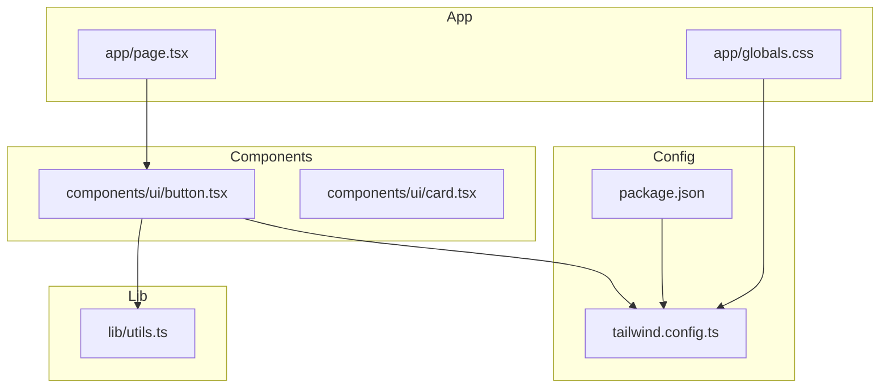
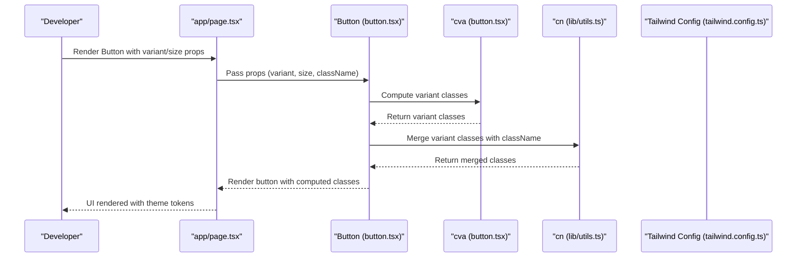
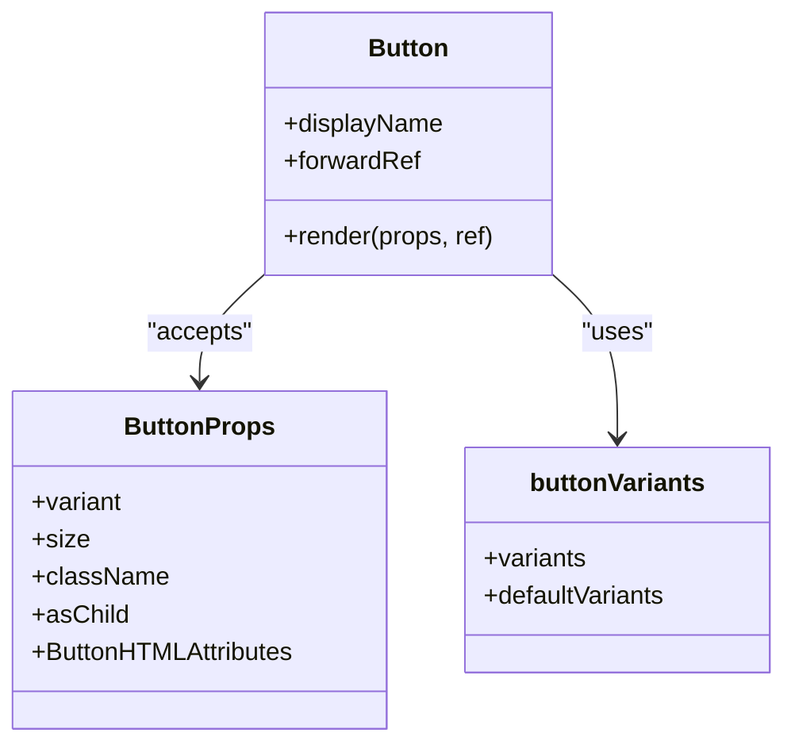
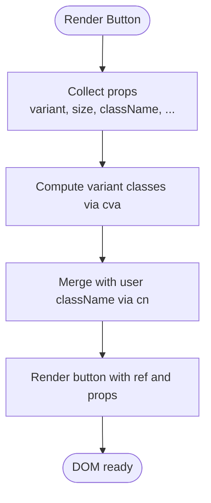
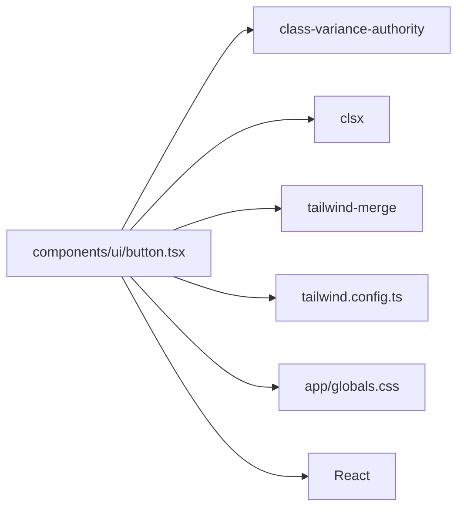

# Button Component

<cite>
**Referenced Files in This Document**
- [button.tsx](file://components/ui/button.tsx)
- [utils.ts](file://lib/utils.ts)
- [tailwind.config.ts](file://tailwind.config.ts)
- [globals.css](file://app/globals.css)
- [page.tsx](file://app/page.tsx)
- [package.json](file://package.json)
</cite>

## Table of Contents
1. [Introduction](#introduction)
2. [Project Structure](#project-structure)
3. [Core Components](#core-components)
4. [Architecture Overview](#architecture-overview)
5. [Detailed Component Analysis](#detailed-component-analysis)
6. [Dependency Analysis](#dependency-analysis)
7. [Performance Considerations](#performance-considerations)
8. [Troubleshooting Guide](#troubleshooting-guide)
9. [Conclusion](#conclusion)
10. [Appendices](#appendices)

## Introduction
This document provides comprehensive documentation for the Button component system used across the project. It explains all button variants, sizes, styling patterns, and the underlying architecture built with class-variance-authority (cva), forwardRef, and the cn utility. It also covers hover effects, shadow variations, and glass morphism effects, along with guidelines for extending variants, customizing animations, accessibility considerations, focus states, and responsive behavior.

## Project Structure
The Button component resides in the UI components module alongside other shared components. Styling and theme tokens are configured via Tailwind CSS and global CSS variables.

**Diagram sources**
- [button.tsx](file://components/ui/button.tsx#L1-L57)
- [utils.ts](file://lib/utils.ts#L1-L7)
- [tailwind.config.ts](file://tailwind.config.ts#L1-L108)
- [globals.css](file://app/globals.css#L1-L252)
- [page.tsx](file://app/page.tsx#L1-L501)
- [package.json](file://package.json#L1-L33)

**Section sources**
- [button.tsx](file://components/ui/button.tsx#L1-L57)
- [utils.ts](file://lib/utils.ts#L1-L7)
- [tailwind.config.ts](file://tailwind.config.ts#L1-L108)
- [globals.css](file://app/globals.css#L1-L252)
- [page.tsx](file://app/page.tsx#L1-L501)
- [package.json](file://package.json#L1-L33)

## Core Components
The Button component is implemented as a single-file React component that:
- Uses cva to define variant and size combinations
- Merges classes via cn for safe conditional class joining
- Exposes a forwardRef-enabled button element
- Inherits standard button attributes and supports additional props

Key characteristics:
- Variants: default, destructive, outline, secondary, ghost, link, glow, glass
- Sizes: default, sm, lg, xl, icon
- Focus-visible ring behavior and disabled state handling
- Hover effects including scaling, shadows, and color transitions
- Glass morphism support with backdrop blur and reduced opacity

**Section sources**
- [button.tsx](file://components/ui/button.tsx#L5-L35)
- [button.tsx](file://components/ui/button.tsx#L37-L41)
- [button.tsx](file://components/ui/button.tsx#L43-L54)

## Architecture Overview
The Button component integrates with Tailwind’s design system and theme tokens. The cva configuration defines variant and size classes, while cn merges them safely with any user-provided className. The theme configuration exposes color tokens and keyframes that enable advanced effects like glow and glass.

**Diagram sources**
- [page.tsx](file://app/page.tsx#L76-L76)
- [page.tsx](file://app/page.tsx#L95-L95)
- [page.tsx](file://app/page.tsx#L142-L149)
- [button.tsx](file://components/ui/button.tsx#L43-L54)
- [button.tsx](file://components/ui/button.tsx#L5-L35)
- [utils.ts](file://lib/utils.ts#L4-L6)
- [tailwind.config.ts](file://tailwind.config.ts#L21-L62)

## Detailed Component Analysis

### Component Composition
The Button component composes:
- cva for variant and size variants
- forwardRef for DOM access
- cn for class merging
- standard button attributes and additional props

**Diagram sources**
- [button.tsx](file://components/ui/button.tsx#L37-L41)
- [button.tsx](file://components/ui/button.tsx#L43-L54)
- [button.tsx](file://components/ui/button.tsx#L5-L35)

**Section sources**
- [button.tsx](file://components/ui/button.tsx#L37-L54)

### Variant Definitions and Styling Patterns
Each variant defines base, hover, and focus states using Tailwind utility classes and theme tokens. Variants include:
- default: primary background with hover shadow and scale
- destructive: destructive background with hover
- outline: transparent background with border and hover
- secondary: secondary background with hover
- ghost: hover background and text color change
- link: underlined text with hover underline
- glow: primary background with glow shadow and subtle scale
- glass: translucent card background with backdrop blur and border

Sizes define height, padding, and typography adjustments:
- default, sm, lg, xl, icon

Focus-visible ring behavior ensures keyboard accessibility with ring offset and visibility.

**Section sources**
- [button.tsx](file://components/ui/button.tsx#L5-L35)

### Prop Interfaces and ForwardRef Implementation
The component accepts standard button attributes and cva variant props, plus an optional asChild flag. It renders a button element with merged classes and forwards the ref to the DOM node.

**Diagram sources**
- [button.tsx](file://components/ui/button.tsx#L43-L54)
- [button.tsx](file://components/ui/button.tsx#L5-L35)
- [utils.ts](file://lib/utils.ts#L4-L6)

**Section sources**
- [button.tsx](file://components/ui/button.tsx#L37-L54)

### Styling Patterns and Effects
- Hover effects: scale transforms, shadow expansions, and color overlays
- Shadow variations: soft shadows for default, glow shadows for glow variant
- Glass morphism: translucent backgrounds with backdrop blur and reduced borders
- Focus states: visible ring with offset for accessibility

Theme tokens and keyframes are defined in Tailwind configuration and global CSS to support advanced effects.

**Section sources**
- [button.tsx](file://components/ui/button.tsx#L10-L20)
- [tailwind.config.ts](file://tailwind.config.ts#L21-L62)
- [globals.css](file://app/globals.css#L107-L121)
- [globals.css](file://app/globals.css#L144-L209)

### Usage Examples Across the Application
The Button component is used extensively across the application with various variants and sizes to demonstrate capabilities and maintain design consistency.

Examples include:
- Glow variant with xl size for primary CTAs
- Glass variant with xl size for secondary actions
- Outline variant with xl size for contact actions
- Sm and lg sizes in navigation and mobile menus

These usages showcase responsive behavior and consistent styling across different contexts.

**Section sources**
- [page.tsx](file://app/page.tsx#L76-L76)
- [page.tsx](file://app/page.tsx#L95-L95)
- [page.tsx](file://app/page.tsx#L142-L149)
- [page.tsx](file://app/page.tsx#L421-L427)

## Dependency Analysis
The Button component relies on:
- class-variance-authority for variant composition
- clsx and tailwind-merge for safe class merging
- Tailwind CSS for utility classes and theme tokens
- React for component rendering and forwardRef

**Diagram sources**
- [button.tsx](file://components/ui/button.tsx#L1-L3)
- [utils.ts](file://lib/utils.ts#L1-L2)
- [tailwind.config.ts](file://tailwind.config.ts#L1-L108)
- [globals.css](file://app/globals.css#L1-L252)
- [package.json](file://package.json#L11-L21)

**Section sources**
- [button.tsx](file://components/ui/button.tsx#L1-L3)
- [utils.ts](file://lib/utils.ts#L1-L2)
- [package.json](file://package.json#L11-L21)

## Performance Considerations
- cva computes classes at render time; keep variant sets minimal to reduce re-renders
- cn merges classes efficiently; avoid passing excessive or conflicting classes
- Glass variant uses backdrop blur; test on lower-end devices for performance impact
- Hover animations rely on CSS transitions; ensure hardware acceleration is available

[No sources needed since this section provides general guidance]

## Troubleshooting Guide
Common issues and resolutions:
- Conflicting classes: Use cn to merge classes; avoid overriding variant classes manually
- Disabled state not applying: Ensure disabled prop is passed; verify opacity and pointer-events classes
- Focus ring not visible: Confirm focus-visible styles are enabled; check ring and ring-offset classes
- Glass effect not appearing: Verify backdrop blur and border classes; ensure theme tokens are defined

Accessibility checks:
- Keyboard navigation: Test tab order and focus ring visibility
- Screen reader compatibility: Ensure aria-label or child text is present
- Color contrast: Validate contrast ratios against WCAG guidelines

**Section sources**
- [button.tsx](file://components/ui/button.tsx#L6-L6)
- [button.tsx](file://components/ui/button.tsx#L30-L33)

## Conclusion
The Button component system provides a flexible, accessible, and visually consistent foundation for interactive elements. By leveraging cva, forwardRef, and cn, it balances customization with maintainability. The included variants, sizes, and effects enable rich UI patterns while preserving design consistency across the application.

[No sources needed since this section summarizes without analyzing specific files]

## Appendices

### Guidelines for Extending Button Variants
- Define new variant keys in cva variants and add corresponding Tailwind classes
- Use theme tokens consistently for colors and shadows
- Add hover and focus states for accessibility and UX
- Keep default variants aligned with brand guidelines

### Customizing Animations
- Integrate Tailwind keyframes and animation utilities
- Apply animation classes conditionally via className prop
- Ensure animations are hardware-accelerated for performance

### Maintaining Design Consistency
- Reuse existing variants and sizes across components
- Align typography and spacing scales with theme tokens
- Document new variants in component usage examples

### Accessibility Considerations
- Preserve focus-visible ring behavior
- Provide sufficient color contrast
- Ensure keyboard operability and screen reader compatibility

[No sources needed since this section provides general guidance]