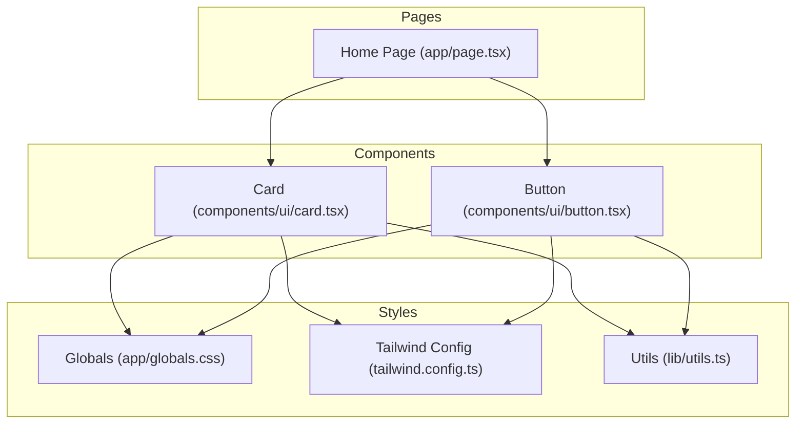
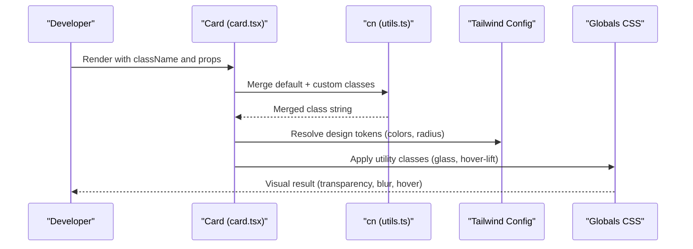
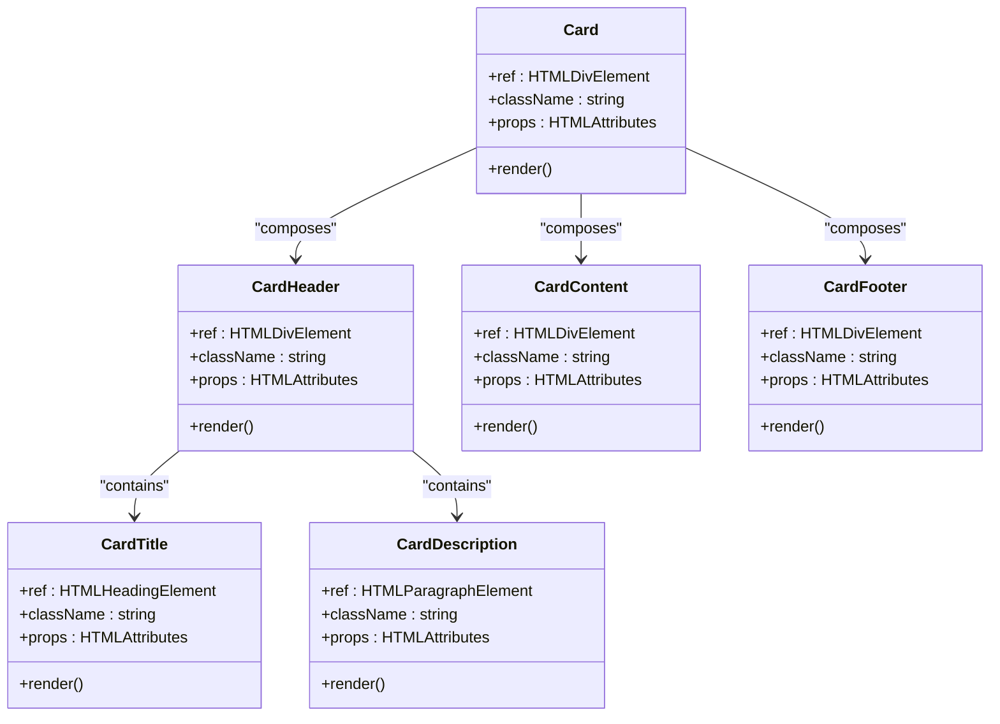
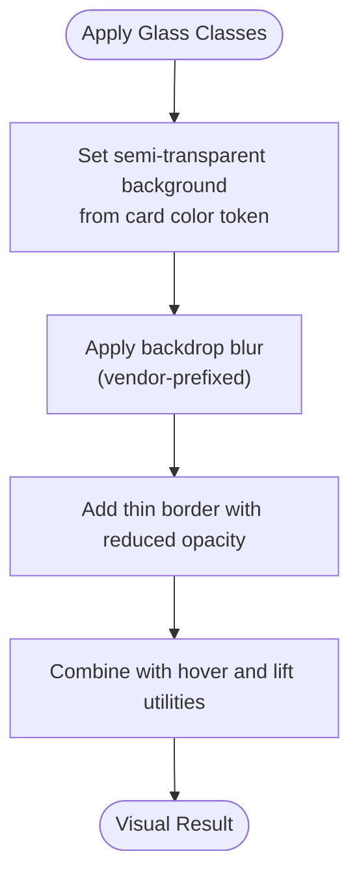
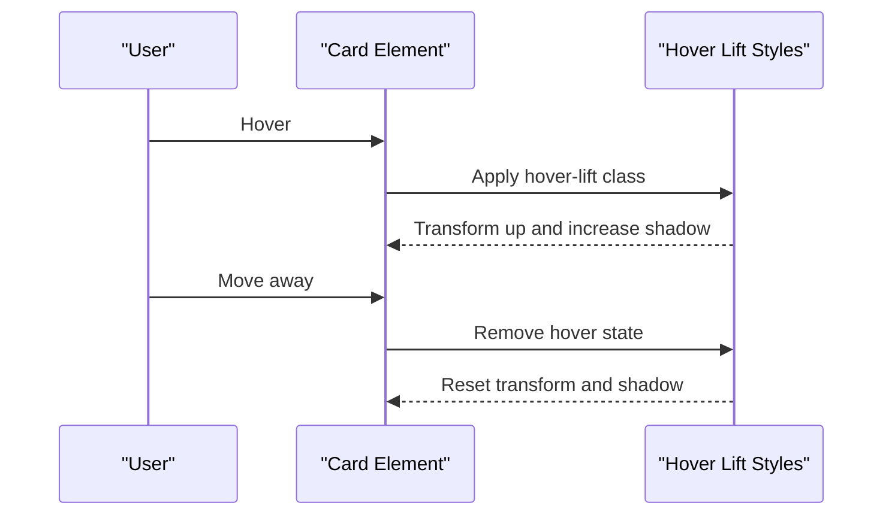
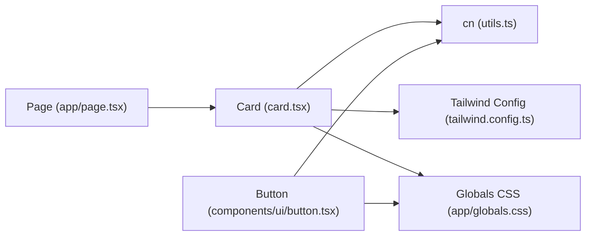

# Card Component

<cite>
**Referenced Files in This Document**
- [card.tsx](file://components/ui/card.tsx)
- [button.tsx](file://components/ui/button.tsx)
- [globals.css](file://app/globals.css)
- [tailwind.config.ts](file://tailwind.config.ts)
- [utils.ts](file://lib/utils.ts)
- [page.tsx](file://app/page.tsx)
</cite>

## Table of Contents
1. [Introduction](#introduction)
2. [Project Structure](#project-structure)
3. [Core Components](#core-components)
4. [Architecture Overview](#architecture-overview)
5. [Detailed Component Analysis](#detailed-component-analysis)
6. [Dependency Analysis](#dependency-analysis)
7. [Performance Considerations](#performance-considerations)
8. [Troubleshooting Guide](#troubleshooting-guide)
9. [Conclusion](#conclusion)
10. [Appendices](#appendices)

## Introduction
This document explains the Card component system used across the project. It focuses on the glass morphism effects, backdrop blur implementations, and border styling. It also covers the component’s layout structure, content organization patterns, interactive states, and how it integrates with Tailwind CSS utilities for transparency and blur. Practical examples demonstrate variants, hover animations, and shadow effects, along with guidelines for customization, responsive layouts, performance considerations, and accessibility best practices.

## Project Structure
The Card system is implemented as a reusable UI primitive with supporting styles and configuration:
- The Card component primitives live under components/ui.
- Glass and hover effects are defined in global CSS utilities.
- Tailwind configuration defines color tokens and keyframes used by cards and other components.
- Utilities consolidate Tailwind class merging logic.
- Example usages appear in the main page.

**Diagram sources**
- [card.tsx](file://components/ui/card.tsx#L1-L79)
- [button.tsx](file://components/ui/button.tsx#L1-L57)
- [globals.css](file://app/globals.css#L1-L252)
- [tailwind.config.ts](file://tailwind.config.ts#L1-L108)
- [utils.ts](file://lib/utils.ts#L1-L7)
- [page.tsx](file://app/page.tsx#L1-L501)

**Section sources**
- [card.tsx](file://components/ui/card.tsx#L1-L79)
- [globals.css](file://app/globals.css#L107-L121)
- [tailwind.config.ts](file://tailwind.config.ts#L21-L62)
- [utils.ts](file://lib/utils.ts#L4-L6)
- [page.tsx](file://app/page.tsx#L242-L254)

## Core Components
The Card system consists of a set of composable primitives that form a cohesive layout and content model:
- Card: Base container with rounded corners, border, background, and subtle shadow.
- CardHeader: Top section for titles and metadata.
- CardTitle: Prominent headline within the header.
- CardDescription: Subtitle or short description.
- CardContent: Main content area with padding.
- CardFooter: Bottom section for actions or supplementary info.

Each component is implemented as a forwardRef component that merges incoming className with Tailwind defaults using a shared utility.

Key characteristics:
- Rounded corners and soft shadows for depth.
- Typography tokens for readability and hierarchy.
- Consistent spacing via padding and flex utilities.
- Transition timing for smooth interactive states.

**Section sources**
- [card.tsx](file://components/ui/card.tsx#L4-L17)
- [card.tsx](file://components/ui/card.tsx#L19-L29)
- [card.tsx](file://components/ui/card.tsx#L31-L44)
- [card.tsx](file://components/ui/card.tsx#L46-L56)
- [card.tsx](file://components/ui/card.tsx#L58-L64)
- [card.tsx](file://components/ui/card.tsx#L66-L76)

## Architecture Overview
The Card component integrates with Tailwind’s design tokens and global CSS utilities to deliver a cohesive look-and-feel. The system leverages:
- Design tokens for colors and radii.
- Utility classes for transparency and blur.
- Hover and lift animations for interactivity.
- Responsive grid usage in pages to showcase cards.

**Diagram sources**
- [card.tsx](file://components/ui/card.tsx#L10-L13)
- [utils.ts](file://lib/utils.ts#L4-L6)
- [tailwind.config.ts](file://tailwind.config.ts#L21-L62)
- [globals.css](file://app/globals.css#L107-L121)

## Detailed Component Analysis

### Card Primitive
The Card component is a flexible container that:
- Uses rounded corners and a soft border.
- Applies a card background and foreground color.
- Adds a subtle shadow and transition timing for interactive states.
- Merges custom classes via the shared cn utility.

**Diagram sources**
- [card.tsx](file://components/ui/card.tsx#L4-L17)
- [card.tsx](file://components/ui/card.tsx#L19-L29)
- [card.tsx](file://components/ui/card.tsx#L31-L44)
- [card.tsx](file://components/ui/card.tsx#L46-L56)
- [card.tsx](file://components/ui/card.tsx#L58-L64)
- [card.tsx](file://components/ui/card.tsx#L66-L76)

**Section sources**
- [card.tsx](file://components/ui/card.tsx#L4-L17)
- [card.tsx](file://components/ui/card.tsx#L19-L29)
- [card.tsx](file://components/ui/card.tsx#L31-L44)
- [card.tsx](file://components/ui/card.tsx#L46-L56)
- [card.tsx](file://components/ui/card.tsx#L58-L64)
- [card.tsx](file://components/ui/card.tsx#L66-L76)

### Glass Morphism Effects and Backdrop Blur
Glass effects are implemented via dedicated utility classes that:
- Set a semi-transparent background derived from the card color token.
- Apply backdrop blur using vendor-prefixed properties for broad browser support.
- Add a thin border with reduced opacity for depth while maintaining readability.
- Combine with motion and elevation utilities for interactive feedback.

**Diagram sources**
- [globals.css](file://app/globals.css#L107-L121)
- [globals.css](file://app/globals.css#L242-L250)

**Section sources**
- [globals.css](file://app/globals.css#L107-L121)
- [globals.css](file://app/globals.css#L242-L250)

### Border Styling and Color Tokens
Borders are styled using Tailwind’s design tokens:
- The card component applies a border derived from the border token.
- Hover states adjust border opacity for emphasis.
- The Tailwind config defines color tokens for card backgrounds and borders, enabling consistent theming.

**Section sources**
- [card.tsx](file://components/ui/card.tsx#L11)
- [tailwind.config.ts](file://tailwind.config.ts#L21-L26)
- [globals.css](file://app/globals.css#L35-L38)

### Layout Structure and Content Organization
Cards are organized using a consistent structure:
- Header for titles and metadata.
- Title and description for hierarchy and context.
- Content area for dense information.
- Footer for actions or supplementary info.

Responsive grids in pages demonstrate how cards adapt to different screen sizes.

**Section sources**
- [card.tsx](file://components/ui/card.tsx#L19-L29)
- [card.tsx](file://components/ui/card.tsx#L31-L44)
- [card.tsx](file://components/ui/card.tsx#L46-L56)
- [card.tsx](file://components/ui/card.tsx#L58-L64)
- [card.tsx](file://components/ui/card.tsx#L66-L76)
- [page.tsx](file://app/page.tsx#L209-L255)

### Interactive States and Hover Animations
Interactive states are implemented via:
- A dedicated hover-lift utility that transitions transform and box-shadow.
- Smooth transitions on hover for elevation and glow-like effects.
- Example usage in feature cards demonstrates hover scaling and shadow enhancement.

**Diagram sources**
- [globals.css](file://app/globals.css#L242-L250)
- [page.tsx](file://app/page.tsx#L242-L254)

**Section sources**
- [globals.css](file://app/globals.css#L242-L250)
- [page.tsx](file://app/page.tsx#L242-L254)

### Shadow Effects and Elevation
Shadows are integrated with:
- Soft base shadows for depth.
- Elevated hover shadows for interactivity.
- Glow utilities for accent highlights in other components.

**Section sources**
- [card.tsx](file://components/ui/card.tsx#L11)
- [globals.css](file://app/globals.css#L247-L249)
- [globals.css](file://app/globals.css#L94-L101)

### Integration with Tailwind CSS Utilities
The Card system relies on:
- Design tokens for colors and radii.
- Utility classes for transparency, blur, and motion.
- Variants and utilities for responsive layouts.

**Section sources**
- [tailwind.config.ts](file://tailwind.config.ts#L21-L62)
- [globals.css](file://app/globals.css#L107-L121)
- [page.tsx](file://app/page.tsx#L242-L254)

### Examples of Card Variants and Usage
Practical examples show:
- Standard glass cards with hover-lift and border transitions.
- Glass buttons that complement card aesthetics.
- Grid layouts demonstrating responsive behavior.

**Section sources**
- [page.tsx](file://app/page.tsx#L242-L254)
- [button.tsx](file://components/ui/button.tsx#L19-L20)

## Dependency Analysis
The Card component depends on:
- Shared utility for class merging.
- Tailwind design tokens for colors and radii.
- Global CSS utilities for glass and hover effects.

**Diagram sources**
- [card.tsx](file://components/ui/card.tsx#L1-L2)
- [utils.ts](file://lib/utils.ts#L4-L6)
- [tailwind.config.ts](file://tailwind.config.ts#L21-L62)
- [globals.css](file://app/globals.css#L107-L121)
- [page.tsx](file://app/page.tsx#L242-L254)
- [button.tsx](file://components/ui/button.tsx#L19-L20)

**Section sources**
- [card.tsx](file://components/ui/card.tsx#L1-L2)
- [utils.ts](file://lib/utils.ts#L4-L6)
- [tailwind.config.ts](file://tailwind.config.ts#L21-L62)
- [globals.css](file://app/globals.css#L107-L121)
- [page.tsx](file://app/page.tsx#L242-L254)
- [button.tsx](file://components/ui/button.tsx#L19-L20)

## Performance Considerations
Glass morphism and backdrop blur can impact rendering performance:
- Backdrop filters are GPU-intensive; use moderate blur values and avoid excessive stacking.
- Prefer lighter blur radii on low-end devices.
- Limit the number of blurred elements on the same page.
- Use lazy loading for heavy content inside cards.
- Minimize reflows by avoiding frequent DOM mutations during hover states.

Guidelines:
- Keep blur values within the documented ranges.
- Avoid combining multiple backdrop filters on adjacent elements.
- Test on various devices and reduce blur intensity for mobile.

**Section sources**
- [globals.css](file://app/globals.css#L107-L121)

## Troubleshooting Guide
Common issues and resolutions:
- Transparency not visible: Ensure the card background color token is set and the glass utility is applied.
- Blurry content unreadable: Increase contrast by adjusting background opacity or using stronger borders.
- Hover animation feels sluggish: Reduce transition duration or simplify transforms.
- Border not visible: Verify border token values and ensure the card has sufficient contrast against the background.

Accessibility checks:
- Maintain sufficient color contrast between foreground and background.
- Provide focus indicators for interactive elements within cards.
- Ensure hover effects are not the only indication of interactivity.

**Section sources**
- [globals.css](file://app/globals.css#L107-L121)
- [card.tsx](file://components/ui/card.tsx#L11)

## Conclusion
The Card component system delivers a modern, accessible, and visually consistent interface foundation. By leveraging design tokens, utility classes, and thoughtful interactive states, it enables rapid development of feature-rich pages with glass morphism aesthetics. Following the customization and performance guidelines ensures maintainable, high-quality user experiences across devices.

## Appendices

### Customization Guidelines
- Colors: Adjust card and border tokens in the Tailwind config to match brand themes.
- Spacing: Modify padding and margin utilities to fit content density.
- Typography: Use semantic headings and paragraph utilities for hierarchy.
- Interactions: Extend hover-lift or add new variants via additional utility classes.

**Section sources**
- [tailwind.config.ts](file://tailwind.config.ts#L21-L62)
- [globals.css](file://app/globals.css#L242-L250)

### Adding Content Sections
- Use CardHeader for titles and metadata.
- Insert CardTitle and CardDescription for context.
- Place dense content in CardContent.
- Add actions or summaries in CardFooter.

**Section sources**
- [card.tsx](file://components/ui/card.tsx#L19-L29)
- [card.tsx](file://components/ui/card.tsx#L31-L44)
- [card.tsx](file://components/ui/card.tsx#L46-L56)
- [card.tsx](file://components/ui/card.tsx#L58-L64)
- [card.tsx](file://components/ui/card.tsx#L66-L76)

### Responsive Layouts
- Use grid utilities to arrange cards responsively.
- Apply padding and spacing utilities for mobile-first layouts.
- Compose card variants with responsive breakpoints for optimal display.

**Section sources**
- [page.tsx](file://app/page.tsx#L209-L255)