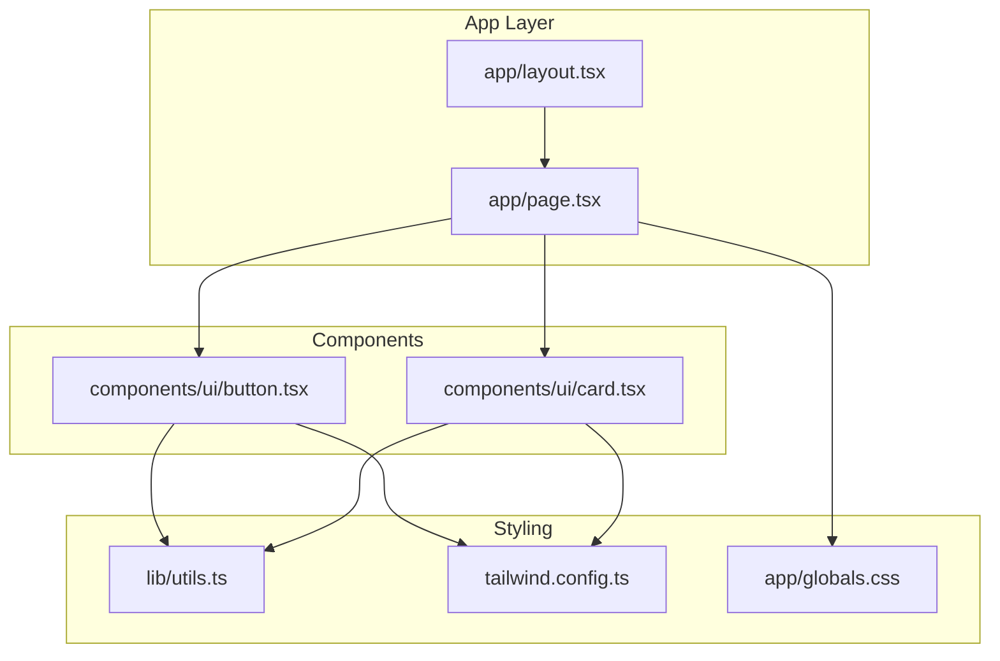
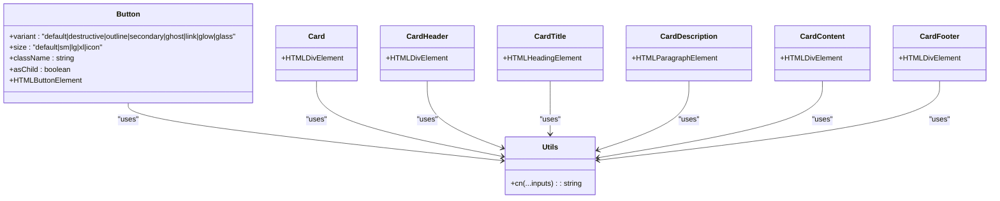
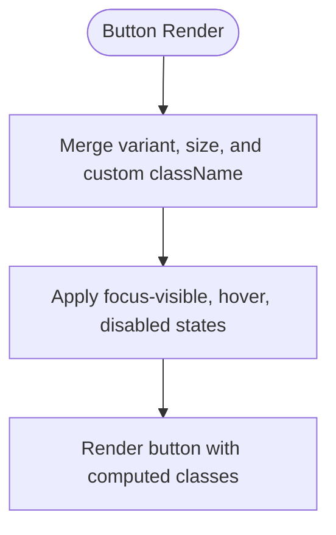
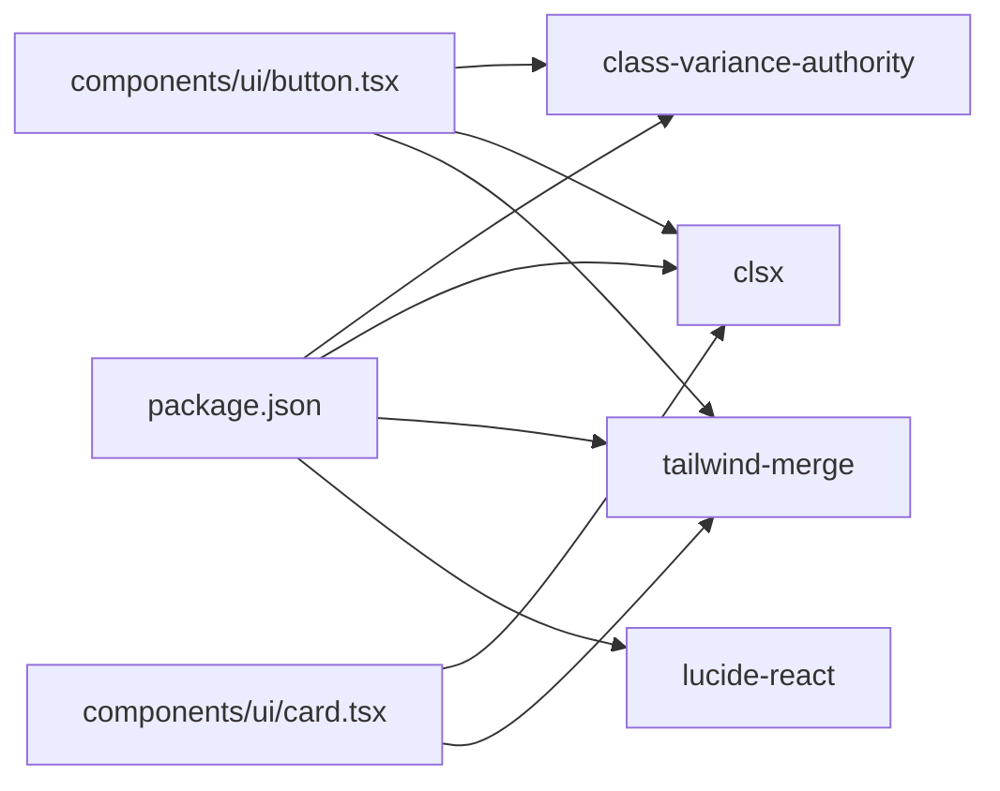

# UI Component Library

<cite>
**Referenced Files in This Document**
- [button.tsx](file://components/ui/button.tsx)
- [card.tsx](file://components/ui/card.tsx)
- [utils.ts](file://lib/utils.ts)
- [globals.css](file://app/globals.css)
- [tailwind.config.ts](file://tailwind.config.ts)
- [page.tsx](file://app/page.tsx)
- [layout.tsx](file://app/layout.tsx)
- [package.json](file://package.json)
</cite>

## Table of Contents
1. [Introduction](#introduction)
2. [Project Structure](#project-structure)
3. [Core Components](#core-components)
4. [Architecture Overview](#architecture-overview)
5. [Detailed Component Analysis](#detailed-component-analysis)
6. [Dependency Analysis](#dependency-analysis)
7. [Performance Considerations](#performance-considerations)
8. [Troubleshooting Guide](#troubleshooting-guide)
9. [Conclusion](#conclusion)
10. [Appendices](#appendices)

## Introduction
This document describes the AlterLabs UI component library with a focus on the Button and Card components. It explains variants, styling options, composition patterns, prop interfaces, and usage examples across the application. It also provides guidelines for extending components, adding new variants, and maintaining design consistency using Tailwind CSS and the project’s theme tokens.

## Project Structure
The UI components live under components/ui and are consumed by the Next.js app pages. Styling is centralized in app/globals.css with theme tokens defined in Tailwind configuration. Utility helpers merge Tailwind classes safely.



**Diagram sources**
- [layout.tsx](file://app/layout.tsx#L18-L28)
- [page.tsx](file://app/page.tsx#L1-L501)
- [button.tsx](file://components/ui/button.tsx#L1-L57)
- [card.tsx](file://components/ui/card.tsx#L1-L79)
- [utils.ts](file://lib/utils.ts#L1-L7)
- [tailwind.config.ts](file://tailwind.config.ts#L1-L108)
- [globals.css](file://app/globals.css#L1-L252)

**Section sources**
- [layout.tsx](file://app/layout.tsx#L18-L28)
- [page.tsx](file://app/page.tsx#L1-L501)
- [button.tsx](file://components/ui/button.tsx#L1-L57)
- [card.tsx](file://components/ui/card.tsx#L1-L79)
- [utils.ts](file://lib/utils.ts#L1-L7)
- [tailwind.config.ts](file://tailwind.config.ts#L1-L108)
- [globals.css](file://app/globals.css#L1-L252)

## Core Components
This section documents the Button and Card components, their variants, sizes, props, and practical usage patterns observed in the application.

- Button
  - Variants: default, destructive, outline, secondary, ghost, link, glow, glass
  - Sizes: default, sm, lg, xl, icon
  - Props: Inherits standard button attributes plus variant, size, className, and asChild
  - Composition: Uses class variance authority (cva) with a central variants object and Tailwind classes
  - Interactive states: Focus-visible ring, hover effects, disabled state, transitions
  - Example usage: Glow and glass variants appear in navigation and hero sections

- Card
  - Composition: Card, CardHeader, CardTitle, CardDescription, CardContent, CardFooter
  - Props: Standard HTML div attributes; forwardRef-enabled for accessibility
  - Styling: Rounded borders, card background, subtle shadows, transitions
  - Example usage: Feature cards with hover lift and glass backgrounds

**Section sources**
- [button.tsx](file://components/ui/button.tsx#L5-L35)
- [button.tsx](file://components/ui/button.tsx#L37-L41)
- [button.tsx](file://components/ui/button.tsx#L43-L56)
- [card.tsx](file://components/ui/card.tsx#L4-L17)
- [card.tsx](file://components/ui/card.tsx#L19-L29)
- [card.tsx](file://components/ui/card.tsx#L31-L44)
- [card.tsx](file://components/ui/card.tsx#L46-L56)
- [card.tsx](file://components/ui/card.tsx#L58-L76)
- [page.tsx](file://app/page.tsx#L76-L95)
- [page.tsx](file://app/page.tsx#L142-L149)
- [page.tsx](file://app/page.tsx#L242-L254)

## Architecture Overview
The Button and Card components are built with:
- Tailwind CSS for styling and theme tokens
- class-variance-authority (cva) for variant-driven class composition
- A shared cn utility that merges classes safely using clsx and tailwind-merge
- A global theme defined via CSS variables and extended in Tailwind



**Diagram sources**
- [button.tsx](file://components/ui/button.tsx#L37-L41)
- [button.tsx](file://components/ui/button.tsx#L43-L56)
- [card.tsx](file://components/ui/card.tsx#L4-L17)
- [card.tsx](file://components/ui/card.tsx#L19-L29)
- [card.tsx](file://components/ui/card.tsx#L31-L44)
- [card.tsx](file://components/ui/card.tsx#L46-L56)
- [card.tsx](file://components/ui/card.tsx#L58-L76)
- [utils.ts](file://lib/utils.ts#L4-L6)

## Detailed Component Analysis

### Button Component
- Purpose: A versatile button with multiple visual variants and sizing options
- Variants and styling highlights
  - default: Primary background with hover lift and shadow
  - destructive: Destructive background with hover
  - outline: Transparent background with border and hover background
  - secondary: Secondary background with hover
  - ghost: Hover background and text color change
  - link: Underline on hover with primary color
  - glow: Glowing shadow and slight scale on hover
  - glass: Glass morphism background with backdrop blur and border
- Sizes and spacing
  - default, sm, lg, xl, icon with proportional heights and paddings
- Props and composition
  - Inherits button attributes and adds variant, size, className, asChild
  - Uses cva with default variants and transitions
  - Merges classes via cn
- Interactive states
  - Focus-visible ring and offset ring
  - Disabled pointer events and reduced opacity
  - Hover effects vary by variant (shadow, scale, border, background)
- Usage patterns in the app
  - Glow variant for prominent CTAs in navigation and hero
  - Glass variant for secondary actions with transparency



**Diagram sources**
- [button.tsx](file://components/ui/button.tsx#L43-L56)
- [button.tsx](file://components/ui/button.tsx#L5-L35)
- [utils.ts](file://lib/utils.ts#L4-L6)

**Section sources**
- [button.tsx](file://components/ui/button.tsx#L5-L35)
- [button.tsx](file://components/ui/button.tsx#L37-L41)
- [button.tsx](file://components/ui/button.tsx#L43-L56)
- [page.tsx](file://app/page.tsx#L76-L95)
- [page.tsx](file://app/page.tsx#L142-L149)

### Card Component Family
- Composition pattern
  - Card: Base container with rounded corners, border, card background, and subtle shadow
  - CardHeader: Column layout with vertical spacing and padding
  - CardTitle: Large, semibold typography with tight tracking
  - CardDescription: Small muted text
  - CardContent: Padding with top margin reset
  - CardFooter: Flexible footer layout with padding
- Props and accessibility
  - All components use forwardRef and accept standard HTML attributes
  - Designed for composition within feature cards and content sections
- Usage patterns in the app
  - Feature cards with hover lift and glass backgrounds
  - Consistent typography and spacing across content sections

```mermaid
sequenceDiagram
participant Page as "Page"
participant Card as "Card"
participant Header as "CardHeader"
participant Title as "CardTitle"
participant Desc as "CardDescription"
participant Content as "CardContent"
participant Footer as "CardFooter"
Page->>Card : Render with className
Card->>Header : Render header slot
Header->>Title : Render title slot
Header->>Desc : Render description slot
Card->>Content : Render content slot
Card->>Footer : Render footer slot
```

**Diagram sources**
- [card.tsx](file://components/ui/card.tsx#L4-L17)
- [card.tsx](file://components/ui/card.tsx#L19-L29)
- [card.tsx](file://components/ui/card.tsx#L31-L44)
- [card.tsx](file://components/ui/card.tsx#L46-L56)
- [card.tsx](file://components/ui/card.tsx#L58-L76)

**Section sources**
- [card.tsx](file://components/ui/card.tsx#L4-L17)
- [card.tsx](file://components/ui/card.tsx#L19-L29)
- [card.tsx](file://components/ui/card.tsx#L31-L44)
- [card.tsx](file://components/ui/card.tsx#L46-L56)
- [card.tsx](file://components/ui/card.tsx#L58-L76)
- [page.tsx](file://app/page.tsx#L242-L254)

## Dependency Analysis
- Internal dependencies
  - Button and Card depend on cn for safe class merging
  - Both components rely on Tailwind CSS classes and theme tokens
- External dependencies
  - class-variance-authority for variant composition
  - clsx and tailwind-merge for class merging
  - lucide-react icons used in the app for visual elements
- Theme integration
  - CSS variables define the AlterLabs dark theme palette
  - Tailwind extends colors and animations using HSL variables
  - Global utilities include gradients, glow effects, and glass styles



**Diagram sources**
- [package.json](file://package.json#L11-L21)
- [button.tsx](file://components/ui/button.tsx#L1-L3)
- [card.tsx](file://components/ui/card.tsx#L1-L2)
- [utils.ts](file://lib/utils.ts#L1-L2)

**Section sources**
- [package.json](file://package.json#L11-L21)
- [button.tsx](file://components/ui/button.tsx#L1-L3)
- [card.tsx](file://components/ui/card.tsx#L1-L2)
- [utils.ts](file://lib/utils.ts#L1-L2)

## Performance Considerations
- Class merging
  - Using cn ensures minimal class duplication and avoids conflicts
- Transitions and animations
  - Buttons and cards apply transitions for hover and focus states; keep durations reasonable to avoid jank
- Glass morphism
  - Backdrop filters can be expensive on mobile; use judiciously and prefer lighter blur values when needed
- Iconography
  - lucide-react icons are tree-shaken; import only the icons used in production builds

[No sources needed since this section provides general guidance]

## Troubleshooting Guide
- Button not rendering variant styles
  - Verify variant and size props are passed correctly and className does not override critical classes unintentionally
- Glass effect looks too heavy
  - Adjust background alpha and backdrop blur values in the theme or utility classes
- Focus ring not visible
  - Ensure focus-visible styles are not overridden by custom className
- Card layout issues
  - Confirm composition order: Card -> CardHeader -> CardTitle/CardDescription -> CardContent -> CardFooter

[No sources needed since this section provides general guidance]

## Conclusion
The AlterLabs UI component library centers on two core components—Button and Card—that leverage Tailwind CSS, theme tokens, and cva for consistent, extensible styling. The Button offers multiple variants and sizes with clear interactive states, while the Card family provides a flexible composition model for content sections. The project’s theme and utilities enable a cohesive aesthetic with modern effects like glow and glass.

[No sources needed since this section summarizes without analyzing specific files]

## Appendices

### Button Prop Reference
- variant: "default | destructive | outline | secondary | ghost | link | glow | glass"
- size: "default | sm | lg | xl | icon"
- className: string
- asChild: boolean
- Inherits standard button attributes

**Section sources**
- [button.tsx](file://components/ui/button.tsx#L37-L41)

### Card Composition Reference
- Card: Base container
- CardHeader: Header area
- CardTitle: Title typography
- CardDescription: Description text
- CardContent: Body content
- CardFooter: Footer area

**Section sources**
- [card.tsx](file://components/ui/card.tsx#L4-L17)
- [card.tsx](file://components/ui/card.tsx#L19-L29)
- [card.tsx](file://components/ui/card.tsx#L31-L44)
- [card.tsx](file://components/ui/card.tsx#L46-L56)
- [card.tsx](file://components/ui/card.tsx#L58-L76)

### Theme Tokens and Utilities
- Theme tokens: background, foreground, primary, secondary, destructive, muted, accent, card, popover, border, input, ring, radius
- Utilities: gradient-primary, gradient-text, gradient-border, glow-primary, glow-accent, text-glow, glass, glass-strong, mesh-gradient, noise-overlay, and various animations

**Section sources**
- [globals.css](file://app/globals.css#L6-L44)
- [globals.css](file://app/globals.css#L62-L251)
- [tailwind.config.ts](file://tailwind.config.ts#L21-L62)

### Extending Components and Adding Variants

- Guidelines for extending Button
  - Add new variant entries in the cva variants object with Tailwind classes
  - Define defaults in defaultVariants if applicable
  - Keep hover/focus/disabled states consistent with existing patterns
  - Test across sizes and states

- Guidelines for extending Card
  - Introduce new subcomponents with forwardRef and standard attributes
  - Reuse cn for class merging and maintain consistent spacing
  - Align typography scales with existing CardTitle/CardDescription

- Maintaining design consistency
  - Use theme tokens (CSS variables) for colors and radii
  - Prefer Tailwind utilities from the theme extension
  - Keep transitions and motion predictable across components

**Section sources**
- [button.tsx](file://components/ui/button.tsx#L5-L35)
- [card.tsx](file://components/ui/card.tsx#L4-L17)
- [globals.css](file://app/globals.css#L6-L44)
- [tailwind.config.ts](file://tailwind.config.ts#L21-L62)